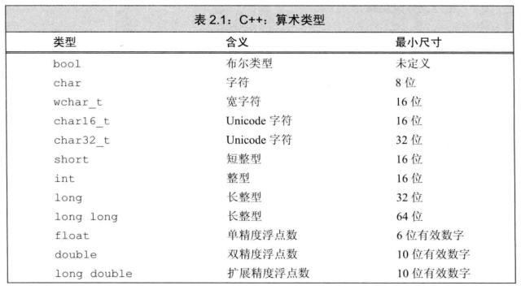
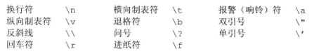
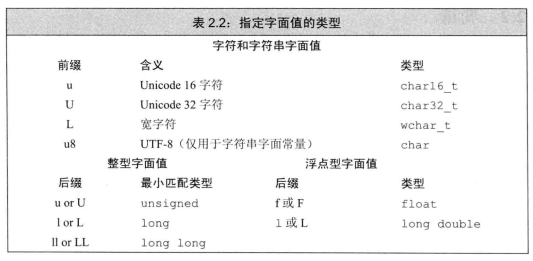

# 1 基本内置类型
## 1.1 算术类型


算术类型包含 **整型**（含字符和布尔类型）及 **浮点型**
- 整型 integer type
  1. 数字：int, short, long, long long均为带符号的。需在类型名前添加unsigned以得到无符号类型（可取到0）。
  2. char在一些机器上是signed，在另一些机器上是unsigned。可明确指出其类型为 signed char 或 unsigned char

- 浮点型
  float/double/long double

## 1.2 类型转换
1. 将浮点数赋值给整数类型时，仅保留**小数点之前的部分**。
2. 赋给无符号数一个超出其范围的值时，保留该数对于区间长度取模后的余数（-1对于8比特无符号数相当于255）。
3. 赋给有符号数一个超出其范围的数时，结果是未定义的，有可能崩溃。
4. 当一个算术表达式中既有无符号数又有int值时。int值会被转化为无符号数。容易导致2中的错误。故**切勿混合有符号类型和无符号类型**！

## 1.3 字面值常量 literal
- 整型和浮点型字面值
  1. 以0开头的整数代表八进制， 以0x或0X开头代表十六进制
  2. 整型字面值具体的数据类型由值和符号决定。默认情况下，十进制字面值的类型是能容纳下该整型字面值的前提下int、long和long long中尺寸最小的那个。整型字面值都不是short类型的。
  3. 浮点型字面值默认是double类型的。
- 字符和字符串字面值
  1. 字符字面值如'a'，字符串字面值如"abc"
  2. 字符串实际上是由常量字符串构成的数组，编译器会在每个字符串的结尾添加一个空字符'\0'
  3. 如果两个字符串字面值位置紧邻且仅由空格、缩进和换行符分隔，则它们实际上是一个整体:
   ```cpp
   std::cout << "a really, really long string"
                "that spans two lines" << std::endl;
  ```
- 转义序列
  
  '\n'之类的，也可以用'\\'后加八进制数字(只考虑反斜线后的前三个数字)或'\x'后加十六进制数字表示。

  

- 指定字面值的类型

  通过添加表中的前缀或后缀以改变整型、浮点型和字符型的默认类型：

  

  注：建议使用长整型字面值时，使用大写L后缀。前后缀有时只表示字面值类型必须满足的条件，实际选取满足条件的占据空间最小的类型。(整型的U后缀代表unsigned int, unsigned long或unsigned long long)
- 布尔字面值和指针字面值
  1. true 和 false 为布尔类型字面值
  2. nullptr 为指针字面值

### 练习2.5
- (a) 'a', L'a', "a", L"a"

    字符字面值，宽字符字面值，字符串字面值，宽字符串字面值。
- (b) 10, 10u, 10L, 10uL, 012, 0xC

  十进制整型，十进制无符号整型，十进制长整型，十进制无符号长整型，八进制整型，十六进制整型。
- (c) 3.14, 3.14f, 3.14L(长整型L必须大写，与数字1做区分)

  double, float, long double
- (d) 10, 10u, 10., 10e-2

  十进制整型，十进制无符号整型，double, double
# 2 变量
## 2.1 变量定义
- 列表初始化，详见[列表初始化](./initialization.md#1-列表初始化)

  列表初始化使用花括号来初始化或赋值变量
  ```cpp
  int a{0};
  int b = {1};
  ```
  当用于内置类型的变量时，如果我们用列表初始化对象且初始值存在丢失信息的风险，则编译器将报错：
  ```cpp
  long double ld = 3.1415926536;
  int a{ld}, b = {ld};//错误：存在丢失信息的风险
  int c(ld), d= ld;//正确，不是列表初始化，且丢失了部分信息
  ```
- 默认初始化：定义变量时没有指定初值，会被赋予默认值
  
  例外：定义在函数体内部(块作用域中)的内置类型变量(或者指针)将**不被初始化**


## 2.2 变量声明declaration和定义definition的关系(支持分离式编译)
- 声明：规定变量类型和名字，使得名字为程序所知，用于使用别处定义的名字，需添加关键字 extern
- 定义：规定变量类型和名字并分配存储空间，并创建与名字关联的实体
  ```cpp
  extern int i; //声明而非定义i,不能包括初值，否则就是定义了
  int j; //声明并定义j
- 变量能且只能被定义一次，但可以被多次声明

## 2.3 标识符 identifier
- 变量名一般用小写字母
- 用户自定义类名一般大写开头

## 2.4 作用域 scope
```cpp
#include <iostream>
int main() {
  int sum = 0;
  for (int i = 0; i < 5; ++i) {
    sum += i;
  }
  std::cout << sum << std::endl;
  return 0;
}
```
- 全局作用域(global scope)：定义在函数体之外，如main
- 块作用域(block scope)：花括号之间(如从声明sum开始到main函数结束)，或for语句内(如从i的声明开始，到for语句整个结束)
- 内层作用域(inner scope)可以覆盖掉外层作用域(outer scope)中已有的名字，除非在该名字左侧加上作用域操作符 :: ,其左侧为空表示全局作用域

# 3 复合类型 compound type
一条复合类型声明语句由一个**基础数据类型**和**声明符(declarator)列表组成**
## 3.1 引用 reference
- 引用必须被初始化
  ```cpp
  int i;
  int &r = i;
  int &refVal; // 错误
  ```
- 引用会与某个对象（而不是某个右值）绑定在一起
- 引用并非对象，仅是一个已经存在的对象的别名，不能直接定义一个引用的引用，但是可以间接实现，见[引用折叠](16_模板与泛型编程.md#2.5-模板实参推断和引用)。
- 一般情况下，引用类型必须与被引用对象类型一致，否则会改变被引用对象的值而报错。但有两个例外：[允许常量引用绑定非常量，且允许数据类型在一定程度内变化](#41-const的引用)及[动态绑定](./15_面向对象程序设计.md#1-oop概述)
  
## 3.2 指针 pointer
- 指针本身就是一个对象
- 指针在其生命周期内可以先后指向不同的对象
- 无需在定义时赋初值。但类似内置类型，如果在块作用域中定义的指针未被初始化，该指针也将拥有一个未定义的值；反之在块作用域外定义的指针可以被默认初始化为nullptr
- 不能定义指向引用的指针
- 指针的类型要和它所指向的对象严格匹配，两个例外：[允许一个指向常量的指针指向一个非常量对象，但不允许数据类型发生变化](#42-指针和const)及[动态绑定](./15_面向对象程序设计.md#1-oop概述)
  ```cpp
  int i = 42;
  int *p = &i; //p存放i的地址
  *p = 0; // 同时改变i的值
  cout << *p;
  ```
- 空指针
  ```cpp
  //method 1
  int *p1 = nullptr;
  //method 2
  int *p2 = 0;//int是必须的，以表示现在在初始化，而不是赋值
  //method 3
  #include <cstdlib>
  int *p3 = NULL;//NULL是头文件cstdlib中的预处理变量
  ```
- 把int变量赋值给一个指针是错误的，即使这个变量值为0也不行：
  ```cpp
  int zero = 0;
  int *p4 = zero;//错误
  ```
- 指针的赋值(改变的永远是等号左侧的对象)

  ```cpp
  int *p1 = 0;//初始化p1，初始值为nullptr
  int i = 42;
  p1 = &i;//p1指向变量i
  *p1 = 0;//i赋值0
  p1 = 0;//p1现在不指向任何对象
  ```
- void* 指针可用于存放任意对象的地址，但不能直接操作该指针指向的对象，因为不知道该对象是什么类型


## 3.3 理解复合类型的声明
- 定义多个变量
  ```cpp
  int* p1, p2; // p1是指向int的指针，p2是int
  //下面两句没有任何区别
  int *p3;
  int* p3;
  ```
- 指向指针的指针
  ```cpp
  int i = 42;
  int *pi = &i;
  int **ppi = &pi;
  cout << i << *pi << **ppi;
  ```
- 指向指针的引用
  ```cpp
  int i = 42;
  int *p;
  int *&r = p; // r是一个对指针 p 的引用。从右往左阅读。

  r = &i; //指针p指向 i
  ```
  离变量最近的符号(*&r中的&)对变量有最直接的影响。所以r是一个引用。

# 4 const 限定符
- const对象一旦创建后其值就不能改变，故必须初始化，可以用非const变量初始化
- const对象可用于初始化其他同数据类型变量
  ```cpp
  int i = 42;
  const int ci = i; //正确
  int j = ci; //正确
  ```
- const对象仅在文件内有效，同名变量可以在不同文件中进行多次定义，相当于独立变量。不受[“变量能且只能被定义一次，但可以被多次声明”](#22-变量声明declaration和定义definition的关系支持分离式编译)影响
- 如果某常量初始值不是一个常量表达式，而是一个有可能改变的函数返回值。我们又希望在其他文件中也可以被访问该初始值，此时就不能在多个文件中进行独立定义。需要在声明和定义处添加extern关键字，这样仅定义一次就行了。
  ```cpp
  //file.cc文件中定义并初始化为常量，并希望被其他文件访问
  extern const int bufSize = fcn();//此extern可省略
  //file.h头文件
  extern const int bufSize; // 此处extern表示 仅声明不定义
  ```

## 4.1 const的引用（常量引用）
```cpp
const int ci = 1024;
const int &r1 = ci; // 引用ri不是一个对象，此处const不是指该引用const，而是其引用的对象为常量
int &r2 = ci; // 错误，不能让一个 非常量引用 引用一个常量对象
```
- 一般情况下，引用类型必须与被引用对象类型一致，否则会改变被引用对象的值而报错。但有例外：

  初始化常量引用时表达式结果能转化成引用类型即可：
   ```cpp
   double dval = 3.14;
   const int &ri = dval; //ri绑定了一个类型转换得出的临时量
   ```
- 常量引用绑定一个非常量
  ```cpp
  int i = 42;
  const int &ri = i; // 正确，但不允许通过ri来改变i
  ```

## 4.2 指针和const
```cpp
const double pi = 3.14;
double *ptr = &pi; //错误，普通指针无法指向常量
const doule *cptr = &pi;
```
- 一般情况下，指针类型必须与被引用对象类型一致。但有例外：
  
  指向常量的指针可以指向非常量对象，但是不可以改变数据类型。
  ```cpp
  double pi = 3.14;
  const double *cptr1 = &pi; //定义并初始化一个 指向常量的指针
  const int *cptr2 = &pi; //报错，跟引用略有区别，数据类型不能变
  const int &cr = pi; //正确，可以进行类型转换即可
  ```

- const 指针
  ```cpp
  int i = 0;
  int *const cptr = &i; // cptr一直指向i
  const double pi = 3.14;
  const double *const pip = &pi; // pip是一个指向常量对象的常量指针
  ```
  最后一句从右往左读，离pip近的const表示pip本身是一个常量指针， 远的表示pip为指向常量的指针。

  常量指针可以修改其所指对象的值。

## 4.3 顶层const
顶层const(top-level const)表示任意对象本身是个常量（如常量指针），底层 const(low-level const)特指指针所指对象或引用所绑定对象为常量。

## 4.4 constexpr 和 常量表达式
- 常量表达式是指**值不会改变**并且**在编译过程就能得到计算结果**的表达式，常被用来作为常量对象的初值。被常量表达式初始化的const对象也是常量表达式，被常量表达式初始化的非const对象不是常量表达式，编译过程中无法得到计算结果的常量也不是常量表达式：
  ```cpp
  const i = 5;//i是常量表达式
  int j = i + 1;//i+1是，但j不是常量表达式
  const int sz = getsize();//sz不是常量表达式
  ```
- 复杂系统中很难判断一个初值表达式是否是常量表达式。如果认定某变量是一个常量表达式，可以将变量声明为constexpr类型以便由编译器来验证是否是一个常量表达式，之后也不可再改变该对象。
  ```cpp
  constexpr int mf = 20; //20是一个常量表达式
  constexpr int limit = mf + 1; //mf+1是一个常量表达式
  int i = 5;
  constexpr int j = i + 1; // 报错
  constexpr int sz = size();//如果size()是一个constexpr函数才正确
  ```
  [constexpr函数](./06_函数.md#52-内联函数和constexpr函数)
- 字面值类型 literal type

  可以声明constexpr的类型称为字面值类型，需要保证能在编译时就得到计算，如算术类型、指针、引用和[字面值常量类](./07_类.md#56-字面值常量类)，而string类型不属于字面值类型。

- 在constexpr声明中定义指针时，限定符constexpr仅对指针有效，与指针所指的对象无关。constexpr指针的初始值必须是nullptr, 0或存储在固定地址中的某个变量
  ```cpp
  constexpr int i = 42;
  int j = 0;
  const int *p = &i; // 指向常量的指针
  constexpr int *q = &j; // 常量指针
  ```
# 5 处理类型
## 5.1 类型别名
- 传统办法(可以认为typedef作为声明语句中基本数据类型的一部分出现，只是现在不声明变量，而声明类型别名)：
  ```cpp
  typedef double a, *b; //a是double的同义词， b是double*同义词
  //const修饰基本数据类型(此处为指针，而不是double)
  const b cp = 0; // cp是指向double的常量指针，而不是指向常量的指针！！！
  typedef int int_array[4]; //int_array表示创建容量为4的整型数组。假设没有typedef，此处声明的变量就是一个容量为4的整型数组
  ```
- 别名声明 alias declaration
  ```cpp
  using c = double; // c是double的同义词
  using int_array = int[4]; //int_array表示创建容量为4的整型数组
  ```
## 5.2 auto类型说明符
- auto定义的变量必须有初始值
- 一条声明语句只能有一个基本数据类型（指针，引用不算）
  ```cpp
  auto i = 0, *p = &i; //i是整数，p是整型指针
  ```
- 复合类型、常量和auto：auto一般会忽略掉顶层const，保留底层const
  ```cpp
  int i = 0;
  const int ci = i, &cr = ci;
  auto b = ci; // b是int
  auto c = cr; // c是int
  auto d = &i; // d是一个int*
  auto e = &ci; // e是一个指向整数常量的指针(const int *)
  const auto f = ci; // f是const int
  auto &g = ci; // g是整型常量引用，const int &
  auto &h = 42; //报错，非常量引用不能绑定常量
  const auto &j = 42; // 常量引用可以绑定常量
  ```
## 5.3 decltype类型指示符
auto类型说明符 需要确定某表达式的类型和值。而如果只需要推断表达式的类型，而不需要计算表达式的值，需要用 decltype 类型说明符。
```cpp
decltype(f()) sum; // sum的类型是函数 f 的返回类型
```
- decltype 保留顶层const
  ```cpp
  const int ci = 0, &cj = ci;
  decltype(ci) x = 0; // x是 const int
  decltype(cj) y = x; // y是 const int &
  ```
- decltype 和 引用
  ```cpp
  int i = 42, *p = &i, &r = i;
  decltype(r) a = i; // a是 int &，必须初始化
  decltype(*p) b = i; // b也是 int &，必须初始化，*p为左值
  decltype(r + 0) c; // c是 int，尚未初始化
  decltype(i) d; // d 是 int，尚未初始化
  decltype((i)) e; // 报错， e是 int &，必须初始化。
  ```
  decltype((variable))结果永远是引用，而decltype(variable)仅当variable这个变量本身是引用或解引用的指针时结果才是引用。而对于decltype(expression)，如果expression是左值，结果即是引用，见[左值和右值](./04_表达式.md#11-基本概念)。
  
# 6 自定义数据结构
## 6.1 定义Sales_data类型
```cpp
struct Sales_data {
  std::string bookNo;
  unsigned units_sold = 0;
  double revenue = 0.0;
};
```
- 类内部定义的名字必须唯一，但是可以与类外部定义的名字重复
- C++11允许为数据成员提供一个类内初始值，可置于等号右侧或花括号内

## 6.3 编写自己的头文件
为保证各个文件中类的定义一致，类通常被定义在头文件中，且类所在头文件的名字应与类的名字一样。所以Sales_data类要定义在Sales_data.h中。且Sales_data.h要包含string.h头文件，同时使用Sales_data.h的程序不仅要包含Sales_data.h(其中已经包含string.h)，还要包含string.h头文件以操纵字符串类型。这样导致多次包含同一头文件，需要进行适当处理：
- 头文件保护符 header guard

   #define 把一个名字设定为预处理变量，#ifdef 当且仅当变量已定义是为真，#ifndef 当且仅当遍历来那个未定义是为真，#endif表示条件预处理指令结束。预处理变量不属于std，由预处理器负责管理，是运行于编译器之前的一段程序。
   ```cpp
   //Sales_data.h文件
   #ifndef SALES_DATA_H
   #define SALES_DATA_H
   #include <string>
   struct Sales_data {
     std::string bookNo;
     unsigned units_sold = 0;
     double revenue = 0.0;
  };
  #endif
  ```
  上述代码的目的是避免重复包含Sales_data.h。如果已经包含过该头文件，第二遍直接pass。

    
  