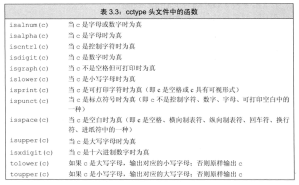
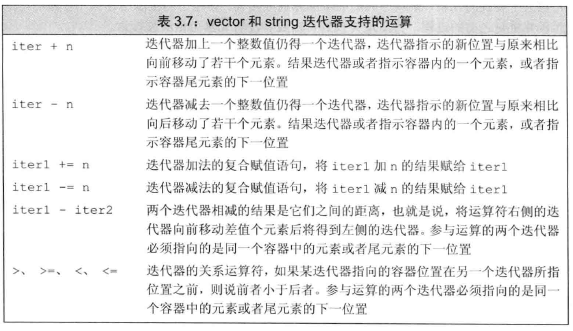
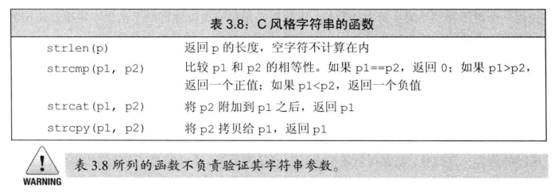

# 1 命名空间的using声明
```cpp
using std::cin; //仅使用命名空间的某个成员
using std::cout; using std::endl;//一行可以放多句，但需要一分号分隔
```
头文件不应包含using声明，否则每个包含这个头文件的文件都会有该声明。

# 2 标准库类型string
```cpp
#include <string>
using std::string;
```
## 2.1 定义和初始化string对象
```cpp
string s1; // 默认初始化成一个空串
string s2(s1); // s2是s1的副本
string s2 = s1; // s2是s1的副本
string s3("value"); // 构造函数初始化
string s3 = "value"; // 拷贝初始化
string s4(n, 'c'); // 把s4初始化为连续n个字符c组成的串
string s4 = string(n, 'c'); // 把s4初始化为连续n个字符c组成的串
```
不使用等号的初始化又称直接初始化(direct initialization)，使用等号的初始化又称拷贝初始化(copy initialization)。详见[直接初始化 VS 拷贝初始化](./13_拷贝控制.md#11-拷贝构造函数)

## 2.2 string对象上的操作
- 读写string对象(每次仅能读取被空格或换行符分隔的一个词)
  ```cpp
  string s;
  cin >> s;
  cout << s << endl;
  while (cin >> s) //  >>运算符会返回流参数，检测流是否有效
    cout << s << endl; // endl结束当前行并刷新缓冲区
  ```
  如果输入是"   Hello World!   "（注意空格），输出是 "Hello"

  流是否有效详见[条件状态与if/while](08_IO库.md#1.2-条件状态)
- 使用getline读取一整行(保留输入时的空白符)
  ```cpp
  string line;
  while (getline(cin, line))
    cout << line << endl;
   ```
- string的 empty 和 size 操作
- string::size_type
  
  size函数的输出是一个无符号类型size_type，且足以放下任何string大小。故应该避免混合使用size_type和int
- 比较string对象
  
   "Hiya" > "hiya" > "Hello World" > "Hello"
- 两个string对象相加
  
  左侧运算对象与右侧运算对象串接而成
- 字符串字面值(如",")是const char*类型，与string是不同类型，可以将字符串字面值与string相加，但不可以将两个字符串字面值相加

## 2.3 处理string对象中的字符
cctype头文件中声明的函数见下表


- 使用范围for循环进行遍历1(也可用于其他序列,但不可改变其元素)
  ```cpp
  string str;
  for (auto c : str)
    cout << c << endl;
  ```
- 使用范围for循环进行遍历2(也可用于其他序列,使用引用后可改变其元素)
  ```cpp
  string str;
  for (auto &c : str)
    c = toupper(c);
  ```
- 下表运算符[]接受的输入参数是string::size_type类型
  ```cpp
  string str;
  for(decltype(str.size()) i = 0; i < str.size(); ++i) {

  }
  ```
更多操作见[顺序容器](./09_顺序容器.md)
# 3 标准库类型vector
```cpp
#include <vector>
using std::vector;
```
vector是一个类模板，通过提供一些额外信息来指定模板到底被实例化(instantiation)成什么样的类。提供信息的方式是在模板后面跟一堆尖括号，并在尖括号中放上信息。

```cpp
vector<vector<int> > a; // 早期版本必须留一个空格
vector<vector<int>>; // C++11
```

## 3.1 定义和初始化vector对象
值初始化：内置类型初始化为0，类类型由默认构造函数初始化。对于容器的初始化，值初始化指的是 只说明容器的大小而不指定初始值，容器的元素会被默认初始化。默认初始化与值初始化区别可参考[直接管理内存](./12_动态内存.md#12-直接管理内存)
```cpp
vector<int> v1; // 空vector
vector<int> v2(v1); //副本
vector<int> v2 = v1; //副本
vector<int> v3(n, val); // v3包含n个重复元素，每个元素都是val
vector<int> v4(n); // v4包含n个重复元素，每个元素都是对应类型的默认初值，此处n个0。也称值初始化
vector<int> v5{a, b, c...}; //列表初始化，不能使用圆括号
vector<int> v5 = {a, b, c...}; //列表初始化，不能使用圆括号
```
圆括号表示调用了构造函数，参数是元素数量及初值。花括号表示列表初始化，直接写出元素内容。除非元素内容不能用来初始化当前类型的vector，才会考虑构造函数：
```cpp
vector<string> v6{10, "hi"}; //构造一个含10个"hi"的vector
```
## 3.2 向vector对象中添加元素
```cpp
vec.push_back(i); // 在vec尾部添加i元素
```
如果循环体内部含有向vector对象添加元素的语句时，不能使用范围for循环(for (deckaration : expression) statement)

## 3.3 其他vector操作
- vec.size()的输出类型根据vec元素的类型而定，如vector<int>::size_type
- vector对象的下标运算符可用于访问已存在的元素，而不能用于添加元素

# 4 迭代器介绍
有效的迭代器要么指向某个元素，要么指向容器中尾元素的下一元素
## 4.1 使用迭代器
可以使用迭代器的容器同时拥有返回迭代器的成员
```cpp
auto a = vec.begin(); //指向第一个元素
auto b = vec.end(); //指向尾元素的下一个元素
```
如果容器为空，vec.begin() == vec.end()
- 迭代器运算符
  *iter 返回迭代器iter所指元素的引用，迭代器允许用++或--移动所指位置。但不能对end返回的迭代器进行递增或解引用( *iter )操作

  下表为所有标准迭代器(forward_list不支持--)所支持的运算符:

  

- 使用迭代器进行遍历
  ```cpp
  for (auto it = s.begin(); it != s.end(); ++it)
    cout << *it << endl;
  ```
- 泛型编程：C++程序员一般使用迭代器而非下标，一般使用!=而非<以表示结束条件。原因是所有容器都支持迭代器和!=，而不是所有容器都支持下标和<
- 迭代器类型
  ```cpp
  vector<int>::iterator it1; // it1能读写vector<int>元素
  string::iterator it2; // it2能读写字符
  vector<int>::const_iterator it3; // it3只能读元素，不能写元素
  string::const_iterator it4; //it4只能读字符，不能写字符
  ```
  const_iterator 和 指向常量的指针(疑似书上写错了？)差不多，能读取但不能修改它所指的元素值。如果vector对象或string对象是常量，只能用const_iterator。

  begin 和 end 返回的具体类型由对象是否是常量决定。对象const返回const_iterator，反之仅返回iterator

  cbegin 和 cend 永远返回const_iterator，无论对象是否是常量

- 解引用和成员访问
  
  解引用符号 * 的优先级较低，如想要检查迭代器所指元素是否为空：
  ```cpp
  (*it).empty() //圆括号必不可少
  it->mem // 如果it指向一个类，此式表示当前所指元素的mem成员
  ```

- 凡是使用了迭代器的循环体，都不要向迭代器所属的容器添加元素

## 4.2 迭代器运算
两个迭代器相减所得为类型是 difference_type 的带符号整数型

仅vector、string、deque、array迭代器支持的运算：


# 5 数组
如果不清楚元素的确切个数，请用vector
## 5.1 定义和初始化内置数组
数组的维度在编译时必须已知，并且需要是一个常量表达式，如：
```cpp
constexpr unsigned sz = 42;
int arr[10];
int *parr[sz]; // 含有42个整型指针的数组
```
- 显式初始化数组元素
  ```cpp
  const unsigned sz = 3;
  int a1[sz] = {0, 1, 2}; // {0, 1, 2}
  int a2[] = {0, 1, 2}; // {0, 1, 2}
  int a3[5] = {0, 1, 2}; // {0, 1, 2, 0, 0}
  int a4[2] = {0, 1, 2}; //报错
  ```
- 字符数组的特殊性
  ```cpp
  char a1[] = {'C', '+', '+'}; // 列表维度为3
  char a2[] = {'C', '+', '+', '\0'}; // 列表维度为4
  char a3[] = "C++"; // 列表维度为4，自动添加空字符
  char a4[3] = "C++"; //报错
  ```
- 不允许拷贝和赋值

  不允许将数组的内容拷贝给其他数组作为其初始值
- 复杂的数组声明
  ```cpp
  int *ptrs[10]; // 含有10个整形指针的数组
  int &refs[10] = ; // 报错，不存在引用的数组
  int (*Parray) [10] = &arr; // Parray指向一个含有10个整数的数组
  int (&Rarray) [10] = arr; // Rarray引用一个含10个整数的数组
  ```
  由内而外，从右向左来理解

## 5.2 访问数组元素
在使用数组下标时，通常将其定义为 size_t 类型。size_t是一种在cstddef头文件中定义的无符号类型，被设计得足够大以便能表示内存中任意对象的大小。

遍历：
```cpp
for (auto i : arr)
  cout<< i << " ";
cout << endl;
```

## 5.3 指针和数组
在很多用到数组名字的地方，编译器都会自动地将其替换成一个指向数组首元素的指针,[例外](./04_表达式.md#112-其他隐式类型转换) 。
```cpp
int ia[] = {0, 1, 2, 3, 4, 5, 6, 7, 8, 9};
auto ia2(ia); // auto将ia视作指向第一个元素的指针，故ia2是一个整形指针，指向ia第一个元素
decltype(ia) ia3 = {0, 1, 2, 3, 4, 5, 6, 7, 8, 9}; // decltype仍将ia视作数组
```
- 数组的指针也是迭代器

  指向数组元素的指针允许进行递增递减
  ```cpp
  int arr[10];
  int *e = &arr[10]; // e指向(不存在的)尾后元素,此处允许索引越界
  for (int *b = arr; b != e; ++b)
    cout << *b << endl;
  ```
- 标准库函数 begin 和 end

  这两个数定义在iterator头文件中。但数组不是类，故这两个函数不是(类的)成员函数，只能把数组作为其参数：
  ```cpp
  int ia[10];
  int *beg = begin(ia); //指向首元素
  int *last = end(ia); //指向尾后元素
  while (beg != end) {
    ...
    ++beg;
  }
  ```
- 指针运算
  
  两指针相减的结果是一种名为 ptrdiff_t 的带符号整型，定义在cstddef头文件中。

- 下标和指针
  ```cpp
  int ia[] = {0, 2, 4, 6, 8};
  //method 1
  int i = ia[2];
  //method2
  int i = *(ia + 2);//1 和 2等价

  int *p = &ia[2];
  int j = p[1]; // p[1]等价于 *(p + 1),等价于 ia[3]
  int k = p[-2]; // p[-2]是ia[0]
  ```
  标准库类型 string 和 vector 限定使用的下标必须是无符号类型，而内置类型(如数组)的下标则无此要求。

## 5.4 C风格字符串
```cpp
//C++风格字符串
string s1 = "A string example";
//C风格字符串
const char ca1[] = "A string example";
```
- string之间进行大小比较的时候，比较的是两个字符串本身。而如果比较两个C风格字符串，比较的是两个指针。除非调用 cstring 头文件中的strcmp函数。(更多函数见P109)
- 多个string对象可以直接通过 '+' 连接起来，而C风格字符串之间不可以这么做，只能调用 cstring 头文件中的strcat函数。更多函数如下：
  
  

但是C风格字符串其实会导致严重错误，不建议使用

## 5.5 与旧代码的接口
- 混用string对象和C风格字符串
  
  1. 用字符串字面值来初始化string和C风格字符串
   ```cpp
   string s("Hello World");
   char a[] = "Hello World";
   ```
  2. C风格字符串转换成string
   ```cpp
   char a[] = {'a','b','c','\0'}; //必须以'\0'结尾
   string str = a;
   ```
  3. string转换成C风格字符串
   ```cpp
   string s = "Hello!";
   const char *str = s.c_str();
   ```
   c_str不稳定，建议拷贝一份返回的字符数组。
- 使用数组初始化 vector 对象
  ```cpp
  int int_arr[] = {0, 1, 2, 3, 4};
  vector<int> ivec(begin(int_arr), end(int_arr)); //第二个指针应指向待拷贝区域尾元素的下一位置
  ```

现代的C++程序应当尽量使用 vector 和迭代器，避免使用内置数组和指针；应该尽量使用 string，避免使用C风格的基于数组的字符串。

# 6 多维数组
多维数组其实是数组的数组。
```cpp
int ia[3][4]; // 大小为3的数组，每个元素都是含有4个整数的数组，也可称为3行4列
```
- 多维数组的初始化
  ```cpp
  //method 1
  int ia[3][4] = {
    {0, 1, 2, 3},
    {4, 5, 6, 7},
    {8, 9, 10, 11}
  };
  //method2,两者等价
  int ia[3][4] = {0, 1, 2, 3, 4, 5, 6, 7, 8, 9, 10, 11};
  //仅初始化每行首元素，其他元素默认值初始化
  int ia[3][4] = {{0}, {4}, {8}}; //必须保留内层花括号
  //显式初始化第一行，其他元素默认初始化
  int ia[3][4] = {0, 3, 6, 9};
  ```
- 多维数组的下标引用
  ```cpp
  int ia[3][4];
  int (&row)[4] = ia[1]; // row是一个引用，绑定一个长度为4的数组(ia第2行的四元素数组)
  ```
- 使用范围for语句处理多维数组
  1. 需要进行写操作(外层数组、内层数组都要采用引用类型)
  ```cpp
  size_t cnt = 0;
  //row代表每行
  for (auto &row : ia) {
    //col代表某行的某个元素
    for (auto &col : row) {
      col = cnt;
      ++cnt;
    }
  }
  ```
  2. 不需要进行写操作(除了最内层的循环(不再是数组)外，其他所有循环的控制变量都应该是引用类型)
   ```cpp
   for (const auto &row : ia) // 使用const是因为不需要进行写操作，使用引用是为了防止 auto row将row转换成指向首元素的指针
    for (auto col : row) 
      cout << col <<" ";
   ```
   注：auto会自动将数组转化成指针，见[指针和数组](#53-指针和数组)
- 普通for语句处理多维数组
  1. 使用auto
    ```cpp
    int ia[3][4];
    for (auto p = begin(ia); p != end(ia); ++p) {
      // p 指向ia的第一个元素(即第一行)，*p指向第一行第一个元素
      for (auto q = begin(*p); q != end(*p); ++q) {
        cout << *q << " ";
      }
      cout << endl;
    }
    ```
    注：*p也表示地址
    
  2. 不使用auto及其他C++11特性
   ```cpp
    int ia[3][4];
    typedef int int_array[4];//using int_array = int[4];
    //int (*p)[4] = ia; p是一个指向长度为4的数组ia第一行的指针
    for (int_array *p = ia; p != ia + 3; ++p) {
      // p 指向ia的第一个元素(即第一行)，*p指向第一行第一个元素
      for (int *q = *p; q != *p + 4; ++q) {
        cout << *q << " ";
      }
      cout << endl;
    }
  ```

  