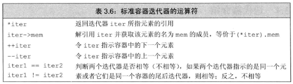

# 1 顺序容器概述
表9.1中介绍了基本的几种顺序容器类型：


1. 数组大小固定而因此不可增减元素，但可以快速随机访问：array(不是内置类型的数组，而是C++标准增加的高效的相似类型)
2. 将元素保存在连续的内存空间而因此可以快速随机访问且仅在尾部增减元素速度很快：vector/string
3. 类似vector/string可以随机访问，但支持头尾快速增减元素：deque
4. 由列表构成，因此容易在中间增减元素，但不支持快速随机访问：forward_list(只支持单向顺序访问), list(支持双向顺序访问)

- 选择容器原则：
    1. 通常选vector
    2. 元素所占空间较小但数量较多，不选list或forward_list。否则链表地址项空间开销较大
    3. 随机访问：vector/deque
    4. 中间插入元素：list或forward_list
    5. 仅头尾插入元素：deque
    6. 仅输入过程中需要在中间插入元素：vector(如果之后需要sort) / 输入阶段使用list，然后拷贝到一个vector

如果不确定容器是list还是vector就要写后续程序：使用公共的操作(迭代器)，而不使用下标

# 2 容器库概览
- 所有容器类型(顺序容器、关联容器、无序容器)都提供的操作：


下面详细来说(也涉及部分上表没有提及的仅适合顺序容器的操作)

## 2.1 迭代器
forward_list迭代器由于是单向链表不支持递减运算符--，其他容器迭代器都支持下表中操作


仅vector、string、deque、array迭代器支持的运算：



- 迭代器范围：[begin, end)
    ```cpp
    //顺序遍历容器
    while (begin != end) {
        cout << *begin << " ";
        ++begin;
    }
    ```
## 2.2 容器类型成员
size_type, iterator, const_iterator, value_type(元素类型), difference_type(代表两迭代器之间距离的带符号整数类型), reference(元素左值类型，相当于value_type &), const_reference(相当于 const value_type &)

用法：
```cpp
list<string>::iterator iter
vector<int>::size_type sz
```

## 2.3 begin和end成员
如表9.2，带r的版本表示反迭代器(rbegin返回指向尾元素的迭代器，rend返回指向首元素之前位置的迭代器)；带c的版本返回相应的const_iterator版本(包括cbegin, cend, crbegin, crend)

但不带c的版本其实是重载版本，也可以返回const_iterator，主要看被赋值变量的类型。
```cpp
list<string> a = {"abc", "def"};
auto it1 = a.begin();//list<string>::iterator
auto it2 = a.rend();//list<string>::reverse_iterator
auto it3 = a.cbegin();//list<string>::const_iterator
auto it4 = a.crend();//list<string>::const_reverse_iterator
list<string>::iterator it5 = a.begin();//list<string>::iterator
list<string>::const_iterator it6 = a.end();//list<string>::const_iterator

const list<string> b = {"abc", "def"};
auto it7 = b.begin();//list<string>::const_iterator
auto it8 = b.cend();//list<string>::const_iterator
```
当auto与begin或end结合使用时，迭代器类型依赖于容器类型。但含c的版本永远输出const_iterator或const_reverse_iterator

## 2.4 容器定义和初始化


1. 对于直接拷贝整个容器
    ```cpp
    C c1(c2);
    C c1 = c2;
    ```
    必须保证c1、c2容器类型相同且所含元素相同
2. 对于范围拷贝
    ```cpp
    C c(begin, end);//拷贝范围不包括end
    ```
    不要求 c 的容器类型或元素类型 与 begin到end之间范围内相同，仅相容(可相互转换即可)

3. C seq(n)不适用于string
    ```cpp
    string a(5);//错误
    vector<string> b(5);//正确,生成一个由5个空字符组成的vector
    ```
4. array的定义和初始化
    ```cpp
    array<int, 42> ia1;//定义一个含有42个默认int元素的ia1，必须制定元素数量
    array<int, 10> ia2 = {0,1,2,3,4,5,6,7,8,9};//列表初始化
    array<int, 10> ia3 = {42};//42和9个0
    //使用类型别名
    array<int, 10>::size_type i;//必须制定元素数量
    ```
    与内置类型array不能拷贝不同，array容器无此要求：
    ```cpp
    int digs[10] = {0,1,2,3,4,5,6,7,8,9};//内置类型
    int cpy[10] = digs;//错误
    array<int, 10> digits = {0,1,2,3,4,5,6,7,8,9};
    array<int, 10> copy = digits;//正确，但元素类型和元素数量必须统一
    ```

## 2.5 赋值和swap
 


- 不适用于array的 c1 = {a, b, c...};
    ```cpp
    array<int, 10> a1 = {0,1,2,3,4,5,6,7,8,9};
    array<int, 10> a2 = {1};//1个1，9个0
    a1 = a2;  //正确
    a2 = {1}; //错误，不能将一个花括号列表赋予数组，但部分编译器仍可通过
    a2  = {0,1,2,3,4,5,6,7,8,9};//错误，不能将一个花括号列表赋予数组，但部分编译器仍可通过
    ```

- c1 = c2;

    c1和c2的容器类型与元素类型均必须相同(array还需要保证数量相同)
- assign(仅顺序容器)

    由于邮编运算对象大小可能与左边运算对象大小不同，故assign不适用于array。

    另外assign仅需要右边容器元素类型与左边容器可相互转换
    ```cpp
    list<string> names;
    vector<const char*> oldstyle;
    names = oldstyle;//错误，容器及元素类型不匹配
    names.assign(oldstyle.cbegin(), oldstyle.cend());//正确
    ```
    assign(begin, end)的参数不能指向调用assign的容器！
    
- 使用swap

    1. 除array外，swap不对任何元素进行拷贝、删除或插入操作，相当于只交换了两容器的变量名。
        1. 除string外，指向容器的迭代器、引用和指针也不失效，指向另一个容器的同一元素了。如iter原来指向c1[3], swap(c1, c2) 后iter指向c2[3]
        2. 对于string，调用swap会导致迭代器、指针和引用失效
    2. 对于array，swap会真正交换它们的元素，故较慢。
    3. 建议统一使用非成员版本swap(c1, c2);

## 2.6 容器大小操作
除了一个例外(forward_list不支持size操作)，所有容器都支持size、empty和max_size(返回一个大于或等于该类型容器所能容纳的最大元素数量的值)

## 2.7 关系运算符
1. 每个容器类型都支持 == !=。
2. 除了无序关联容器外所有容器都支持关系运算符 > >= < <=。但关系运算符左右的运算对象必须保证容器类型和元素类型都相同。

比较原则：
1. 完全相同则两容器相等
2. 较小容器是较大容器的子序列，则较小容器小于较大容器
3. 比较结果取决于第一个不相等的元素的比较结果

# 3 顺序容器操作
## 3.1 向顺序容器添加元素(暂不考虑forward_list)
除array外所有标准库容器都满足表9.5的操作


1. 容器元素是拷贝：当我们将一个对象插入到容器中，实际上放入容器中的是对象值的一个拷贝，而不是引用。因此改变容器中的元素不会改变原始对象，反之亦然。
2. forward_list不支持push_back
3. 仅list、forward和deque支持push_front
4. insert函数的迭代器参数指出了插入的位置，将元素/列表插入到这迭代器**前**
5. 将元素insert到vector、deque和string中的任何位置都是合法的，只是很耗时。
6. 插入范围元素时，范围不能指向与目的位置相同的容器
    ```cpp
    slist.insert(slist.begin(), slist.begin(), slist.end());//报错
    ```
7. 使用insert的返回值，一般是返回指向新添加的第一个元素的迭代器。
8. 使用emplace_front/emplace(同样添加到给定迭代器**前**)/emplace_back操作：

    - 当调用push或insert成员函数时，我们将对象传递给它们，然后将其拷贝到容器中。
    - 当我们调用emplace操作时，会将参数传递给元素类型的构造函数。emplace函数会使用这些参数在容器的内存空间中直接构造元素，故emplace函数的参数必须与元素的构造函数类型相同(除了最开始的迭代器)。
    ```cpp
    struct C {
        C (int a, int b, int c) : a(a), b(b), c(c) { }
        int a;
        int b;
        int c;
    };
    vector<C> vec;
    vec.push_back(a, b, c);//错误，push_back不能直接调用构造函数
    vec.emplace_back(a, b, c);//正确
    vec.push_back(C(a, b, c));//等价
    ```
## 3.2 访问元素


 
## 3.3 删除元素(暂不考虑forward_list)
非array的顺序容器删除操作：


1. 删除元素的成员函数不检查其参数。在删除元素之前，程序员必须确保其存在
2. vector、string不支持push_front()，也因此不支持pop_front()
3. forward_list不支持push_back，也因此不支持pop_back()
4. pop_back()和pop_front()均无返回值，需要提前使用front()/back()之类处理
5. erase返回一个指向删除的最后一个元素之后位置的迭代器
    ```cpp
    elem1 = slist.erase(elem1, elem2);//删除后相当于elem1==elem2
    ```

## 3.4 特殊的forward_list操作
在单向链表中添加或删除一个元素，需要改变前面元素的后继，但是单向链表无法获得某元素的前驱。所以forward_list只能添加或删除其参数后面的元素(不包括参数本身)。故forward_list并未定义insert、emplace和erase，而是定义了insert_after, emplace_after, erase_after


我们只能在参数所表示的forward_list迭代器**后面**添加或删除元素

## 3.5 改变容器大小


## 3.6 容器操作可能是迭代器失效
保证每次改变容器操作后重新定位迭代器
```cpp
 vector<int> vi = {0,1,2,3,4,5,6,7,8,9};
 auto iter - vi.begin();
 //不能提前保存end迭代器，因为end迭代器总会失效
 while(iter != vi.end()) {
     if (*iter % 2) {
         iter = vi.insert(iter, *iter);//在奇数元素前插入插入一个该元素的副本，同时更新迭代器
         iter += 2;//移动迭代器来处理下一个原始元素
     }
     else
        iter = vi.erase(iter);//删除偶数元素，并更新迭代器到所删除元素之后
 }
 ```

# 4 vector对象如何增长
- 管理容量的成员函数


调用reserve之后，capacoty只会大于(n小于当前容量)或等于 n ，但reserve函数不改变容器中元素数量，类似的，[resize函数](#35-改变容器大小)也不会改变容器的容量。简单说元素数量size不等于容量capacity，一般来说容量大于元素数量。

- capacity和size

    size指它已经保存的元素的数目，而capacity则是在不分配新的内存空间时最多可以保存多少元素。

    vector只有在迫不得已时才分配新的内存空间。

# 5 额外的string操作
## 5.1 构造string的其他方法
除了[构造string](./03_字符串_向量和数组.md#21-定义和初始化string对象)和表9.3外，string还可以这么构造：


```cpp
const char *cp = "Hello World!!!";//
char noNull[] = {'H', 'i'};//结尾不是空字符
string s1(cp);//拷贝cp直到遇到空字符
string s2(noNull, 2);//烤白前两个字符
string s3(noNull);//未定义，因为noNull不是以空字符结束
string s4(cp + 6, 5);//从cp[6]开始拷贝5个字符，即"World"，数组相当于指向首元素的指针
string s5(s1, 6, 5);//从s1[6]开始拷贝5个字符，即"World"
string s6(s1, 6);//从s1[6]开始拷贝至s1末尾，即"World!!!"
string s7(s1, 6, 20);//正确，但只从s1[6]开始拷贝至结尾，即"World!!!"
string s8(s1, 16);//抛出一个out_of_range异常
```
注意char数组和string的区别

- substr操作


```cpp
string s("Hello World");
string s2 = s.substr(0, 5);// s2 = "Hello"
string s3 = s.substr(6);//s3 = "World"
string s4 = s.substr(6, 11);//s4 = "World"
string s5 = s.substr(12);//抛出一个out_of_range
```
s.subsre(pos)相当于s.subsre(pos, s.size())

## 5.2 改变string的其他方法
string支持顺序容器的赋值运算符、assign、insert和erase(接受迭代器)，此外还定义了其他版本


assign总是替换string的所有内容，append总是将新字符追加到string末尾。

## 5.3 string搜索操作


## 5.4 compare函数


类似关系运算符

## 5.5 数值转换


# 6 容器适配器
除了顺序容器外，标准库还定义了三个顺序容器适配器：stack、queue和priority_queue。一个容器适配器接受一种已有的容器类型(array、forward_list除外)，使其行为看起来像一种不同的类型。


- 定义一个适配器
    ```cpp
    deque<int> deq = {/**/};
    stack<int> stk(deq);
    ```
    默认情况下stack和queue是基于deque实现的，priority_queue是在vector之上实现的。但也可以基于非默认容器类型创建适配器：
    ```cpp
    //在vector上实现空栈
    stack<string, vector<string>> str_stk;
    ```
    所有容器适配器都要求可以添加、删除元素，故array、forward_list不能用于构造适配器。
    1. stack只要求push_back, pop_back, back操作，因此除array、forward_list均可用
    2. queue要求back, push_back, front, push_front操作，因此只能基于list或deque
    3. priority_queue要求front, push_back, pop_back和随机访问能力，因此可以基于vector或deque

- 栈适配器

    stack类型定义在stack头文件中

    

- 队列适配器

    queue和priority_queue定义在queue头文件中

    

