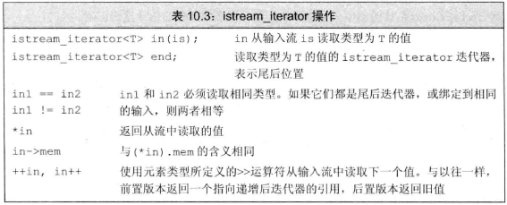

泛型算法可以用于不同类型的元素和多种容器类型(不仅包括标准库类型，也包括内置的数组类型)
# 1 概述
大部分算法都定义在头文件algorithm中，少部分数值泛型算法定义在numeric头文件中。

算法一般不直接操作容器，而是遍历由两个迭代器指定的一个元素范围。

算法永远不会改变底层容器的大小

# 2 初识泛型算法
## 2.1 只读算法
如定义在numeric头文件中的accumulate，只接受3个参数。前两个指出需要求和的元素范围，第三格是和的初值。该算法只会读取其输入范围内的元素，而不改变元素。
```cpp
int sum = accumulate(vec.cbegin(), vec.cend(), 0);
string sum = accumulate(svec.cbegin(), svec.cend(), string(""));//最后一个参数不能是字符串字面值，const char*没有+运算符
```
accumulate函数将第三个参数作为求和起点，必须假定将元素类型加到初值的类型上的操作是可行的。

又如只读算法equal，用来比较第一个序列中的每一个元素和第二个序列中的靠前的所有对应元素。全部相等则返回true，反之返回false
```cpp
equal(vec1.cbegin(), vec1.cend(), vec2.cbegin());//vec2至少与前两个参数间的范围一样长
```
接受两个序列的函数所需要的代表两个序列的迭代器所对应容器类型不一定要相同，甚至两容器各自的元素类型也不一定相同。只要能进行比对应操作(如这里的比较)就可以。如果该函数仅接受三个参数：前两个表示第一个序列，第三个参数表示第二个序列的首元素，则通常要求第二个序列至少与第一个一样长。

## 2.2 写容器元素的算法
必须确保序列原大小至少不小于我们要求算法写入的元素数目
- fill算法接受一对迭代器表示一个范围，还接受一个值作为第三个参数。fill算法将这个值赋予输入范围中的每个元素
    ```cpp
    fill (vec.begin(), vec.begin() + vec.size()/2, 10);//前一半赋10
    ```
    这种算法本质上并不危险，因为该算法直接向某个范围写入元素
- fill_n算法接受一个迭代器、一个计数值和一个值，其假定写入指定个值是安全的
    ```cpp
    fill_n(vec.begin(), n, val);//假定vec至少包含n个元素
    ```
    这种算法就比较危险了，必须保证容器的size不小于n
- back_inserter(定义在头文件iterator中)

    接受一个指向容器的引用，返回一个与该容器绑定的插入迭代器。当我们通过此迭代器赋值时，赋值运算符会调用push_back添加元素：
    ```cpp
    vector<int> vec;
    auto it = back_inserter(vec);
    *it = 42;//目前vec含有1个元素42
    ```
    我们同样可以将back_inserter这一特殊的迭代器作为参数调用泛型算法：
    ```cpp
    vector<int> vec;
    fill_n(back_inserter(vec), 10, 0);//添加10个0到vec
    ```
    相当于进行10次 *it = 0; it = back_inserter(vec);
- 拷贝算法

    将输入范围(前两个迭代器)中的元素拷贝到目的序列(以第三个参数开头)，返回所有拷贝元素之后的值。目的序列至少要包含与输入序列一样多的元素。
    ```cpp
    int a1[] = {0, 1, 2, 3, 4, 5, 6, 7, 8, 9};
    int a2[sizeof(a1) / sizeof(*a1)];//sizeof(a1)返回数组所占字节数，共40；sizeof(*a1)返回*a1所指元素(数组首元素)所占字节数，为4
    auto ret = copy(begin(a1), end(a1), a2);//把a1拷贝给a2，ret指向end(a2)
    ```
    许多算法都提供拷贝副本：
    ```cpp
    replace(ilist.begin(), ilist.end(), 0, 42);//将ilist中所有0替换为42
    replace_copy(ilist.cbegin(), ilist.cend(),back_inserter(ivec), 0, 42);//ilist不变，ivec包含ilist的拷贝，只是把所有0替换成42
    ```
## 2.3 重排容器元素的算法
假设我们有一个随机排列、有重复的字符串vector，我们想输出一个按字母顺序排列，无重复的字符串vector
1. sort
    ```cpp
    sort(words.begin(), words.end());
    ```
2. unique

    unique将容器分为不重复区域和重复区域(如果存在的话)，并返回指向不重复区域之后第一个位置的迭代器，但unique**并不删除任何元素**。
    ```cpp
    auto end_unique = unique(words.begin(), words.end());
    ```
3. erase

    删除end_unique到words末尾
    ```cpp
    words.erase(end_unique, words.end());
    ```

# 3 定制操作
## 3.1 向算法传递函数
sort算法拥有一个可以接受**谓词**作为第三个参数的版本。谓词可分为**一元谓词**和**二元谓词**。对于sort算法来说，可以接受一个函数作为二元谓词。如：
```cpp
bool isShorter(const string &s1, const string &s2) {
    return s1.size() < s2.size();
}

sort(words.begin(), words.end(), isShorter);//按长短由短至长排序words，但不关注等长字符串间的顺序
```
上例中的sort算法不关注等长字符串间的顺序，如果我们希望等长字符串的顺序依旧保持之前words中的顺序(preserve the relative ordering of equivalent elements)，可使用stable_sort算法
```cpp
stablesort(words.begin(), words.end(), isShorter);
```
## 3.2 lambda表达式
有时候我们需要与算法要求谓词不同数量的参数，这时可以使用lambda表达式。

以find_if算法为例，它接受一对迭代器+一个**一元谓词**。该算法返回第一个使谓词返回非0值的元素，如果全0返回find_if的第二个参数。因为仅接受一元谓词，故find_if无法接受一个用于比较字符串长度和待定长度的函数(需要两个字符串、长度两个参数)。此时需要使用lambda。

- 介绍lambda

    我们可以理解lambda表达式为一个未命名的内联函数:
    ```cpp
    [capture list] (parameter list) -> return type { function body }
    ```
    与普通函数不同，lambda必须使用[尾置返回类型](./06_函数.md#33-返回数组指针)来指定返回类型。但我们也可以忽略参数列表(如果不需要参数)和返回类型，但必须永远包含捕获列表和函数体。如果lambda的函数体包含任何单一return语句之外的内容，且未指定返回类型，则返回void

- 向lambda传递参数

    lambda不允许有默认参数。空捕获列表表示此lambda不适用它所在函数(不是指lambda函数体重的局部变量，而是如main之类的函数中)中的任何局部变量。按字符串长短排序的函数可写为
    ```cpp
    sort(words.begin(), words.end(), [] (const string &a, const string &b) { return a.size() < b.size(); });
    ```

- 使用捕获列表

    下面使用lambda构造一个名义上仅接受字符串一个参数，但实际上还捕获另一个长度参数的函数，用于比较该字符串与指定长度的大小关系：
    ```cpp
    vector<string> words{"hello", "my", "world", "lovely"};
    //先按从短到长排序
    sort(words.begin(), words.end(), [](const string &a, const string &b) { return a.size() < b.size(); });
    //设置一个待捕获的长度变量
    vector<string>::size_type sz = 4;
    //wc指向第一个长度比sz大的字符串
    auto wc = find_if(words.begin(), words.end(), [sz](const string &a) { return a.size() > sz; });
    //输出 hello world lovely 
    while (wc != words.end()) {
        cout << *wc << " ";
        ++wc;
    }
    ```
- for_each算法

    上例的最后输出时也可采用泛型算法：
    ```cpp
    for_each(wc, words.end(), [](const string &s) { cout << s << " "; });

    ```
    输出结果相同，此处cout也可以利用引用捕获(见下一节)来传递
## 3.3 lambda捕获和返回
当向一个函数传递一个lambda时，同时定义了一个新类类型和该类的一个对象。传递的参数就是此编译器生成的类类型的未命名对象。默认情况下，从lambda生成的类都包含一个对该lambda所捕获的变量的数据成员。

- 值捕获

    与传值参数类似，只要变量可以拷贝，lambda捕获的值采用的是拷贝方式。注意在创建lambda时就已经拷贝了
    ```cpp
    size_t v1 = 42;
    auto f = [v1]() { return v1; };
    v1 = 0;
    cout << f();//lambda为可调用对象，需要加括号
    ```
    输出42
- 引用捕获

    我们也可以采用引用方式捕获变量：
    ```cpp
    size_t v1 = 42;
    auto f2 = [&v1]() { return v1; };
    v1 = 0;
    cout << f2();//lambda为可调用对象，需要加括号
    ```
    输出0；但需要注意：由于是引用捕获，当被捕获的原变量(更准确地说是局部变量)不复存在时会导致错误。另外不可拷贝的对象(如ostream对象)只能通过引用捕获，如：
    ```cpp
    //os和c以及words必须是当前函数的局部变量
    for_each(words.begin(), words.end(), [&os, c] (const string &s) { os << s << c; });
    ```
- 隐式捕获

    

- 可变lambda

    1. 采用值捕获的变量，如果想要在lambda中改变其值，需要在参数列表**之后**加上关键字 mutable
        ```cpp
        size_t v1 = 42;
        auto f = [v1] () mutable {return ++v1;};
        v1 = 0;
        auto j = f();//j为43
        ```
    2. 采用引用捕获的变量能否改变取决于其引用指向的是否const。且lambda函数体在调用后才运行
        ```cpp
        size_t v1 = 42;
        auto f2 = [&v1] () mutable {return ++v1;};
        v1 = 0;
        auto j = f();//j为1
        ```
        注意j为1
- 指定lambda返回类型

    用于当函数体内不仅有一个return语句时：
    ```cpp
    transform(vi.begin(), vi.end(), vi.begin(), [](int i) -> int {
        if (i < 0)
        return -i;
        else
        return i; });
    ```
    用于将所有负数转化为其绝对值。此处必须指定lambda返回类型。在lambda函数体内不只一条return语句时，默认返回类型为void

## 3.4 参数绑定
- 标准库bind函数（定义在functional头文件中）

    可以解决某些函数明明需要多个参数，但由于类似find_if中的谓词限制，仅能接受一个参数的问题。
    ```cpp
    auto newCallable = bind(callable, arg_list);
    ```
    其中callable为需要多个参数的函数/其他可调用对象；arg_list对应callable的参数表，其中依旧是newCallable参数的，依次用占位符placeholders表示，如 _1, _2
    ```cpp
    bool check_size(const string  &s, string::size_type sz) {
        return s.size() >= sz;
    }
    auto check6 = bind(check_size, _1, 6);//check6(s)相当于check(s, 6)
    ```
    而对于之前的find_if问题也就存在两种等价写法：
    ```cpp
    int sz = 6;
    auto wc = find_if(words.begin(), words.end(), [sz](const string &a) { return a.size() > sz; });
    auto wx = find_if(words.begin(), words.end(), bind(check_size, _1, sz));
    ```
- 使用placeholders

    所有placeholders定义在std::placeholders命名空间中，所以在使用占位符时，要么每一个占位符都声明，如：
    ```cpp
    using std::placeholders:_1;
    ```
    要么统一声明：
    ```cpp
    using namespace std::placeholders;
    ```

- bind 的参数

    我们用bind不仅可以修正参数的数量，还可以重新安排参数顺序
    ```cpp
    auto g = bind(f, a, b, _2, c, _1);//g(_1, _2)相当于f(a, b, _2, c, _1)
    ```
- 绑定引用参数

    默认情况下，bind那些不是占位符的参数会被拷贝到bind返回的新调用对象中。此时就需要使用标准库ref函数：
    ```cpp
    //先定义一个多参数函数
    ostream &print(ostream &os, const string &s, char c) {
        return os << s << c;
    }
    ostream &os = cout;
    char c = ' ';
    //等价写法1
    for_each(words.begin(), words.end(), [&os, c] (const string &s) { os << s << c; });
    //等价写法2
    for_each(words.begin(), words.end(), bind(print, ref(os), _1, c));
    ```
    标准库中还有一个cref函数用于生成const引用。

# 4 再探迭代器
下列迭代器均定义在iterator头文件中。
## 4.1 插入迭代器
- ```back_inserter```:创建一个调用push_back的迭代器
- ```front_inserter```:创建一个调用push_front的迭代器
- ```inserter```:创建一个调用insert的迭代器，接受两个参数：容器，指向该容器某元素的迭代器。元素将被插入到该迭代器所指元素之前。

```cpp
list<int> lst = {1, 2, 3, 4};
list<int> lst2, lst3, lst4, lst5;
copy(lst.cbegin(), lst.cend(), back_inserter(lst2)); // 1 2 3 4
copy(lst.cbegin(), lst.cend(), front_inserter(lst3)); // 4 3 2 1
copy(lst.cbegin(), lst.cend(), inserter(lst4,lst4.begin())); // 1 2 3 4
copy(lst.cbegin(), lst.cend(), inserter(lst5,lst5.end())); // 1 2 3 4
```
对于front_inserter永远将新元素插入到当前的首元素之前，故呈现的是倒序形式

## 4.2 iostream迭代器
istream_iterator读取输入流，ostream_iterator向一个输出流写数据。这些迭代器将它们对应的流当做一个特定类型的元素序列来处理。
- instream_iterator操作

    
    
    ```cpp
    ifstream in("inFile"); //初始化一个从文件中读取的文件流
    istream_iterator<string> str_iter(in); //从"inFile"文件中读取字符串
    istream_iterator<int> in_iter(cin); //从cin读取int
    istream_iterator<int> eof; // 默认初始化迭代器为尾后迭代器，当某个流迭代器与尾后迭代器相等时表示无数据可供读取
    vector<int> vec;
    while (in_iter != eof)
        vec.push_back(*in_iter++);
    ```
    此循环从cin流中读取int值，保存在vec中。默认流迭代器相当于空迭代器，表示无数据可读 或 遇到文件尾 及 遇到IO错误。因此可以如下重写程序：
    ```cpp
    istream_iterator<int> in_iter(cin), eof;
    vector<int> vec(in_iter, eof);
    ```
- 使用算法操作流迭代器

    如对输入流中所有int型计算和
    ```cpp
    istream_iterator<int> in_iter(cin), eof;
    cout << accumulate(in_iter, eof, 0);//accumulate定义在numeric头文件中
    ```
- istream_iterator允许使用懒惰求值

    迭代器绑定到某一个流时，并不保证迭代器立刻从流读取数据。而能保证的是在我们**第一次解引用迭代器之前**，从流中读取数据的操作已经完成了。

- ostream_iterator操作

    
    
    ostream_iterator可以接受第二个参数，该参数可以是字符串字面值或者一个指向以空字符结尾的字符数组的指针(字符数组名)，该字符串会在输出每个元素后自动打印。同时ostream_iterator不允许默认初始化。
    ```cpp  
    vector<int> vec = {1, 2, 3, 4, 5};
    ostream_iterator<int> out_iter(cout, " ");
    for (auto e : vec)
        *out_iter++ = e;//直接输出元素和" "
    ```
    最后一条语句中的 * 和 ++ 对该迭代器对象没有任何影响，完全可以写成```out_iter = e;```。但是为了保证与一般迭代器操作相同，建议加上。

    或者不用循环，直接用copy算法打印所有元素：
    ```cpp
    vector<int> vec = {1, 2, 3, 4, 5};
    ostream_iterator<int> out_iter(cout, " ");
    copy(vec.begin(), vec.end(), out_iter);
    ```
- 使用流迭代器处理类类型

    我们可以为任何定义了输入运算符(>>)的类型创建istream_iterator对象，可以为任何定义了输出运算符(<<)的类型创建ostream_iterator对象。此处可用```in_iter->mem```

## 4.3 反向迭代器
在容器中从尾元素向首元素反向移动的迭代器。递增递减的含义也会颠倒过来。递增一个反向迭代器(++it)会移动到前一个元素，递减一个反向迭代器(--it)会移动到下一个元素。

除了forward_list之外，其他容器都支持反向迭代器。我们可以调用rbegin/crbegin，和rend/crend成员函数分别表示尾元素和售前元素的迭代器，且有非const/const版本。

- 使用反向迭代器

    使用反向迭代器往往会反向改变泛型算法的效果，因为反向迭代器递增实际指向前一个元素：
    ```cpp
    vector<int> vec{1, 4, 2, 5, 3, 0};
    sort(vec.begin(), vec.end());//0 1 2 3 4 5
    sort(vec.rbegin(), vec.rend());//5 4 3 2 1 0
    ```
    流迭代器不支持递减操作，但是反向迭代器支持递减运算符。因此，不可能从一个forward_list或一个流迭代器创建反向迭代器

- 反向迭代器和其他迭代器的关系

    假定有一个名为line的string，保存着若干个由逗号分隔的单词。下面程序用于打印第一个单词：
    ```cpp
    //comma指向第一个逗号或等于line.cend()（如果没有逗号的话）
    auto comma = find(line.cbegin(), line.cend(), ',');
    cout << string(line.cbegin(), comma);
    ```
    而如果希望打印最后一个单词，可以改用反向迭代器
    ```cpp
    //rcomma指向最后一个逗号或line.crend()
    auto rcomma = find(line.crbegin(), line.crend(), ',');
    cout << string(line.crbegin(), rcomma);//错误！！！反向打印最后一个单词
    cout << string(rcomma.base(), line.cend());//正确，打印最后一个单词
    ```
    rcomma是指向最后一个逗号的反向迭代器，而rcomma.base()是指向最后一个逗号之后的元素的普通迭代器。可以理解为reverse_iterator的base成员函数可以将crbegin()转化为cend()，如图：
    
    
    
# 5 泛型算法结构
每个泛型算法都会指明其迭代器参数的最小类别。迭代器类别见下表:


## 5.1 5类迭代器
如find算法在一个序列上进行以便扫描。对元素进行只读操作，因此至少需要**输入迭代器**；replace函数至少需要一对**前向迭代器**。

每个迭代器类别具体见P366

## 5.2 算法形参模式
大多数算法所接受的参数都是以下形式：


- 接受单个目标迭代器的算法

    dest参数是一个表示算法可以写入的目的位置的迭代器。算法假定按需要写入不管多少个数据都是安全的。常见的dest参数有插入迭代器/ostream_iterator。
- 接受第二个输入序列的算法

    接受单独的beg2或beg2和end2通常使用第二个范围中的元素与第一个范围结合起来进行一些运算。
## 5.3 算法命名规范
- 一些算法使用重载形式传递一个谓词
    ```cpp
    unique(beg, end);//调用元素类型的==运算符来检查重复元素
    unique(beg, end, comp);//调用谓词comp比较
    ```
- _if版本的算法

    接受谓词参数的版本都有附加的_if后缀
    ```cpp
    find(beg, end, val); //查找输入范围中val第一次出现的位置
    find_if(beg, end, val); //查找第一个令pred为真的元素
    ```
    之所以不利用重载来处理这个问题，是因为参数数量相同，需要避免歧义。
- 区分拷贝元素的版本和不拷贝的版本

    重拍元素的算法将重拍后的元素写回给定的输入序列(不拷贝)或写入一个指定的输出目的(拷贝)
- 同时提供_copy和_if版本

    ```cpp
    //从v1中删除奇数元素
    remove_if(v1.begin(), v1.end(), [] (int i) {return i % 2;}); 
    //将偶数元素从v1拷贝到v2(或者说将remove过奇数元素的v1拷贝到v2)，v1不变
    remove_copy_if(v1.begin(), v1.end(), back_inserter(v2),
                    [] (int i) {return i % 2;});
    ```

# 6 特定容器算法
部分通用版本的算法，如sort，要求参数是**随机访问迭代器**，因此不能用于list和forward_list。其他算法的通用版本可以用于链表，但是代价太高，不如用链表版本的算法。


- splice成员


链表特有算法会改变底层的容器大小，而通用版本不会。
```cpp
vector<int> vec{0, 1, 2, 3, 4, 5};
list<int> lst{0, 1, 2, 3, 4, 5};
//返回指向未删除元素之后的第一个元素的迭代器
auto newEnd = remove_if(vec.begin(), vec.end(), [](const int i) { return i == 2; });
//输出 0 1 3 4 5 5，说明通用版本未改变容器大小
for_each(vec.begin(), vec.end(), [](const int i) { cout << i << " "; });
cout << endl;
//输出 0 1 3 4 5
for_each(vec.begin(), newEnd, [](const int i) { cout << i << " "; });
cout << endl;
//链表特有版本
lst.remove_if([](const int i) { return i == 2; });
//输出 0 1 3 4 5，说明链表特有版本改变了容器大小
for_each(lst.begin(), lst.end(), [](const int i) { cout << i << " "; });
```