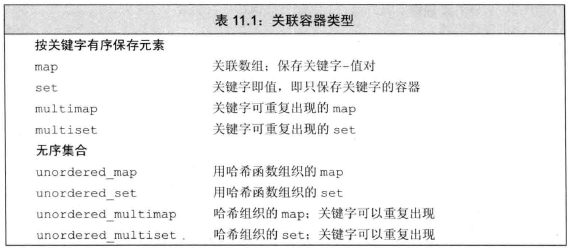
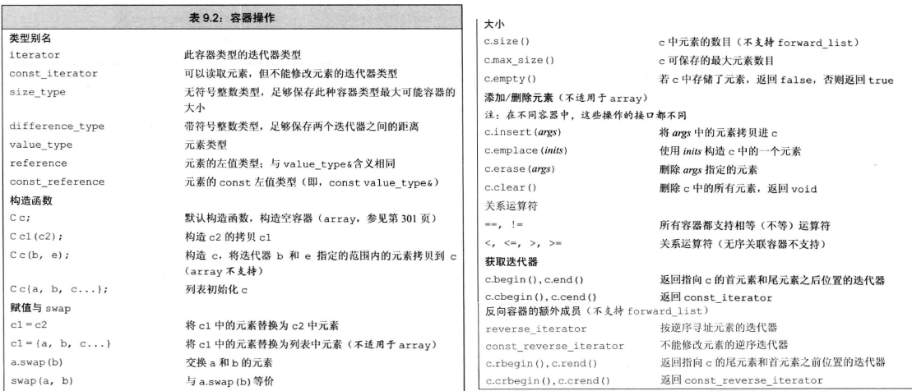
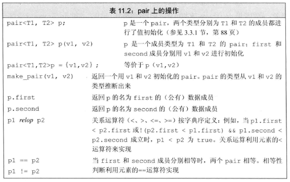
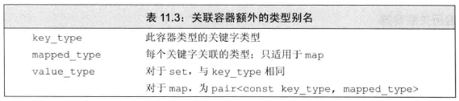
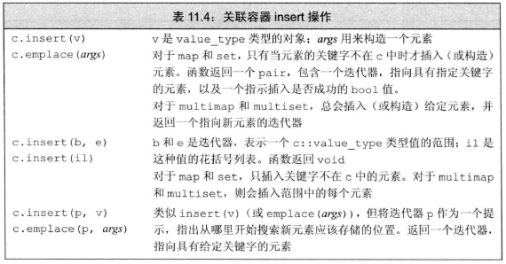
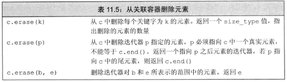
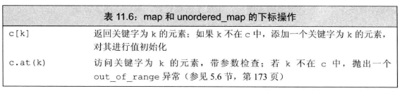
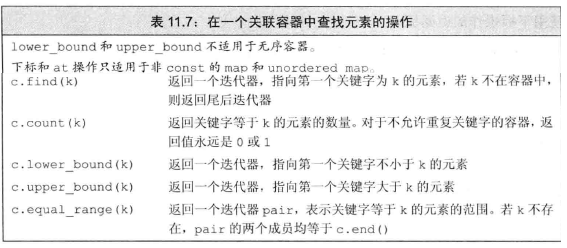
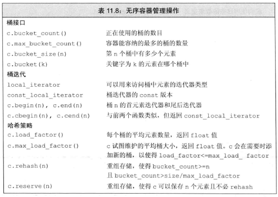

关联容器中的元素是按照关键字来保存和访问的，而顺序容器中的元素是按他们在容器中的位置来顺序保存和访问。

两个主要的关联容器类型是**map**和**set**。map中的元素是一些key-value对：关键字起到索引的引用，值则表示与索引相关联的数据。set中每个元素只包含一个关键字：set支持高效的关键字查询操作。注意需要声明命名空间std。

标准库中提供的8个关联容器：



其中map和multimap定义在头文件map中，set和multiset定义在头文件set中，无序容器则定义在头文件unordered_map和unordered_set中。

# 1 使用关联容器
map也被称为associative array。如果给定一个名字到电话号码的map，我们可以使用一个人的名字作为下标来获取此人的电话号码。

set常用于查询某值是否存在于某集合中。

- 使用map

    单词计数程序：
    ```cpp
    map<string, size_t> word_count;
    string word;
    while(cin >> word)
        ++word_vount[word];//如果word还未早该map中，自动创建值为0的元素
    //范围for每次会从map中提取一个pair类型对象
    for (const auto &w : word_count)
        cout << w.first << " occurs " << w.second 
             << ((w.second > 1) ? " times" : " time") << endl;
    ```
- 使用set

    仅统计不常用单词(不在某个集合中的单词)的出现次数
    ```cpp
    map<string, size_t> word_count;
    set<string> exclude = {"The", "A"};
    string word;
    while( cin >> word)
        if (exclude.find(word) == exclude.end())
            ++word_count[word];
    ```
    find返回一个迭代器，如果给定关键字在set中，迭代器指向该关键字；否则返回尾后迭代器。

# 2 关联容器概述
关联容器支持所有表9.2中的操作：



但不支持push_front或push_back之类的顺序容器的位置相关操作。

## 2.1 定义关联容器
定义一个map时，必须既指明关键字类型又指明值类型；而定义一个set时，只需指明关键字类型。
```cpp
map<string, string> authors = {{"Surname", "Given name"}, {"Vorname", "Familienname"}};
```

- 初始化multimap或multiset

    一个map或set中的关键字必须是唯一的，即对于一个给定的关键字，只能由一个元素的关键字等于它。而multimap和multiset没有此限制。
    ```cpp
    vector<int> ivec{1, 1, 2, 2, 3, 3, 4, 4, 5, 5};
    set<int> iset(ivec.cbegin(), ivec.cend());
    multiset<int> miset(ivec.cbegin(), ivec.cend());
    cout << ivec.size() << endl; // 10
    cout << iset.size() << endl; // 5
    cout << miset.size() << endl; // 10
    ```

## 2.2 关键字类型的要求
对于有序容器——map,set,multimap,multiset，关键字类型必须定义元素比较的方法，通常要求定义了 运算符< 或者 使用关键字类型的比较函数 的类型。这样才能将这些元素的顺序定义出来。

- 使用关键字类型的比较函数

    ```cpp
    class Sales_data {
    public:
        explicit Sales_data(int num) : isbn(num) { }
        int isbn;
    };

    bool compareIsbn(const Sales_data &lhs, const Sales_data &rhs) {
        return lhs.isbn < rhs.isbn;
    }

    int main() {
        Sales_data a(30), b(20);
        multiset<Sales_data, decltype(compareIsbn) *> bookstore(compareIsbn);
        bookstore.emplace(a);
        bookstore.emplace(b);
        for (auto book : bookstore) {
            cout << book.isbn << " "; //依次输出20 30
        }
        return 0;
    }
    ```
    在我们使用自定义的关键字类型比较函数时，set接受2个类型：关键字类型以及一个指向比较函数的函数指针。并需要在括号中指出比较函数compareIsbn(会自动转化为表示函数地址的指针)来初始化这些元素排序。**注意如果```compareIsbn```和```bookstore```是同一个类的两个对象，则需要把```compareIsbn```设定为静态成员，并且声明```bookstore```时使用大括号包含```compareIsbn```，防止bookstore被认定为函数成员，见[Basket.h](./Exercise/15/Basket.h)**
    ```cpp
    Sales_data a(30), b(20);
    map<Sales_data, int, decltype(compareIsbn) *> bookstore(compareIsbn);
    bookstore[a] = 5;
    bookstore[b] = 6;
    for (auto book : bookstore) {
        cout << book.first.isbn << " " << book.second << endl; //依次输出20 6, 30 5
    }
    ```
    类似地，map接受3个类型，比较函数的函数指针类型位于最后。
### 练习 11.10
可以定义 ```vector<int>::iterator``` 到 ```int``` 的map，但是不能定义 ```list<int>::iterator``` 到 ```int``` 的map。因为map的键必须实现 ```<``` 操作，list 的迭代器不支持比较运算(见[表3.7](./09_顺序容器.md#21-迭代器))。

### 练习 11.11
```cpp
using Less = bool (*)(const Sales_data &, const Sales_data &);
multiset<Sales_data, Less> bookstore(compareIsbn);
```

## 2.3 pair类型
范围for每次会从map中提取一个pair类型对象

与其他标准库类型不同，pair的数据成员是public的，两个成员分别命名为first和second。



- 返回pair对象的函数

    ```cpp
    pair<string, int> process(vector<string> &v) {
        if (!v.empty())
            return {v.back(), v.back().size()};
        else
            return pair<string, int>(); //返回一个空pair
    }
    ```

# 3 关联容器操作
除了所有容器都支持的类型别名(表9.2)外，


关联容器还定义了表11.3中列出的类型：



注：只有map类型(unordered_map, unordered_multimap, multimap和map)定义了mapped_type
```cpp
set<string>::value_type v1; // v1是个string
set<string>::key_type v2; // v2是个string
map<string, int>::value_type v3; // v3是个pair<const string, int>
map<string, int>::mapped_type v4; // v4是个int
```

## 3.1 关联容器迭代器
- map的迭代器中关键字是const的

    对map而言，解引用一个关联容器迭代器时，我们会得到一个pair对象。其first成员保存 **const**的关键字， second成员保存值，与map的value_type相同

- set的迭代器是const的

    对set而言，解引用一个关联容器迭代器时，我们会得到一个const的关键字尽管set同时定义了iterator和const_iterator，但两种类型都只允许只读访问set中的元素。

- 遍历关联容器

    map和set支持begin/end操作：
    ```cpp
    //word_count为一个建立好的map
    auto map_it = word_count.cbegin();
    while ( map_it != word_count.cend()) {
        cout << map_it->first << " occures "
             << map_it->second << " times" <<endl;
        ++map_it;
    }
    ```
    迭代器按关键字升序遍历元素。

- 关联容器和算法

    通常**不对关联容器使用泛型算法**。关键字是const这一特性意味着不能将关联容器传递给修改或重排容器元素的算法。使用关联容器定义的专用函数成员更适合。

    实际编程中，我们一般将关联容器当作源序列或目的位置。即用泛型copy算法将元素从一个关联容器拷贝到另一个序列，或调用inserter将一个插入器绑定到一个关联容器，并将其当作目的位置来调用另一个算法。

## 3.2 添加元素
```cpp
vector<int> ivec = {2,4,6,8,2,4,6,8};
set<int> set2;
set2.insert(ivec.cbegin(), ivec.cend()); // set2有4个元素：2 4 6 8
set2.insert({1,3,5,7,1,3,5,7});//set2有8个元素：1 2 3 4 5 6 7 8
```

- 向map添加元素

    对一个map进行insert操作的4种方法：
    ```cpp
    //向map对象插入{word,1}
    word_count.insert({word, 1});
    word_count.emplace(word, 1);//直接调用pair构造函数，不用加花括号
    world_count.insert(make_pair(word, 1));
    world_count.insert(pair<string, size_t>(word, 1));
    world_count.insert(map<string, size_t>::value_type(word, 1));
    ```
    
    

    注：当我们调用emplace操作时，会将参数传递给元素类型的构造函数。
- 检测insert的返回值

    添加单一元素的insert和emplace版本返回一个pair。其first成员是一个迭代器，指向具有给定关键字的元素；其second成员是bool对象，指出关键字是插入成功(1)还是之前就已经存在于容器中(0)
    ```cpp
    //一种更复杂的统计输入次数的办法
    map<string, size_t> word_count;
    string word;
    while (cin >> word) {
        auto ret = word_count.insert({word, 1});
        if(!ret.second)
            ++((ret.first)->second);//也可去掉所有括号
    }
    ```
    简化方法见[1.使用关联容器](#1-使用关联容器)

- 向multiset或multimap添加元素

    对于允许重复关键字的容器，接受单个元素的insert操作仅返回一个指向新元素的迭代器。

## 3.3 删除元素
关联容器定义了三个版本的erase：



后两个操作与顺序容器的元素删除类似，见[顺序容器删除元素](./09_顺序容器.md#33-删除元素暂不考虑forward_list)。区别在于关联容器的erase返回void

第一种操作接受一个key_type参数，并删除容器中所有匹配给定关键字的元素，并返回实际删除元素的数量。对于保存不重复关键字的容器(map/set)erase的返回值总是0或1。

## 3.4 map的下标操作
map和unordered_map支持的下标操作：



但set类型均不支持下标，multimap和unordered_multimap也不支持下标操作。且我们只能对非const的map使用下标操作。

- 使用下标操作的返回值

    通常情况下，解引用一个迭代器和下标运算符返回的类型是一样的。但是对于一个map进行下标操作，得到一个mapped_type对象(值)，解引用一个map迭代器时，会得到一个value_type对象(键值对)

    

    但与其他下标运算符相同的是，返回值依旧为左值。因此我们可以读/写元素

## 3.5 访问元素



- 对map使用find代替下标操作

    下标操作会自动添加尚不在关键字列表的元素，无法用于检测某个关键字是否在map中。此时应用find代替下标操作：
    ```cpp
    if (word_count.find(word) == word_count.end())
        cout << word << " is not in the map!";
    ```

- 在multimap或multiset中查找元素

    如给定一个从作者到著作题目的映射authors，想要打印一个作者的所有著作：
    ```cpp
    string search_item("Author_1");
    //方法1
    auto entries = authors.count(search_item);//著作数量
    auto iter = authors.find(search_item);//第一本书的迭代器
    while(entries) {
        cout << iter->second << endl;
        ++iter;
        --entries;
    }
    //方法2
    for (auto beg = authors.lower_bound(search_item), end = authors.upper_bound(search_item); beg != end; ++beg)
        cout << beg->second << endl;
    //方法3,equal_range返回一个pair，其两个元素分别表示等于某元素的头/尾后迭代器
    for (auto pos = authors.equal_range(search_item), pos.first != pos.second; ++ pos.first)
        cout << pos.first->second << endl;
    ```
## 3.6 一个单词转换的map
[word_transform.cpp](./Exercise/11/word_transform.cpp)

# 4 无序容器
使用**哈希函数**和**运算符==**来组织元素。

- 使用无序容器

    无序容器允许相应的有序容器的相关操作。所以通常可以用一个无序容器替换对应的有序容器。但此时遍历的输出一般情况下就是无序的。

- 管理桶

    哈希函数总是将同一个参数映射到一个桶中，但是也有可能将不同参数映射到同一个桶中。类似字典，每个首字母代表一个桶，不同单词可能分到同一个桶中。因此无序容器的组织形式上就是若干个不同的桶，每个桶中保存0个或多个元素。
    
    

- 无序容器对关键字类型的要求

    默认情况下，无序容器使用关键字的```==```运算符和```hash<key_type>```模板来比较元素。标准库为**内置类型、string和智能指针类型**定义了```hash```模板。这样就可以直接为这些类型的关键字生成哈希值，也就可以直接定义这些类型关键字的无序容器。但对于关键字类型为自定义类型的无序容器，则需要提供自己的hash模板(见16.5)

    现在我们不用默认的hash模板，而类似[为有序容器重载关键字类型的默认比较操作](#22-关键字类型的要求)。我们需要提供函数来替代==运算符和哈希函数：
    ```cpp
    class Sales_data {
    public:
        explicit Sales_data(int num) : isbn(num) { }
        int isbn;
    };
    //哈希函数
    size_t hasher(const Sales_data &sd) {
        //相当于Sales_data的哈希值基于该类某一个数据成员的哈希值
        return hash<int>() (sd.isbn);
    }
    //代替==运算符的函数
    bool eqOp(const Sales_data &lhs, const Sales_data &rhs) {
        return lhs.isbn == rhs.isbn;
    }

    Sales_data a(50), b(40);
    using SD_multiset = unordered_multiset<Sales_data, decltype(hasher)*, decltype(eqOp)*>;
    SD_multiset bookstore(42, hasher, eqOp);//42为桶大小
    bookstore.emplace(a);
    bookstore.emplace(b);
    cout << bookstore.bucket(a) << endl;
    cout << bookstore.bucket(b) << endl;
    cout << bookstore.max_load_factor() << endl;
    ```
