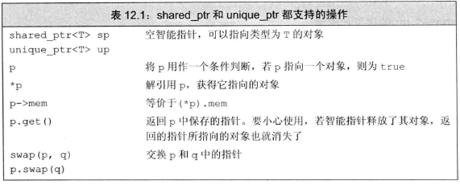
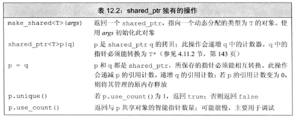
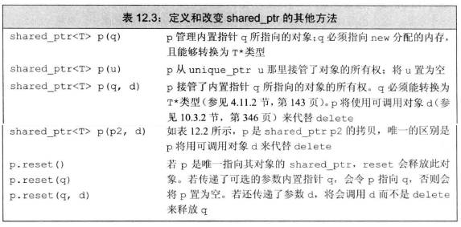
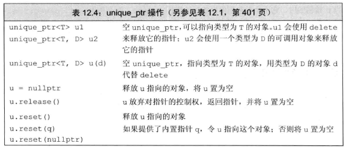
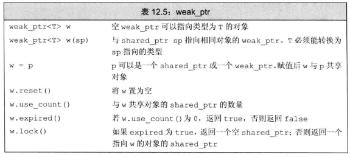
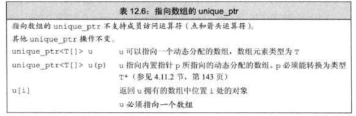
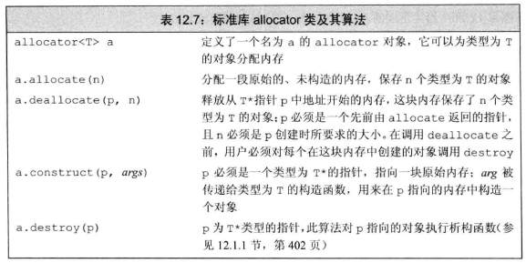
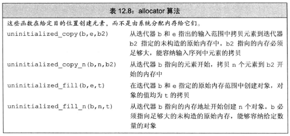

- 全局对象：程序启动时分配，程序结束时销毁
- 局部自动对象：进入定义所在的程序块时被创建，在离开块时销毁
- 局部static对象：第一次使用前分配，程序结束时销毁
- 动态分配对象：生存期与在哪里创建无关，只有当显式地被释放时，对象才会被销毁。

程序中有静态内存、栈内存和堆(heap)。
- 静态内存：用来存储局部static对象、类static数据成员以及定义在任何函数之外的变量。
- 栈内存：用来保存定义在函数内的非static对象。
- 堆：用来存储动态分配的对象

# 1 动态内存与智能指针
管理动态内存的运算符
1. ```new```:在动态内存中为对象分配空间并返回一个指向该对象的指针
2. ```delete```: 接受一个动态对象的指针，销毁该对象，并释放与之关联的内存

为了更容易更安全地使用动态内存，新的标准库提供了两种智能指针来管理动态对象。其类似常规指针，但是负责自动释放所指向的对象。(智能指针shared_ptr, unique_ptr, weak_ptr均定义在memory头文件中)



## 1.1 shared_ptr类(允许多个指针指向同一个对象)
智能指针也是模板，需要接受一个可以指向的类型：
```cpp
shared_ptr<string> p1;//指向string
shared_ptr<list<int>> p2; //指向int的list
```



- make_shared函数
    
    类似顺序容器的emplace成员，利用参数构造给定类型的对象
    ```cpp
    shared_ptr<int> p3 = make_shared<int> 42;//指向一个值为42的int的shared_ptr
    shared_ptr<string> p4 = make_shared<string>(2, '9');//指向"99"
    shared_ptr<int> p5 = make_shared<int>();//被值初始化，指向0
    auto p6 = make_shared<vector<string>>();
    ```
- shared_ptr的拷贝和赋值

    shared_ptr允许多个指针指向同一块内存，但并非指向同一块内存的两个shared_ptr就相互关联，见[不要使用get初始化另一个智能指针或为智能指针赋值](#13-shared_ptr和new结合使用)。也就是说shared_ptr之间相互关联，但不会因为指向同一块内存就相互关联。在进行拷贝或赋值操作时，每个shared_ptr会记录有多少个其他shared_ptr与其关联。我们可以认为每个shared_ptr都有一个关联的计数器，称为**引用计数 reference count**。每当拷贝该shared_count(包括将它作为参数传递给函数)时，计数器会递增；而当shared_ptr被销毁时(局部shared_ptr离开作用域或某个shared_ptr被赋新值时)，计数器会递减。一旦一个shared_ptr所指对象的计数器变为0，他就会自动释放自己所管理的对象。
    ```cpp
    auto p = make_shared<int>(42); //p所指向的变量只有p1个引用者
    auto q(p);//此对象有2个引用者
    auto r = make_shared<int>(42);//r指向的int只有一个引用者，尽管两个对象值相同
    r = q;//r原来所指对象已没有引用者,自动释放；p/q所指对象现有3个引用者
    ```

    如果将shared_ptr存放于一个容器中，而后不再需要全部元素。要记得用erase删除不再需要的那些元素。

- 使用动态生存期的资源的类
    1. 程序不知道自己需要使用多少对象(如vector之类的容器类的定义)
    2. 程序不知道所需对象的准确类型(见第15章)
    3. 程序需要在多个对象间共享数据

        一般情况下(如vector)，被拷贝的对象与生成的副本对象中的元素分离的。故当原对象被销毁时，其副本元素虽然不受影响，但已经不是原对象的元素了。如果我们希望拷贝一个类对象时，原对象及其拷贝共享元素(而不仅仅是值相同)：我们需要在类中定义一个shared_ptr对象，这样只要某个对象在被销毁前拷贝给别的副本了，且该副本仍未销毁，则共享元素，如：[12.1.1节练习](./Exercise/12/12_2.cpp)

## 1.2 直接管理内存(内置指针)
相对于智能指针，new和delete的操作非常容易出错。应尽量避免使用。
- 使用过new动态分配和初始化对象

    ```cpp
    int *pi = new int; //pi指向一个动态分配的，未初始化的无名int对象
    string *ps = new string(2, '1');//ps指向"11"
    vector<int> *pv = new vector<int>{1,2,3,4,5};
    ```
    默认初始化 VS [值初始化](./03_字符串_向量和数组.md#31-定义和初始化vector对象)
    ```cpp
    string *ps1 = new string;//默认初始化为空string
    string *ps = new string();//值初始化空string
    int *pi1 = new int; //默认初始化，*pi1值未定义
    int *pi2 = new int(); //值初始化，*pi2为0
    ```
    对于定义了构造函数的类类型(string)，值初始化和默认初始化都会调用默认构造函数。但对于内置类型，值初始化的内置类型均有良好定义的值。但默认初始化对象的值是未定义的。
    
    可以用auto来分配内存以产生与某对象同类型的指针
    ```cpp
    auto p1 = new auto(obj);//p指向一个与obj类型相同的对象
    ```

- 动态分配的const对象

    内置类型的const对象不能默认初始化，定义了默认构造函数的类类型可以默认初始化
    ```cpp
    const int *pci = new const int(1024);
    const string *pcs = new const string;
    ```
- 内存耗尽

    如果一个程序用光了所有可用的内存，new表达式就会失败。如果new不能分配出所要求的的内存空间，就会抛出一个类型为```bad_alloc```的[异常](./05_语句.md#63-标准异常)。我们可以改变使用new的方式来阻止它抛出异常：
    ```cpp
    int *p1 = new int;//如果分配失败，抛出bad_alloc异常
    int *p2 = new (notthrow) int;//如果分配失败，new返回一个空指针
    ```
    注：bad_alloc和notthrow都定义在头文件new中。

- 释放动态内存

    ```cpp
    delete p;//p必须指向一个动态分配的对象或是一个空指针
    ```

- 动态对象的生存期直到被释放为止

    1. shared_ptr管理的内存在最后一个shared_ptr销毁时会被自动释放
    2. 由new分配的动态对象，直到被显式释放前都是存在的。

## 1.3 shared_ptr和new结合使用
使用new返回的指针来初始化智能指针：
```cpp
shared_ptr<int> p1(new int(42));//直接初始化
shared_ptr<int> p2 = new int(42);//错误
```
从new返回的内置指针到智能指针的构造函数是explicit，因此必须使用直接初始化。返回值也是一样，不能直接返回new生成的指针
```cpp
shared_ptr<int> clone(int p) {
    return shared_ptr<int>(new int(p));
}
```



注意```shared_ptr<T> p(q, d)```，此处shared_ptr不再如默认状态时管理动态内存，也因此无法利用delete操作释放内存。

- 不要混合使用普通指针和智能指针

    ```cpp
    void process(shared_ptr<int> ptr) {
        ...
    }//ptr离开作用域，会被销毁，引用计数递减

    int *x(new int(1024));
    process(shared_ptr<int>(x));//使用临时shared_ptr,但函数调用完后该shared_ptr计数器为0
    int i = *x;//错误，x是个空悬指针
    ```
- 不要使用get初始化另一个智能指针或为智能指针赋值

    对于智能指针p：
    ```cpp
    p.get()//返回p中保存的指针,不过该指针是一个内置指针
    ```
    该函数用于向不能使用智能指针的代码传递一个指向智能指针管理对象(仍然是动态内存)的内置指针。
    ```cpp
    shared_ptr<int> p(new int(42));//引用计数为1
    int *q = p.get();//引用计数依旧为1
    {
        shared_ptr<int> r(q);//注意r和p相互独立但指向同一块内存，不共享引用计数
    }//该代码块结束后，r的引用计数递减至0，释放该内存
    int foo = *p;//未定义：p指向的内存已经被释放了
    ```
- 其他shared_ptr操作

    ```cpp
    shared_ptr<int> p(new int(42));
    p.reset(new int(1024));//释放之前所指内存，指向新内存
    ```
    reset会更新引用计数，并在必要时，释放p指向的对象。
## 1.4 智能指针和异常
使用智能指针时，即使程序块过早结束(如异常未被捕获)，智能指针类也能确保在内存不再需要时将其释放。而如果在new之后delete之前发生了异常且未被[catch](./05_语句.md#62-try语句块)，则该内存不会被释放。

智能指针基本规范：
1. 不使用相同的内置指针初始化/reset多个智能指针
2. 不delete get()返回的指针
3. 不使用get()初始化或reset另一个智能指针
4. 如果使用get()返回的指针，当最后一个对应的智能指针被销毁后，该内置指针就无效了
5. 如果智能指针管理的资源不是动态内存，记住传递一个删除器，见表12.3

## 1.5 unique_ptr
某个时刻只能由一个unique_ptr指向一个给定对象。当unique_ptr被销毁时，他所指向的对象也被销毁。



unique_ptr没有类似make_shared的标准库函数。我们需要将其绑定至一个new返回的指针。且必须直接初始化：
```cpp
unique_ptr<double> p1;//指向一个double的空unique_ptr
unique_ptr<int> p2(new int(42)); //p2指向一个值为42的int
```
unique_ptr拥有其指向的对象，因此**不支持**普通的拷贝或赋值操作。但我们可以通过调用release或reset将指针的所有权从一个(非const)unique_ptr转移给另一个unique_ptr:
```cpp
unique_ptr<int> p2(p1.release());//release将p1置空，并返回指针
unique_ptr<int> p3(new int(1024));
p2.reset(p3.release());//reset释放了p2原来指向的内存42, p3的所有权也转移给了p2
```
注意如果我们不用智能指针，而用内置类型来保存release返回的指针，需要负责资源的释放：
```cpp
p2.release();//错误，p2所指向的内存没被释放，而且p2与该对象的联系被切断
auto p = p2.release();//记得delete(p)
```

- 传递unique_ptr参数和返回unique_ptr

    不能拷贝unique_ptr的规则的例外：我们可以拷贝或赋值一个将要被销毁的unique_ptr。最常见的是从函数返回一个unique_ptr:
    ```cpp
    unique_ptr<int> clone(int p) {
        return unique_ptr<int>(new int(p));
    }
    //或者返回局部对象的拷贝
    unique_ptr<int> clone(int p) {
        unique_ptr<int> ret(new int(p));
        return ret;
    }
    ```

- 向unique_ptr传递删除器

    类似shared_ptr，unique_ptr会默认用delete释放它所指向的对象。类似[重载关联容器的比较操作](./11_关联容器.md#22-关键字类型的要求)，需要在尖括号中unique_ptr指向类型之后提供删除器类型，并提供一个该类型的可调用对象：
    ```cpp
    //fcn为类型是delT的可调用对象
    unique_ptr<objT, delT> p (new objT, fcn);
    ```
    delT可以写作```decltype(fcn)*```

## 1.6 weak_ptr
weak_ptr是一种不控制所指向对象生存期的智能指针，它指向 由shared_ptr管理的对象。将一个weak_ptr绑定到一个shared_ptr不会改变shared_ptr的引用计数，该释放的时候就得释放，即使weak_ptr指向对象。



由于对象可能不存在，我们不能使用weak_ptr直接访问对象，必须调用lock。因此可以用lock来检查某对象是否仍存在：
```cpp
shared_ptr<int> np = wp.lock()
//如果np不是一个空指针，即wp所指对象仍然存在
if (np) {
    ...
}
```

- 核查指针类
[练习12.19](./Exercise/12/12_19.cpp)

# 2 动态数组
为了支持一次为很多对象分配内存的功能，C++和标准库各提供了一种方法。C++语言定义了另一种new表达式语法，可以分配并初始化一个对象数组；标准库中包含了一个名为allocator的类，允许我们将分配和初始化分离。
## 2.1 new和数组
```cpp
int *pia = new int[42];//42为分配对象的数目，pia指向第一个对象
//或者使用类型别名
typedef int arrT[42];//arrT表示42个int的数组类型
int *p = new arrT;//等价于pia
```
- 分配一个数组会得到一个元素类型的指针

    由于分配的内存并不是一个数组类型，故不能调用begin或end，也不能用范围for语句，可以
    ```cpp
    size_t n = 5;
    int *p = new int [n];
    for (int *q = p; q != p + n; ++q) {...}
    ```
- 初始化动态分配对象的数组

    类似[分配单个对象](#12-直接管理内存内置指针)，默认情况下会默认初始化元素，而只要在后面跟上括号，就可以值初始化
    ```cpp
    int *pia = new int[10];//10个未初始化的int
    int *pia2 = new int[10]();//10个值初始化为0的int
    string *psa = new string[10];//10个空string
    string *psa2 = new string[10]();//10个空string
    ```
    新标准中，可以列表初始化
    ```cpp
    int *pia3 = new int[10]{0,1,2,3,4,5,6,7,8,9};
    ```
    列表初始化数目小于规定的元素数目，则剩余值初始化(此处不用加圆括号)；列表初始化数目大于规定的元素数目，则抛出```bad_array_new_length```异常
- 动态分配一个空数组是合法的

    ```cpp
    char arr[0];//错误，不能定义长度为0的数组
    char *cp = new char[0];//正确，但cp不能解引用
    ```
- 释放动态数组

    ```cpp
    delete p;//p必须指向一个动态分配的对象或为空
    delete [] pa;//pa必须指向一个动态分配的数组或为空
    ```
    动态数组的成员会按逆序销毁。
- 智能指针和动态数组(智能指针类型不支持指针算术运算)

    标准库提供了一个可以管理new分配的数组的unique_ptr版本：
    ```cpp
    unique_ptr<int[]> up(new int[10]);//up包含10个未初始化int的数组
    up.reset();//自动调用delete[]销毁指针，注意不应是书上的release
    ```

    
    
    与unique_ptr不同，shared_ptr不直接支持管理动态数组。如果希望使用shared_ptr管理一个动态数组，必须提供自己定义的删除器。
    ```cpp
    shared_ptr<int> sp(new int[10], [](int *p) { delete[] p;});
    sp.reset();//使用我们提供的lambda释放数组
    ```
    如果未提供删除器，会调用(不带方括号的)delete释放动态数组，会报错。

    shared_ptr未定义下标运算符，且智能指针类型不支持指针算术运算。故必须用get获取一个内置指针，然后用它来访问数组元素。

## 2.2 allocator类
new将内存分配和对象构造组合在了一起，delete将对象析构和内存释放组合在一起。但在分配一大块内存时，我们希望将内存分配和对象构造分离。这样我们才能只在真正需要时才真正执行对象创建操作。更重要的是，没有默认构造函数的类就不能动态分配数组了。

- allocator类(定义在头文件memory中)

    allocator分配的内存是原始的，未构造的。allocator只是个可以分配指定类型内存的分配器，并不存储数据，需要及时存储指针管理数据。一个allocator可以分配多个内存空间。

    
    
- allocator分配未构造的内存
    
    allocator是个模板
    ```cpp
    allocator<string> alloc;
    auto const p = alloc.allocate(n);//p指向首元素
    auto q = p;//q不是const
    alloc.construct(q++);//*q为空字符串
    alloc.construct(q++, 5, 'c');//*q为ccccc
    alloc.construct(q++, "hi");//*q为hi
    cout << *q << endl;//错误：q指向未构造的内存
    ...
    //当我们用完对象后，必须对每个构造的元素调用destroy来销毁它们
    while (q != p) //q指向最后构造的元素之后的位置
        alloc.destroy(--q);//最后一步：q = p; destroy(p); 
    //之后还可以重新使用已销毁对象的内存保存其他string
    //或者将其归还给系统
    alloc.deallocate(p, n);
    ```

- 拷贝和填充未初始化内存的算法

    
    
    返回值是一个迭代器，指向构造的最后一个元素之后的元素
    ```cpp
    vector<int> vi = {1,2,3,4,5};
    auto p = alloc.allocate(vi.size() * 2);
    //前一半插入vi的所有元素,q指向构造后的
    auto q = uninitialized_copy(vi.begin(), vi.end(), p)
    //后一半初始化为42
    uninitialized_fill_n(q, vi.size(), 42);
    ```

# 3 使用标准库：文本查询程序
目的：允许用户在一个给定文件中查询单词，查询结果是单词在文件中出现的次数及其所在行的列表。如果一个单词在一行中出现多次，此行出现一次，且行序升序输出。

实现过程：共创建 TextQuery 和 QueryResult两个类。其中TextQuery对象包含2个数据成员(以给定文件每行字符串为元素的vector；以及在存储文本信息时创建的map，其键为单词，其值为出现行号的集合)，QueryResult对象包含3个数据成员(待查询单词；该单词在TextQuery对象中map中对应的值，即一个集合；以给定文件每行字符串为元素的vector，为了输出含该该单词的每一行的所有内容)。由于我们不希望拷贝字符串vector或set。我们将set和vector声明为shared_ptr实现共享。

头文件：[Query.h](./Exercise/12/Query.h)

实现文件：[Query.cpp](./Exercise/12/Query.cpp)

主函数：[QueryMain.cpp](./Exercise/12/QueryMain.cpp)

```
g++ -o query.exe .\Query.cpp .\QueryMain.cpp
.\query.exe
```