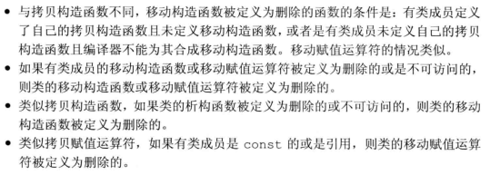

用于显式或隐式指定对象的拷贝、移动、赋值和销毁，一个类定义了5种特殊的成员函数作为拷贝控制成员：拷贝构造函数(copy constructor)、拷贝赋值运算符(copy-assignment operator)、移动构造函数(move constructor)、移动赋值运算符(move-assignment operator)和析构函数(destructor)。

如果一个类没有定义所有这些拷贝控制成员，编译器也会自动为它定义缺失的操作。
# 1 拷贝、赋值与销毁
## 1.1 拷贝构造函数
如果一个构造函数第一个参数是自身类型的**引用**，且任何额外参数都有默认值，则该构造函数是**拷贝构造函数**。
```cpp
class Foo {
public:& 
    Foo(); //默认构造函数
    Foo(const Foo&);//拷贝构造函数
}
```
第一个参数几乎总是const的引用，且拷贝构造函数通常不应该是explicit，以便隐式使用。

- 合成拷贝构造函数

    即使我们定义了其他构造函数，编译器也会为我们合成一个拷贝构造函数。对于某些类来说，合成拷贝函数用来阻止我们拷贝该类型的对象。一般情况下，合成的拷贝构造函数会将其参数的非static成员逐个拷贝到正在创建中的对象。
    ```cpp
    class Sales_data {
    public:
        Sales_data(const Sales_data&);
    private:
        std::string bookNo;
        int units_sold = 0;
        double revenue = 0.0;
    }
    //与Sales_data的合成拷贝构造函数等价
    Sales_data::Sales_data(const Sales_data &orig):
        bookNo(orig.bookNo),
        units_sold(orig.units_sold),
        revenue(orig.revenue) { }
    ```
- 拷贝初始化

    直接初始化 VS 拷贝初始化：
    ```cpp
    string dots(10, '.');           //直接初始化
    string s(dots);                 //调用拷贝构造函数的直接初始化
    string s2 = dots;               //拷贝初始化
    string null_book = "abcde";     //拷贝初始化
    string nines = string(5, '9')   //拷贝初始化
    ```
    使用直接初始化时，要求编译器选择与我们提供的**参数最匹配**的构造函数，因此直接初始化也有可能调用拷贝构造函数；使用拷贝初始化时，我们**使用拷贝构造函数或移动构造函数**将右侧运算对象拷贝到正在创建的对象中，如果需要的话还要进行类型转换。拷贝初始化要么使用拷贝构造函数，要么使用移动构造函数——[左值被拷贝，右值被移动](#62-移动构造函数和移动赋值运算符)

    拷贝初始化发生在：
    1. 用 = 定义变量
    2. 将一个对象作为实参传递给一个非引用类型的形参
    3. 从一个返回类型为非引用类型的函数返回一个对象
    4. 用花括号列表初始化一个数组中的元素或一个[聚合类](./07_类.md#5.5-聚合类)中的成员。

    相应的，标准库容器调用insert或push算法时为拷贝初始化，调用emplace为直接初始化

- 拷贝初始化的限制

    拷贝初始化被用来初始化非引用类类型参数，因此拷贝函数自己的参数必须是引用类型。换句话说，传值时必须调用拷贝构造函数，所以拷贝构造函数自己必须调用引用。


    如果通过某类型参数初始化类对象的构造函数是explicit的(不允许隐式转换)，那么拷贝初始化和直接初始化就会有很大区别
    ```cpp
    vector<int> v1(10); // 正确，直接初始化
    vector<int> v2 = 10;// 错误，等号右侧的int不能隐式转换为vector&
    ```

- 编译器可以绕过拷贝函数，直接将拷贝初始化改写成直接初始化

## 1.2 拷贝赋值运算符(```=```引导的初始化调用的依旧是拷贝构造函数，而不是赋值运算符)
与拷贝构造函数一样，如果类未定义自己的拷贝赋值运算符，编译器会为它合成一个。

- 重载赋值运算符(详见第14章)

    重载运算符本质上是函数，其参数表示运算符的运算对象。如果一个运算符是一个成员函数，其左侧运算对象就绑定到隐式的this参数：
    ```cpp
    class Foo {
    public:
        Foo& operator=(const Foo&);
    };
    ```
    赋值运算符通常返回一个指向其左侧运算对象的引用，因为内置的赋值运算结果就是其左侧运算对象的左值。

- 合成拷贝赋值运算符

    类似合成拷贝构造函数，某些类的合成赋值运算符用来禁止该类型对象的赋值。一般情况下，它会将右侧运算对象的每个非static成员赋予左侧运算对象的对应成员
    ```cpp
    //等价于合成拷贝赋值运算符
    Sales_data& Sales_data::operator=(const Sales_data &rhs) {
        bookNo = rhs.bookNo;
        units_sold = rhs.units_sold;
        revenue = rhs.revenue;
        return *this;
    }
    ```

## 1.3 析构函数
构造函数初始化对象的非static数据成员，析构函数释放对象使用的资源并销毁对象的非static成员

由于析构函数不接受参数，因此它不能被重载，并对于一个给定类，只会有位移一个析构函数。

- 析构函数的工作

    构造函数中，成员的初始化发生在函数体的执行之前，且按照他们在类中出现的顺序(而不是冒号后面初始化列表的顺序)进行初始化(见[成员初始化的顺序](./07_类.md#5.1-构造函数初始值列表))。

    而在一个析构函数中，首先执行函数体，然后按初始化顺序的逆序销毁成员。而析构函数中销毁成员的部分是隐式的，即不存在类似构造函数中初始化列表的东西。类的成员中：内置类型没有析构函数，其销毁什么都不用做；而类类型成员的销毁需要执行自己的析构函数。

    注意：当隐式销毁一个内置指针，该指针所指向的对象不会被销毁。因此当一个内置指针指向一个动态分配对象时，析构函数函数体中必须有delete函数。
- 什么时候调用析构函数

    1. 变量在离开其作用域时被销毁
    2. 当一个对象被销毁时，其成员被销毁
    3. 容器(标准库或数组)被销毁时，其成员被销毁
    4. 指向动态分配的对象的指针应用delete运算符时，该对象被销毁
    5. 创建临时对象的完整表达式结束时，临时对象被销毁

    
    ```cpp
    {
        //p 和 p2 都指向动态分配的对象
        Sales_data *p = new Sales_data; //p是一个内置指针
        auto p2 = make_shared<Sales_data>(); //p2是一个shared_ptr
        Sales_data item(*p); //直接初始化，但调用拷贝构造函数将*p拷贝到item中
        vector<Sales_data> vec; //局部对象
        vec.push_back(*p2); //拷贝p2指向的对象
        delete p; //对p指向的对象执行析构函数
    }//对item、p2和vec调用析构函数
    //销毁p2递减其引用计数，如果引用计数变为0，对象被释放
    //销毁vec会销毁其元素
    ```
    但当指向一个对象的引用或指针离开作用域时，析构函数不会执行：
    ```cpp
    int i = 5;
    {
        int *p1 = &i;
    }
    cout << i << endl;//输出5
    ```

- 合成析构函数

    类似拷贝构造函数和拷贝赋值运算符，合成析构函数可以被用来组织该类型的对象被销毁。一般情况下，合成析构函数的函数体为空：
    ```cpp
    class Sales_data{
    public:
        ~Sales_Data() { }
    };
    ```
    析构函数体本身不直接销毁成员，成员是在析构函数体之后被隐式销毁的。

## 1.4 三/五法则
- 需要析构函数的类也需要拷贝和赋值操作

    如果一个类需要自定义析构函数，几乎可以肯定它也需要自定义拷贝构造函数和拷贝赋值运算符，例外见[基类的虚析构函数不要求赋值运算符或拷贝构造函数](./15_面向对象程序设计.md#7.1-虚析构函数)，如：
    ```cpp
    class HasPtr {
    public:
        HasPtr(const string &s = string()) : ps(new string(s)), i(0) {  }
        ~HasPtr() { delete ps; }
    private:
        string *ps;
        int i;
    };
    ```
    如果仅定义一个析构函数，而是用合成版本的拷贝构造函数和拷贝赋值运算符的话，在拷贝初始化一个HasPtr对象时，多个对象的ps会指向相同的内存，如：
    ```cpp
    HasPtr f(HasPtr hp) {
        HatPtr ret = hp;
        return ret;
    }
    HasPtr p("abc");
    f(p);//即使p这个实参被拷贝仅hp的形参中，其指针成员指向相同内存，故p.ps已经被释放
    HasPtr q(p);//错误！p已经无效
    ```
    当f返回时，ret和hp都会被销毁，但两个对象的ps成员指向同样的内存，会导致析构时此指针被delete2次。同时被调用的实参在拷贝给形参之后也会被delete。

- 需要拷贝操作的类也需要赋值操作，反之亦然。但不意味着必须一个析构函数

## 1.5 使用```=default```
我们可以通过将拷贝控制成员定义为```=default```来显式要求编译器生成合成的版本。
```cpp
class Sales_data {
public:
    Sales_data() = default;//合成版本的默认构造函数
    Sales_data(const Sales_data&) = default;
    Sales_data& operator=(const Sales_data&);
    ~Sales_data() = default;
};
Sales_data& operator=(const Sales_data&) = default;//定义在类外表示不内联
```

## 1.6 阻止拷贝
例如iostream类阻止了拷贝，以避免多个对象写入或读取相同的IO缓存。此时我们需要定义拷贝控制成员来阻止拷贝。
- 定义删除的函数

    删除的函数是指虽然声明了，但是不允许以任何方式使用的函数
    ```cpp
    struct A{
        A() = default; //合成版本的默认构造函数
        A(const A&) = delete;//阻止拷贝
        A &operator=(const A&) = delete;//阻止赋值
        ~A() = default;
    }
    ```
    与```=default```的区别：
    1. ```=delete```必须出现在函数第一次声明的时候。
    2. 可以对任何函数指定```=delete```

- 一般情况下，析构函数不能是删除的成员
- 合成的拷贝控制成员可能是删除的

    如果成员或类本身不能默认构造、拷贝、赋值或销毁(显式定义```=delete```或不可访问，如private)，会导致类对应的成员函数(默认构造、拷贝、赋值或销毁)定义为删除的。

    **如果一个类定义了移动构造函数和/或一个移动赋值运算符，该类的合成拷贝构造函数和拷贝赋值运算符会被定义为删除的**(只有自定义拷贝构造函数)。
- private拷贝控制(旧标准)

    即使友元或成员函数可以访问private，只要我们仅声明不定义(绝大多数情况下合法)，合成版本的拷贝控制成员就相当于定义为```=delete```

# 2 拷贝控制和资源管理
我们可以通过定义拷贝操作，使类的行为看起来像一个值或一个指针

- 类的行为像值：当我们拷贝一个对象时，副本和原对象是完全独立的。
- 类的行为像指针：当我们拷贝一个这种类的对象，副本和原对象共享相同的底层数据。

在我们使用过的标准库类中，标准库容器和string类的行为像一个值；shared_ptr类的行为像指针。

## 2.1 行为像值的类
类值版本的HasPtr：
```cpp
class HasPtr {
public:
    HasPtr(const string &s = string()) : ps(new string(s)), i(0) { }
    //不是直接拷贝指针，而是拷贝指针指向的对象
    HasPtr(const HasPtr &p) : ps(new string(*p.ps)), i(p.i) { }
    HasPtr &operator=(const HasPtr &);
    ~HasPtr() { delete ps; }

private:
    string *ps;
    int i;
};
//类值拷贝赋值运算符
HasPtr& HasPtr::operator=(const HasPtr &rhs) {
    auto newp = new string(*rhs.ps);//拷贝底层string
    delete ps; // 释放旧内存
    ps = newp;
    i = rhs.i;
    return *this;
}
```
- 类值拷贝赋值运算符

    组合了析构函数和构造函数的操作。先销毁左侧运算对象的资源，在从右侧运算对象拷贝数据。此例中先拷贝右侧对象的原因是为了防止自拷贝。而如果不是自拷贝的话，原先的内存必须delete。

    编写一个复制运算符时，常需要将右侧运算对象拷贝到一个局部临时对象中。拷贝完成后销毁左侧运算对象的现有成员。

## 2.2 定义行为像指针的类
行为像指针的类在拷贝指针成员时拷贝的是指针本身，而不是指针指向的对象。析构函数中也不能单方面释放所值对象，而是利用引用计数，即当没有用户指向该对象时才可以销毁。

最好方法是应用shared_ptr，但此处我们自己设计引用计数

- 定义一个使用引用计数的类
    ```cpp
  class HasPtr {
    public:
        HasPtr(const string &s = string()) : 
            ps(new string(s)), i(0), use(new size_t(1)) { }
        HasPtr(const HasPtr &p) : ps(p.ps), i(p.i), use(p.use) { ++*use; }
        HasPtr &operator=(const HasPtr &);
        ~HasPtr();

    private:
        string *ps;
        int i;
        //为了共享以及在拷贝构造函数中的常引用，必须采用指针
        size_t *use; //用来记录多少对象共享*ps的成员
    };

    HasPtr &HasPtr::operator=(const HasPtr &rhs) {
        //自赋值时，use至少是2
        ++*rhs.use;
        //类似普通赋值运算符，先析构左侧对象(此处需要没有其他用户)
        if (--*use == 0) {
            delete ps;
            delete use;
        }
        ps = rhs.ps;
        i = rhs.i;
        use = rhs.use;
        return *this;
    }

    HasPtr::~HasPtr() {
        if (--*use == 0) {
            delete ps;  //释放string内存
            delete use; //释放计数器内存
        }
    }
    ```
# 3 交换操作
用于交换两个元素。如果一个类定义了自己的swap，算法将使用自定义版本，否则，算法将使用标准库定义的swap。
```cpp
class HasPtr {
    friend void swap(HasPtr &, HasPtr &);
/*...*/
};
inline void swap(HasPtr &lhs, HasPtr &rhs) {
    using std::swap;
    swap(lhs.ps, rhs.ps);  //交换指针，而不是string数据
    swap(lhs.i, rhs.i);
}
```
注意```swap```和```std::swap```对于两个```HasPtr```(类值版本)对象的区别：```swap```仅交换了两个ps指针和两个i值。但是```std::swap```需要利用1个临时对象来交换两个对象，调用了三次拷贝构造函数，多次分配新空间。

- 在赋值运算符中使用swap(拷贝交换)
  ```cpp
  HasPtr &HasPtr::operator=(HasPtr rhs) {
    //注意rhs是赋值的，即经过拷贝构造函数构造的形参
    swap(*this, rhs);
    //转换后的rhs(原*this自动被析构)
    return *this;
  }
  ```
  拷贝交换版本的赋值运算符异常安全。由于参数是传值的，自动处理了自赋值情况。而且考虑了动态分配内存的释放。该版本与之前的[类值拷贝赋值运算符](#21-行为像值的类)等价，但在处理动态内存时较为简洁，反之复杂。

# 4 拷贝控制示例
- 目的描述：
    建立两个类：Message和Folder。

    Folder对象中包含多个Message对象，每个Message对象也可出现在多个Folder对象中，但要保证一旦该Message对象发生改变，所有包含该Message的Folder对象的该成员都被改变。Message对象中包含一个保存它所在Folder的指针的set。

    Message类提供save和remove操作，来向一个给定Folder添加或删除一条Message。

    拷贝一个Message时，副本和原对象是不同的Message对象，但两个Message出现在相同的Folder中。故需要向每个包含此消息的Folder添加一份指向新创建的Message的指针。

    销毁一个Message时，需要从包含此消息的所有FOlder中删除指向此Message的指针。

    将一个Message对象赋予另一个Message时，左测Message的内容被右侧Message替代，切需要更新Folder

[Message.h](./Exercise/13/Message.h), [Message.cpp](./Exercise/13/Message.cpp), [Folder.h](Exercise/13/Folder.h), [Folder.cpp](./Exercise/13/Folder.cpp),[FolderMessage.cpp](Exercise/13/FolderMessageMain.cpp)

```
g++ -o FolderMessageMain.exe Folder.cpp Message.cpp FolderMessageMain.cpp 
./FolderMessageMain.exe 
```

# 5 动态内存管理类
有些类运行时需要分配可大可小的内存空间。通常情况下，可以如[StrBlob类](Exercise/12/12_19.cpp)使用vector来管理元素。但有些类需要自己进行内存分配。

下面我们实现一个部分等价于```vector<string>```的类```StrVec```:
[StrVec.h](Exercise/13/StrVec.h), [StrVec.cpp](Exercise/13/StrVec.cpp), [StrVecMain.cpp](Exercise/13/StrVecMain.cpp)

```
g++ -o StrVecMain.exe StrVec.cpp StrVecMain.cpp
./StrVecMain.exe
```

# 6 对象移动(虚参类型是右值引用)
很多时候对象拷贝完后，原对象就被销毁了，此时移动而非拷贝对象会大幅度提升性能。另一个原因是许多对象(如IO类或unique_str类)不能拷贝。

## 6.1 右值引用
通过```&&```获得绑定到**右值**的引用，且只能绑定到一个将要销毁的对象。其作为函数参数类型时意思是此接收参数必须是右值。

左值引用不能绑定到要求转换的表达式、字面常量或返回右值的表达式，但const引用可以绑定到右值上。不能将一个右值引用直接绑定到一个左值上：
```cpp
int i = 42;
int &r = i;//正确
int &&rr = i;//错误：不能将一个右值引用绑定到一个左值上
int &r2 = i * 42;//错误：i*42是个右值
const int &r3 = i * 42;//正确，可将一个const引用绑定到右值上
int &&rr2 = i * 42;//正确，将rr2绑定到乘法结果上
```
返回左值引用的函数，赋值```=```、下标```[]```、解引用```*```和前置递增递减```++ --```运算符都返回左值表达式。

返回非引用类型的函数，联通算术```+ - * / %```、关系```&& || ！```、位```<< >>```和后置递增递减```++ --```运算符都返回右值。这类表达式不能绑定一个左值引用，只能绑定一个const左值引用或右值引用。

- 左值持久，右值短暂
  
  右值引用只能绑定到字面常量或临时对象上。

- 变量是左值(即使变量类型是右值引用)，字面常量是右值
  ```cpp
  int &&rr1 = 42; //正确，字面常量是右值
  int &&rr2 = rr1;//错误，变量rr1也是左值
  ```
    也就是说必须直接用右值或者std::move()的返回值作为移动构造函数的参数。不能将该右值赋值给一个变量，再以此变量为参数。
- 标准库move函数
  
  新标准库函数```move```可以获得绑定到左值上的右值引用，定义在头文件```utility```中。
  ```cpp
  int &&rr3 = std::move(rr1);//正确
  ```
  ```move```告诉编译器，我们有一个左值，但我们希望像一个右值一样处理它，表示：在调用```move```之后，我们除了赋新值(如nullptr)或销毁外，将不再利用移(move)后源对象(此处rr1)。

  ```move```不提供using说明。我们直接调用```std::move```，而不像```std::swap```一般可以在函数中进行声明。原因见18章。

## 6.2 移动构造函数和移动赋值运算符
移动构造函数的第一个参数是该类型的一个**右值**引用，任何额外的参数都必须有默认实参。

且移动构造函数必须确保 销毁 移后源对象(被移动前的对象)是无害的。
```cpp
//noexcept不是函数名，表示通知标准库我们的构造函数不抛出任何异常
StrVec::StrVec(StrVec &&s) noexcept : elements(s.elements), first_free(s.first_free),cap(s.cap) {
    //对源对象析构
    s.elements = s.first_free = s.cap = nullptr;
}

//调用
StrVec sv1;//默认构造函数
StrVec sv2(std::move(sv1));//调用移动构造函数
```
移动构造函数不分配任何新内存，直接接管源对象内存。而由于析构函数将销毁源对象并释放内存，故需要在移动后将源对象的指针设为nullptr。

- 移动操作、标准库容器和异常
  
  移动操作由于不分配任何资源，通常不会抛出任何异常。当我们编写一个不抛出任何异常的移动操作时，我们应将此事通知标准库，以避免一些标准库的额外工作。更多有关noexcept见第18章。

- 移动赋值运算符
  ```cpp
    StrVec &StrVec::operator=(StrVec &&rhs) noexcept {
        //直接检查自赋值
        if (this != &rhs) {
            free();
            elements = rhs.elements;
            first_free = rhs.first_free;
            cap = rhs.cap;
            rhs.elements = rhs.first_free = rhs.cap = nullptr;
        }
        return *this;
    }
    //调用
    StrVec sv1， sv2;//默认构造函数
    sv2 = std::move(sv1);//调用移动赋值运算符
    ```
- 移后源对象必须可析构
- 合成的移动操作

    如果一个类定义了自己的拷贝构造函数、拷贝赋值运算符或析构函数(定义为default/删除也算定义，见教材P554例子)，编译器就不会为它合成移动构造函数和移动赋值运算符了。如果一个类没有移动操作，类会使用对应的拷贝操作来代替移动操作。

    当一个类没有定义任何自己版本的拷贝控制成员、且类的每个非static数据成员都可以移动(内置类型或其他定义了移动操作的类类型)时，编译器才会合成移动构造函数或移动赋值运算符。

    **如果一个类定义了移动构造函数和/或一个移动赋值运算符，该类的合成拷贝构造函数和拷贝赋值运算符会被定义为删除的**(只有自定义拷贝构造函数)。
    ```cpp
    struct X {
        int i;//内置类型可以移动
        std::string s;//string定义了自己的移动操作
    };
    struct hasX {
        X mem;//X有合成的移动操作
    };
    X x, x2 = std::move(x); //x2调用合成的移动构造函数
    hasX hx, hx2 = std::move(hx);//hx2调用合成的移动构造函数
    ```
    如果我们显式要求编译器生成```=default```的移动操作，但编译器不能移动所有成员(原因见下图)，则编译器会将移动操作定义为删除的函数。
    
    ```cpp
    struct Y {
        Y();
        Y(const Y&); //Y类定义了拷贝构造函数且不生成合成版本的移动构造函数
        int i;
    };
    struct hasY {
        hasY() = default;
        hasY(hasY&&) = default;//该移动构造函数定义为删除的函数
        Y mem;
    };
    ```
    编译器不能移动Y类型的对象，即hasY类不能移动所有成员。而我们又显式要求移动构造函数```=default```。故hasY会有一个删除的移动构造函数。而如果hasY忽略移动构造函数的声明，**编译器根本不能为它合成一个移动构造函数**。区别在于，定义为删除的移动构造函数无法接受右值为参数的构造函数，而没声明的移动构造函数可能调用拷贝构造函数。

- 移动右值，拷贝左值

    如果一个类既有移动构造函数，又有拷贝构造函数：编译器会使用普通的函数匹配规则来确定使用哪个构造函数。赋值操作的情况类似。
    ```cpp
    StrVec v1, v2;
    v1 = v2;//v2是左值，此处调用拷贝赋值运算符
    StrVec getVec(istream &);//定义一个返回右值的函数(因为返回值类型不是引用)
    v2 = getVec(cin);//getVec(cin)是右值，此处调用移动赋值
    ```
    getVec(cin)是右值，只能转化为const左值(拷贝)或不经过转化(移动)。根据参数最佳匹配原则，显然v2的赋值调用移动赋值。

- 如果没有移动构造函数，右值也将被拷贝。

    当一个类有一个拷贝构造函数，但未定义移动构造函数，编译器不会合成移动构造函数。此时此类将有拷贝构造函数但不会有移动构造函数(移动构造函数只是没声明，不是定义为删除的函数)。
    ```cpp
    class Foo {
    public:
        Foo() = default;
        Foo(const Foo &);
        ...
    };
    Foo x;//默认构造函数
    Foo y(x);//拷贝构造函数
    Foo z(std::move(x));//依旧调用拷贝构造函数
    ```
    std::move(x)返回一个Foo &&, 由于没有移动构造函数，该返回值会被转化为 const Foo &。
- 拷贝交换赋值运算符和移动操作

    [在赋值运算符中使用swap](#3-交换操作)的扩展
    ```cpp
    //移动构造函数
    HasPtr(HasPtr &&p) noexcept : ps(p.ps), i(p.i){p.ps = 0;}
    //赋值运算符既是移动赋值运算符，也是拷贝赋值运算符
    HasPtr &operator=(HasPtr rhs) {
        swap(*this, rhs);
        return *this;
    }
    //调用
    HasPtr hp, hp2;
    hp2 = hp;//hp为左值，此处调用拷贝构造函数
    hp2 = std::move(hp);//此处调用移动构造函数
    ```
    此处定义的赋值运算符要么使用拷贝构造函数，要么使用移动构造函数——左值被拷贝，右值被移动。

- 移动迭代器

    StrVec类中之前定义的reallocate成员利用for循环来分配新内存，移动原有元素。现介绍一种替代方法。

    新标准库中定义了一种**动迭代器**。一般迭代器解引用后得到左值，但是移动迭代器解引用后得到右值。标准库中```make_move_iterator```可以将一个普通迭代器转换为一个移动迭代器：
    ```cpp
    //原写法
    void StrVec::reallocate() {
        auto newcapacity = capacity() ? 2 * capacity() : 1;
        //注意此处不用alloc_n_copy()来拷贝，直接移动
        //分配新内存，newdata指向首元素
        auto newdata = alloc.allocate(newcapacity);
        //创建一个指向新内存首元素的指针的副本
        auto dest = newdata;
        auto elem = elements;
        for (size_t i = 0; i != size(); ++i) {
            //std::move表示希望使用string的移动构造函数
            alloc.construct(dest++, std::move(*elem++));
        }
        free();
        elements = newdata;
        first_free = dest;
        cap = elements + newcapacity;
    }
    //新写法
    void StrVec::reallocate() {
        auto newcapicity = capacity() ? 2 * capacity() : 1;
        auto first = alloc.allocate(newcapacity);
        auto last = uninitialized_copy(make_move_iterator(begin()), make_move_iterator(end()), first);
        free();
        elements = first;
        first_free = last;
        cap = elements + newcapacity;
    }
    ```
    只有在确认算法在为一个元素赋值或将其传递给一个用户定义的函数后不再访问它时，才能将移动迭代器传递给算法。

## 6.3 右值引用和成员函数
一个普通成员函数也可以同时提供拷贝和移动版本。类似于构造函数/赋值运算符，该成员函数的一个版本接受一个指向const的左值引用，第二个版本接受一个指向非const的右值引用，如：
```cpp
//拷贝版本
void StrVec::push_back(const string &s)
{
    chk_n_alloc();//确保有空间容纳新元素
    alloc.construct(first_free++, s);
}
//移动版本
void StrVec::push_back(string &&s) {
    chk_n_alloc();
    alloc.construct(first_free++, std::move(s));
}

//调用
StrVec vec;
string s = "some string";
vec.push_back(s);//s为左值，调用push_back(const string &)
vec.push_back("done");//字面常量为右值，调用push_back(string &&)
```

- 右值和左值引用成员函数

    有时，我们甚至可以向右值赋值(类的赋值运算符返回值*this为右值)：
    ```cpp
    string s1 = "a";
    string s2 = "b";
    s1 + s2 = "wow!";//对右值赋值，但不改变s1 和 s2
    std::move(s1) = "c";//同样对右值赋值，s1被改变成c
    //输出c b cb
    cout << s1 << " " << s2 << " " << s1 + s2 << endl;
    ```
    但在我们自己定义的类中我们可以利用**引用限定符**```& &&```人为设定this所指向的值是左值/右值：
    ```cpp
    class Foo {
    public:
        ...
        Foo &operator=(const Foo &) &;//只能向可修改的左值赋值，因为引用限定符&指定了返回的*this为左值
        Foo sorted() &&;//可用于可改变的右值
        Foo sorted() const &;//用于任何类型的Foo，&必须写在const后
        Foo sorted();//错误，名字和参数列表相同的要么全加引用限定符，要么全不加
        Foo sorted(int i);//正确，参数不同
    private:
        vector<int> data;
    };
    //声明和定义都要标注&或&&
    Foo &Foo::operator=(const Foo &rhs) & {
        ...
        return *this;//*this为左值
    }
    //*this为右值，表示没有其他用户，可以直接原址排序
    Foo Foo::sorted() && {
        sort(data.begin(), data.end());
        return *this;
    }
    //*this是const且是左值，两个原因都不允许原址排序
    Foo Foo::sorted() const & {
        Foo ret(*this);//this指向左值，此处拷贝
        sort(ret.data.begin(), ret.data.end());
        return ret;//返回副本
    }

    Foo &retFoo();//一个返回左值的函数
    Foo retVal();//返回右值的函数
    retFoo() = Foo();//正确
    retVal.sorted();//调用Foo sorted() &&
    retFoo().sorted();//调用Foo sorted() const &
    ```
    注意以下几点：
    1. 名字和参数列表相同的成员函数要么全加引用限定符，要么全不加，const与否不影响
    2. 成员函数的声明和定义都要标注&或&&
    3. 如果还要求const，&必须写在const后
    4. 不同引用限定符的同名重载函数的调用取决于调用时*this实参是左值还是右值
    5. 右值表示将销毁的变量，可以原址排序(改变)，左值不行，必须先做副本。
    ```cpp
    vector<int> vec = {...}, vec2;//vec, vec2均为左值
    vec2 = vec.sort();
    ```
    最后一句的实际过程：
    - vec调用vector<int> sort() &
    - 在vector<int> sort() &中：
      - 调用拷贝构造函数返回一个临时量(右值)
      - 对右值引用调用vector<int> sort() &&，进行原址排序
      - 返回排序好的vec副本
    - 调用移动构造函数或拷贝构造函数
  

