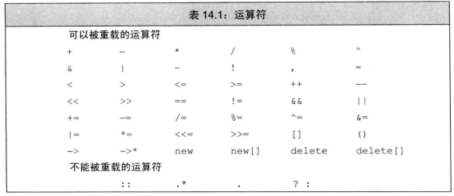
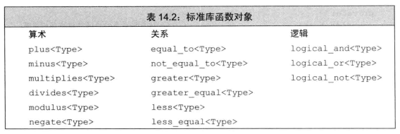
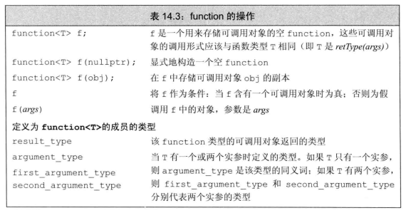

# 1 基本概念
如果一个运算符函数是成员函数，则它的第一个(左侧)运算对象绑定到隐式的this指针上，因此成员运算符函数的参数表数量比运算符的实际运算对象少一个。

运算符函数要么是类的成员，要么至少含有一个类类型的参数。我们可以重载大多数运算符，但不能发明新的运算符号。重载运算符的优先级和结合律与内置运算符保持一致。
```cpp
int operator+(int, int);//错误，既不是类的成员函数，参数又都是内置类型
```
我们可以重载大多数运算符，但不能发明新的运算符号。我们可以重载大多数运算符，但不能发明新的运算符号。



- 直接调用一个重载的运算符函数
    
    1. 非成员运算符函数
    ```cpp
    //普通表达式
    data1 + data2;
    //等价调用
    operator+(data1, data2);//此operator+函数不是成员函数
    ```
    2. 成员运算符函数
    ```cpp
    data1 += data2;
    //等价调用
    data1.operator+=(data2);
    ```
- 某些运算符不建议重载，如```&& || , &```
- 重载运算符应使用与内置类型一致的含义
- 选择作为成员或非成员
  
    1. 赋值```=```，下标```[]```，调用```()```，成员访问箭头```->```必须是成员。
    2. 复合赋值运算符，如```+= *=```一般来说是成员，但并非必须。
    3. 改变对象状态的运算符或者与给定类型密切相关的运算符，如递增```++```、递减```--```、解引用```*```，通常应该是成员。
    4. 具有对称性的运算符，如算术、相等性、关系```< >```、位运算符```& |```，通常应该是普通的非成员函数。
    5. 输入输出运算符必须是非成员函数
    6. 当我们将运算符函数定义为成员函数时，其左侧运算对象必须时运算符所属类的一个对象
    ```cpp
    string s = "world";
    string t = s + "!";
    string u = "hi" + s;//如果+是string成员，则产生错误
    ```
    但如果operator+是非成员函数，则在函数调用时实参"hi"会被转换成形参类型，即string

#  2 输入和输出运算符(非成员函数，返回iostream引用)
## 2.1 重载输出运算符 <<
输出运算符的第一个形参是一个非常量ostream对象的引用(向流写入内容会改变其状态，ostream对象无法复制)。第二个参数一般是我们想打印的类类型的常量引用：
- Sales_data的输出运算符
    ```cpp
    std::ostream &operator<<(std::ostream &os, const Sales_data &item) {
        os << item.isbn() << " " << item.units_sold << " "
        << item.revenue << " " << item.avg_price();
        return os;
    }//需要设定友元
    ```
- 输出运算符尽量减少格式化操作

    输出运算符尤其不会打印换行符。换行符一般由用户在main函数自行添加。
- 输入输出运算符必须是非成员函数
  
    输入输出运算符的左侧运算对象是iostream对象，故不能是类的成员函数。且IO运算符一般被声明为友元。

## 2.2 重载输入运算符 >>
输入运算符的第一个形参是运算符将要读取的流的非常量引用，第二个形参是将要读入到的对象的引用。
- Sales_data的输入运算符
  
    ```cpp
    std::istream &operator>>(std::istream &is, Sales_data &item) {
        double price;
        is >> item.bookNo >> item.units_sold >> price;
        if (is)//不代表还有字符要输入，代表之前的输入没发生错误
            item.revenue = item.units_sold * price;
        //输入运算符必须处理输入可能失败的情况。
        else
            item = Sales_data();
        return is;
    }
    ```
    输入运算符必须处理输入可能失败的情况，而输出运算符不需要。

- 输入时的错误  

    1. 当流含有错误类型的数据时，读取操作可能失败。
    2. 当读取操作到达文件末尾或者遇到输入流的其他错误时也会失败。
- 标示错误

    即使有时候技术上IO是成功的，但可能```bookNo```不满足行业标准，也需要标示错误。一般值设置[```failbit```](./08_IO库.md#1.2-条件状态)

# 3 算术和关系运算符(非成员函数，返回值)
```cpp
Sales_data operator+(const Sales_data &lhs, const Sales_data &rhs) {
    Sales_data sum = lhs;//拷贝构造函数
    sum += rhs;//+=尚未定义
    return sum;
}
```

## 3.1 相等运算符
比较对象的每一个数据成员，只有当所有对应的成员相等时才认为两个对象相等。
```cpp
bool operator==(const Sales_data &lhs, const Sales_data &rhs) {
    return lhs.isbn() == rhs.isbn() &&
           lhs.units_sold == rhs.units_sold &&
           lhs.revenue == rhs.revenue;
}
bool operator!=(const Sales_data &lhs, const Sales_data &rhs) {
    return !(lhs == rhs);
}
```
相等运算符和不相等运算符中的一个应该把工作委托给另一个。

## 3.2 关系运算符
如果类同时包含```==```运算符，则关系运算符的定义应该与```==```保持一致。

Sales_data中则不应支持关系运算符，因为```==```要求所有数据成员相等。而关系运算符只能同时比较一个数据成员，即不存在唯一一种逻辑可靠的<定义。
# 4 赋值运算符(成员函数,返回左侧运算对象的引用)
之前介绍的拷贝赋值和移动赋值将类的一个对象赋值给该类的另一个对象。此外类还可以定义其他赋值运算符，以使用别的类型作为右侧运算对象。
```cpp
StrVec &StrVec::operator=(initializer_list<string> il) {
    auto data = alloc_n_copy(il.begin(), il.end());//一个自定义的函数，返回拷贝的首指针和尾后指针
    free();//必须先释放当前内存空间
    elements = data.first;
    first_free = cap = data.second;
    return *this;
}
```
详见[StrVec.cpp](Exercise/13/StrVec.cpp)

和拷贝赋值运算符及移动赋值运算符相比：
1. 相同：必须先释放当前内存空间
2. 不同：无需检查对象向自身的赋值

- 复合赋值运算符

    ```cpp
    Sales_data& Sales_data::operator+=(const Sales_data &rhs) {
        units_sold += rhs.units_sold;
        revenue += rhs.revenue;
        return *this;
    }
    ```
# 5 下标运算符(成员函数，返回所访问元素的引用)
返回所访问元素的引用，这样下标运算符可以出现在赋值运算符的任何一端。且最好同时定义常量版本和非常量版本。
```cpp
class StrVec {
public:
    //非常量版本
    std::string& operator[](std::size_t n) {
        return elements[n];
    }
    //常量版本
    const std::string& operator[](std::size_t n) const {
        return elements[n];
    }
    ...
private:
    std::string *elements;//指向数组首元素的指针
};

StrVec svec(/*...*/);//初始化一个非常量对象
const StrVec cvec = svec;
if (svec.size() && svec[0].empty()) {
    svec[0] = "zero";//正确，下标运算符返回一个引用
    cvec[0] = "one";//错误，返回一个常量引用，不可赋值
```

# 6 递增和递减运算符(建议设定为成员函数，前置返回引用、后置返回值)
应该为类定义两个版本(前置、后置)运算符。本节中StrBlob类似vector<string>，StrBlobPtr类似其迭代器，详见[12_19](Exercise/12/12_19.cpp)
- 定义前置递增/递减运算符

    ```cpp
    class StrBlobPtr {
    public:
        //前置递增递减运算符，返回递增或递减后对象的引用
        StrBlobPtr& operator++();
        StrBlobPtr& operator--();
    private:
        //若检查成功，返回一个指向vector的shared_ptr
        std::shared_ptr<std::vector<std::string>>check(std::size_t, const std::string&) const;
        //用来检查vector是否报销毁
        std::weak_ptr<std::vector<std::string>> wptr;
        std::size_t curr;//在数组中的当前位置
    };
    StrBlobPtr& StrBlobPtr::operator++() {
        //如果curr已经指向尾后，则报错
        check(curr， "递增超过末尾");//文字部分为报错信息
        ++curr;
        return *this;
    }
    StrBlobPtr& StrBlobPtr::operator--() {
        //如果curr是0，size_t不能为负，会变为最大正数(必定通不过check)
        --curr;
        check(curr, "递减超过起始");
        return *this;
    }
    ```
- 区分前置和后置运算符

    后置版本接受一个额外的(不被使用的)int类型形参。在调用后置运算符时编译器会为这个形参提供一个值为0的实参。且后置版本返回一个值。
    ```cpp
    class StrBlobPtr {
    public:
        StrBlobPtr operator++(int);
        StrBlobPtr operator--(int);
        ...
    };
    StrBlobPtr StrBlobPtr::operator++(int) {
        StrBlobPtr ret = *this;//记录当前值，用于返回
        ++*this;//要求已经编写过前置版本
        return ret;
    }
    StrBlobPtr StrBlobPtr::operator--(int) {
        StrBlobPtr ret = *this;//记录当前值，用于返回
        --*this;//要求已经编写过前置版本
        return ret;
    }
- 显式调用后置运算符
  
    ```cpp
    StrBlobPtr p(/*...*/);//初始化
    //前置版本
    ++p;
    p.operator++();//两者等价
    //后置版本
    p++;
    p.operator++(0);//两者等价
    ```

# 7 成员访问运算符(成员函数，```*```返回元素引用、```->```返回元素指针)
StrBlob类似vector<string>，StrBlobPtr类似其迭代器，详见[12_19](Exercise/12/12_19.cpp)。其解引用```*```后得到所指向的元素(的引用)，其箭头运算符```->```后可调用StrBlob类的成员：
```cpp
class StrBlobPtr {
public:
    string& operator*() const {
        //p为一个指向vector<string>的shared_ptr
        auto p = check(curr, "解引用超过结尾");
        return (*p)[curr];
    }
    string* operator->() const {
        return & this->operator*();//返回一个指向StrBlob类对象中的某个字符串元素的指针
    }
    ...
};

StrBlob a1 = {"hi", "bye", "now"};
StrBlobPtr p(a1);//p.curr=0,相当于p指向a1首元素
*p = "okay";//修改a1首元素
cout << p->size() << endl;//打印4
cout << (*p).size() << endl;//等价
```
注意两个运算符都定义成const成员。

- 对箭头运算符返回值的限定

    箭头运算符与其他运算符的重载不太一样，编译器隐式完成了一些任务，对于```point->mem```:
    1. 如果```point```是指针，应用内置的箭头运算符。解引用该指针，再从所得对象中获取指定成员。
    2. 如果```point```是定义了```operator->```的类的一个对象，**该运算符函数的返回值必须是 指针类型 或 一个自定义了箭头运算符的类的对象**。日过返回指针，执行第1步，否则重复第2步。

# 8 函数调用运算符(成员函数)
如果类重载了函数调用运算符，我们就可以像使用函数一样使用该类的对象：
```cpp
struct absInt {
    //函数调用符为()
    int operator()(int val) const {
        return val < 0 ? -val : val;
    }
};

absInt a;
int i = a(-42);//i赋值42
```
但此处的```a```只是一个对象而非函数。这样定义了调用运算符的类的对象称为**函数对象**

- 含有状态的函数对象类

    函数对象类除了```operator()```也可以包含其他成员：
    ```cpp
    class PrintString {
    public:
        PrintString(ostream &o = cout, char c = ' ') : os(o), sep(c) { }
        void operator()(const string &s) const {os << s << sep;}
    private:
        ostream &os;
        char sep;//用于将不同输出隔开的字符
    };
    PrintString printer;
    string s = /*...*/
    vector<string> vs{/*...*/};
    printer(s);//在cout中打印s，后面跟一个空格
    PrintString errors(cerr, '\n');
    errors(s);//在cerr中打印s，后面跟一个换行符
    //函数对象可作为泛型算法的实参
    for_each(vs.begin(), vs.end(), PrintString(cerr, '\n'));
    ```
    函数对象可作为泛型算法的实参。

## 8.1 lambda是函数对象
lambda实际上会被编译器翻译成一个未命名类的未命名对象。在该类中含有一个重载的函数调用运算符，如：
```cpp
stable_sort(words.begin(), words.end(), [](const string &a, const string &b) {
    return a.size() < b.size();
});
//这lambda对象相当于
class ShorterString {
public:
    bool operator() (const string &s1, const string &s2) const {
        return s1.size() < s2.size();
    }
};
//等价调用
stable_sort(words.begin(), words.end(),ShorterString());
```
注意ShorterString不是函数，而是类，故stable_sort第三个参数需要加```()```

- 表示lambda及相关捕获行为的类

    ```cpp
    auto wc = find_if(words.begin(), words.end(), [sz](const string &s) { return s.size() >= sz; });
    //这lambda对象相当于
    class SizeComp {
        SizeComp(size_t n) : sz(n) { }
        bool operator() (const string &s) const {
            return s.size() >= sz;
        }
        size_t sz;
    };
    //等价调用
    auto wc = find_if(words.begin(), words.end(), SizeComp(sz));
    ```
## 8.2 标准库定义的函数对象
标准库中定义的一系列函数对象见表14.2



- 在算法中使用标准库函数对象    

    ```cpp
    //降序排列
    sort(svec.begin(), svec.end(), greater<string>());
    ```
    有些lambda对象无法完成的任务也可以通过标准库定义的函数对象实现：比较指向无关对象的指针会产生未定义的行为，但如果想要按照指针地址排序只能通过标准库定义的函数对象实现。
    ```cpp
    //该vector存储的指针所指对象相互无关
    vector<string *> nameTable;
    //错误，无关指针不能互相比较
    sort(nameTable.begin(), nameTable.end(), [](string *a, string *b) {
        return a < b;
    });
    //正确
    sort(nameTable.begin(), nameTable.end(), less<string *>());
    ```
    关联容器中使用less<key_type>```对元素排序。
## 8.3 可调用对象与function
C++中的可调用对象：函数、[函数指针](./06_函数.md(#7-函数指针))、[lambda表达式](./10_泛型算法.md#3.2-lambda表达式)、[bind创建的对象](./10_泛型算法.md#3.4-参数绑定)以及重载了函数调用运算符的类。
- 不同类型的可调用对象可能具有相同的调用形式
  
    如果参数和返回类型完全一致，称两个调用形式相同。
    ```cpp
    int add(int i, int j) {return i + j;}
    auto mod = [](int i, int j) {return i % j;};
    struct divide {
        int operator()(int denominator, int divisor) {
            return denominator / divisor;
        }
    };
    ```
    这三个可调用对象共享同一种调用形式```int(int, int)```。我们可以用一个函数表来存储这些可调用对象的指针：
    ```cpp
    map<string, int(*) (int, int)> binops;
    binops.insert({"+", add});//正确，函数名即函数指针
    binops.insert({"%", mod});//错误，mod不是一个函数指针
    ```

- 标准库function类型

    function类型定义在functional头文件中

    

    ```cpp
    function<int(int, int)> f1 = add;//函数指针
    function<int(int, int)> f2 = divide();//函数对象类的对象
    function<int(int, int)> f3 = [](int i, int j) {return i * j;};//lambda

    map<string, function<int(int, int)>> binops = {
        {"+", add},//函数指针
        {"-", std::minus<int>()},//标准库函数对象
        {"/", divide()},//函数对象
        {"*", f3},
        {"%", mod}//命名的lambda对象
    };
    //调用
    binops["+"](10,5);
    ```

- 重载的函数与function

    function对象不能进行参数匹配，故不能直接将重载函数的名字存入function类型对象中，必须存储一个函数指针或使用lambda重新调用重载函数解决该问题：
    ```cpp
    int add(int i, int j) {return i + j;}
    Sales_data add(const Sales_data&, const Sales_data&);
    map<string, function<int(int, int)>> binops;
    binops.insert({"+", add});//错误
    int (*fp) (int, int) = add;
    binops.insert({"+", fp});//正确
    binops.insert({"+", [](int a, int b){
        return add(a, b);//函数调用会自动进行参数匹配
    }});

# 9 重载、类型转换与运算符
仅一个参数的构造函数可以定义一个参数类型向类类型的隐式类型转换(不声明 explicit)
## 9.1 类型转换运算符(成员函数)
还可进行**类类型转换**：
```cpp
//隐式类类型转换
operator type() const;
```
type表示void、数组、函数(但数组指针、函数指针可以)以外的任何类型。类型转换运算符既没有显式的返回类型，也没有形参，且必须为类的成员函数。且不应转变原对象的内容，故常声明为const。
- 定义含有类型转换运算符的类

    ```cpp
    class SmallInt {
    public:
        //int 向 SmallInt的转换
        SmallInt(int i = 0) : val(i) {
            if (i < 0 || i > 255)
                throw std::out_of_range("Bad SmallInt Value");
        }
        //SmallInt 向 int的转换
        operator int() const { return val;}
        SmallInt &operator=(const SmallInt& si) {
            val = si.val;
            return *this;
        }
    private:
        std::size_t val;
    };
    SmallInt si;
    si = 4;//将4隐式转换成int，然后调用SmallInt::operator=
    si + 3;//将si隐式转换成int，然后执行加法
    si = 3.14;//正确，内置类型转换成int，再调用SmallInt::operator=
    ```

- 显式类类型转换

    单纯的隐式类类型转换可能会导致意想不到的问题，如果istream类向bool的转换是隐式的：
    ```cpp
    int i = 42;
    cin << i;
    ```
    由于istream没有定义```<<```运算符，cin这个istream对象会先隐式转换为bool，紧接着这个bool会被提升成int，并进行左移42位的操作。
    
    显式转换：
    ```cpp
    class SmallInt {
    public:
        //编译器不会自动执行这一类型转换
        explicit operator int() const { return val;}
        /*...*/
    };
    SmallInt si = 3;//正确
    si + 3;//错误
    static_cast<int>(si) + 3;//正确，显式请求类型转换
    ```
    例外：如果表达式是条件(如用在if中)，则不一定显式转换也可以进行直接隐式转换。但一般```operator bool```定义成explicit的。

## 9.2 避免有二义性的类型转换
有可能产生二义性的情况：
1. A类定义了接受B类对象的**转换构造函数**， B类定义了一个转换目标是A类的**类型转换运算符**。
```cpp
struct B;
struct A {
    A() = default;
    A(const B&);//B转换成A
};
struct B {
    operator A() const;//另一种B转换成A的方法
};
//函数
A f(const A&);
//调用
B b;
A a = f(b);//二义性错误：f(B::operator A())还是 f(A::A(const B&))?

//显式调用
A a1 = f(b.operator A());//使用B的类型转换运算符
A a2 = f(A(b));//使用A的构造函数
```
2. 某类定义了多个转换规则，且所涉及的类型本身可以相互转换
```cpp
struct A {
    //最好不要创建两个转换源都是算术类型的类型转换
    A(int);
    A(double);
    //最好不要创建两个转换对象都是算术类型的类型转换
    operator int() const; 
    operator double() const;
};
void f2(long double);

A a;
f2(a);//二义性错误：f2(A::operator int())还是f2(A::operator double())

long lg;
A a2(lg);//二义性错误：A::A(int)还是A::A(double)

short s = 42;
A a3(s);//正确，使用A::A(int)
```
最后一句成立是因为short提升成int的操作要优于short转换成double。

- 重载函数与转换构造函数
  
    ```cpp
    struct C {
        C(int);
    };
    struct D {
        D(int);
    };
    void manip(const C&);
    void manip(const D&);
    manip(10);//二义性错误：manip(C(10))还是manip(D(10))
    manip(C(10));//正确
    ```
- 重载函数与用户定义的类型转换

    ```cpp
    struct E {
        E(double);
    };
    void manip2(const C&);
    void manip2(const E&);

    manip2(10);//二义性：manip2(C(10))还是manip2(E(double(10))
    ```
    标准类型转换，如int转double不影响参数匹配。即两种情况会导致二义性错误。

## 9.3 函数匹配与重载运算符
与一般函数不同，调用重载运算符时我们无法区分该运算符是成员函数还是非成员函数，也就是说``` a sym b```的2种情况：
```cpp
a.operator sym(b);//成员函数
operator sym(a, b);//非成员函数
```
如果我们对同一个类既提供了转换目标是算术类型的类型转换，也提供了重载的运算符，就很可能遇到重载运算符与内置运算符的二义性问题(不知道把算术类型转换成类类型，还是把类类型转换成算术类型)。