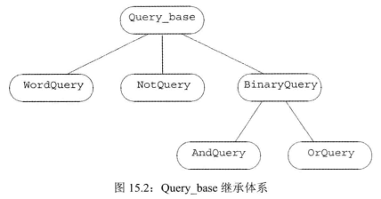
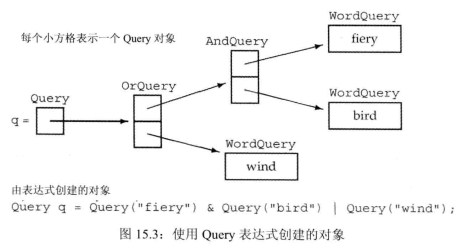

# 1 OOP:概述
面向对象设计(object-oriented programming)：数据抽象、继承和动态绑定。

数据抽象：将类的接口与实现分离(接口类包含一个指向实现类对象的指针，改动时仅需重新编译实现类)

- 继承(inheritance)

    本质上构成了一种层次关系。直接或间接地从**基类base class继承**而来的其他类称为**派生类derived class**。基类负责定义在层次关系中所有类共同拥有的成员，每个派生类定义各自特有的成员。

    对于某些函数，基类希望它的派生类各自定义适合自身的版本，此时基类就将这些函数声明为**虚函数**：
    ```cpp
    //基类
    class Quote {
    public:
        std::string isbn() const;
        //虚函数
        virtual double net_price(std::size_t n) const;
    };
    //Bulk_quote继承Quote
    class Bulk_quote : public Quote {
    public:
        double net_price(std::size_t) const override;
    };
    ```
    1. 类派生列表```public Quote```中的```public```说明我们完全可以把Bulk_quote的对象当成Quote对象(即能访问public成员)来使用。
    2. 虚函数必须在基类和派生类中声明。基类中需要标注```virtual```，派生类中至少标注```virtual```或```override```其中一个。

- 动态绑定

    动态绑定(dynamic binding)允许我们使用同一段代码处理基类和派生类对象，即可以将基类的指针或引用绑定到派生类对象上。
    ```cpp
    double print_total(ostream &os, const Quote &item, size_t n) {
        //根据item实参的类型决定调用哪个net_price
        double ret = item.net_price(n);
        os << "ISBN: " << item.isbn() << " # sold:" << n << " total due: " << ret << endl;
        return ret;
    }
    ```
    该函数的第二个参数既可调用Quote对象，也可调用Bulk_quote对象。且根据实参类型的不同，调用的函数成员也不同。

# 2 定义基类和派生类
## 2.1 定义基类
```cpp
class Quote {
public:
    Quote() = default;
    Quote(const std::string &book, double sales_price) : bookNo(book), price(sales_price) { }
    std::string isbn() const { return bookNo; }
    virtual double net_price(std::size_t n) const { return n * price; }
    virtual ~Quote() = default; //基类一般都定义一个虚析构函数
private:
    std::string bookNo;//不能被派生类直接访问
//protected成员在private基础上还能被子类函数访问
protected:
    double price = 0.0; //未打折原价
};
```
- 成员函数与继承
  
    基类必须将其成员函数分为两类：
    1. 基类希望其派生类进行覆盖的函数，即虚函数。当我们使用指针或引用调用虚函数时，该调用会被动态绑定。即根据引用或指针所绑定的对象类型不同，该调用可能执行基类的版本或某个派生类的版本。
    2. 基类希望派生类直接继承而不要改变的函数。

- 访问控制与继承

    派生类的成员函数不一定有权访问其从基类继承的成员。派生类可以访问基类的public成员、protected成员但不能访问private成员。

## 2.2 定义派生类
类派生列表的形式：一个冒号，后面紧跟着以逗号分割的基类列表，每个基类前面可以有一下三种访问说明符中的一个：public,protected或private。
```cpp
class Bulk_quote : public Quote {
public:
    Bulk_quote() = default;
    Bulk_quote(const std::string &, double, std::size_t, double);
    //覆盖基类的函数版本以实现基于大量购买的折扣政策
    double net_price(std::size_t) const override;
private:
    std::size_t min_qty = 0;//适用优惠政策的最低购买量
    double discount = 0.0;
};
```
Bulk_quote类从它的基类Quote类继承了isbn函数和bookNo(不能直接访问),price等。此外还定义了net_price的新版本，并拥有2个新增加的数据成员：min_qty、discount。

如果一个派生是共有的(访问说明符)，则基类的公有成员也是派生类接口的组成部分。此外我们也能将共有派生类型的对象绑定到基类的引用或指针上。也就是说用指针或引用调用基类对象的函数也接受派生类的指针或引用作为实参。

- 派生类中的虚函数  

    派生类不总是覆盖它继承的虚函数。如果派生类没有覆盖其基类的某个虚函数，则该虚函数会被直接继承。如果选择覆盖基类函数，只需要在派生类声明处声明```override```，定义处不需要。

- 派生类对象及派生类向基类的类型转换
  
    编译器会隐式地执行派生类到基类的转换：
    ```cpp
    Quote item;
    Bulk_quote bulk;
    Quote *p = &item;
    p = &bulk;  //p指向bulk的Quote部分
    Quote &r = bulk;//r绑定到bulk的Quote部分
    ``` 

- 派生类构造函数

    尽管派生类对象中含有从基类继承而来的成员，但是派生类并不能直接初始化这些成员，派生类必须使用基类的构造函数来初始化它的基类部分。
    ```cpp
    //调用基类构造函数创建基类部分
    Bulk_quote::Bulk_quote(const std::string &book, double p, std::size_t qty, double disc) : Quote(book, p), min_qty(qty), discount(disc) { }
    ```
    除非我们特别指出，否则派生类对象的基类部分会像数据成员一样执行默认初始化。类似[普通类中成员的初始化顺序](./07_类.md#5.1-构造函数初始值列表)，派生类中首先初始化基类的部分，然后按照声明的顺序依次初始化派生类的成员。

- 派生类使用基类的成员

    派生类可以访问基类的public成员和protected成员。

- 继承与静态成员

    如果基类定义了一个静态成员，则在整个继承体系中只存在该成员的唯一定义。即派生类中也包含该静态成员，且所有该静态成员某时只有一个值。

- 派生类的声明

    派生类的声明与其他类别相同，不需要包含派生列表
    ```cpp
    class Bulk_quote : public Quote;//错误
    class Bulk_quote;//正确
    ```
- 被用作基类的类

    如果我们想要将某个类用做积累，该类必须已经定义而非仅声明。派生类必须知道基类定义了哪些成员：
    ```cpp
    class Quote;
    class Bulk_quote : public Quote {/**/};//错误
    ```
    因此一个类不能派生它本身。但一个类是基类，同时也可以是一个派生类:
    ```cpp
    class Base {/**/};
    class D1 : public Base {/**/};
    class D2 : public D1 {/**/};
    ```
    D2包含D1和Base的成员。
- 阻止继承的发生

    在类名后加关键字final用于防止别的类继承该类：
    ```cpp
    class NoDerived final{/**/};
    class Base {/**/};
    class Last final : Base {/**/};//正确，但Last不能做基类
    ```
## 2.3 类型转换与继承
和内置指针一样，智能指针类也支持派生类向基类的类型转换。我们可以将一个派生类对象的指针存储在一个基类的智能指针内。

- 静态类型与动态类型

    静态类型是变量声明时的类型或表达时生成的类型，编译时已知；动态类型是变量或表达式表示的内存中的对象的类型，直到运行时才可知。
    ```cpp
    double f(Quote &item) {
        /*...*/
        double ret = item.net_price(n);
        /*...*/
    }
    ```
    item的静态对象是Quote&，其动态类型依赖于item绑定的实参，还有可能是Bulk_quote。
- 不存在从基类向派生类的隐式类型转换

    ```cpp
    Quote base;
    Bulk_quote *bulkP = &base;//错误
    Bulk_quote &bulkP = base;//错误

    Bulk_quote bulk;
    Quote *itemP = &bulk;//正确，派生类绑定到基类指针
    Bulk_quote *p = itemP;//错误，基类不能转换成派生类
    ```
    也就是说即使基类指针或引用绑定的是派生类对象，也不能再由基类指针或引用隐式转换成派生指针或引用。原因是编译器只能检查静态类型，不允许静态类型为基类的指针/引用隐式转换成派生类的指针/引用。如果我们确定基类向派生类的转换安全(如转换前后动态类型相同)，可以用static_cast强制覆盖编译器的检查工作，进行显式转换。

- 对象之间不存在类型转换

    派生类向基类的自动类型转换只对指针或引用类型，在派生类类型和基类类型之间不存在这样的转换。但可以使用拷贝构造函数或赋值运算符：
    ```cpp
    Bulk_quote bulk;
    Quote item(bulk);//调用Quote::Quote(const Quote&)
    item = bulk;//调用Quote::operator=(const Quote&)
    ```
    但此过程中(合成版本)，只有基类部分会被拷贝，派生类部分会被忽略。

# 3 虚函数(虚属性会被继承，派生类中不用声明virtual也是虚函数)
- 对虚函数的调用可能在运行时才被解析

    被调用的函数是与绑定到指针或引用上的对象的**动态类型**相匹配的。

    而当我们通过一个具有普通类型(非指针非引用)的表达式调用虚函数时，编译时就会将调用版本确定下来。
- 派生类中的虚函数

    一个派生类的函数如果覆盖了某个继承而来的虚函数，则它的形参类型必须与它覆盖的基类函数**完全一致**。除了一个特殊情况外，基类虚函数和派生类虚函数的返回类型也必须一致。例外情况：D类由B类派生而来，基类虚函数返回B类的指针或引用，此时派生类的虚函数返回类型可以是D类的指针或引用，但要求D到B类(派生类到基类)的类型转换是可访问的。(可访问性见[派生类向基类转换的可访问性](#5-访问控制与继承))
- final和override说明符

    override用于覆盖基类中的虚函数，但必须要求基类和派生类中**虚函数名字及形参类型完全一致**
    ```cpp
    struct B {
        virtual void f1(int) const;
        virtual void f2();
        void f3();
    };
    struct D : B {
        void f1(int) const override;//正确
        void f2(int) override;//错误，形参列表不一致
        void f3() override;//错误，f3不是虚函数
    };
    ```
    final还可以被用于声明某个函数，表示该函数不能被后续类覆盖：
    ```cpp
    struct D2 : B {
        void f1(int) const final;
    };
    struct D3 : D2 {
        void f2();//正确
        void f1(int) const;//错误，D2已经将f2声明为final
    };
    ```
    final和override位于形参列表(包括任何const或引用修饰符)及[尾置返回类型](./06_函数.md#3.3-返回数组指针)之后。

    override仅需要在声明处标明，定义处不需要。

- 虚函数与默认实参

    如果虚函数使用默认实参。基类和派生类中定义的默认实参最一致。
- 回避虚函数的机制

    某些情况下，我们希望虚函数的调用不进行动态绑定(虚函数版本随调用对象的动态类型而定)，也就是说我们想要执行虚函数的某个特定版本。此时我们需要使用作用于运算符：
    ```cpp
    Bulk_quote bulk;
    Quote *baseP = &bulk;
    baseP->Quote::net_price(42);//强制调用Quote的net_price函数
    ```

# 4 抽象基类
- 纯虚函数

    如果派生类既不想继承一个基类的虚函数，又不想创建自己版本的虚函数，即该虚函数对于派生类无意义，我们可以令虚函数```=0```将其声明为**纯虚函数**，我们也不能直接创建一个这种类的对象：
    ```cpp
    class Disc_quote : public Quote {
    public:
        Disc_quote() = default;
        Disc_quote(const std::string &book, double price, std::size_t qty, double disc) : Quote(book, price), quantity(qty), discount(disc) { }
        //覆盖基类的函数版本以实现基于大量购买的折扣政策
        double net_price(std::size_t) const = 0;//声明为纯虚函数
    protected:
        std::size_t quantity = 0;//适用优惠政策的最低购买量
        double discount = 0.0;
    };
    ```
- 含有纯虚函数的类是抽象基类

    抽象基类负责定义接口，我们不能直接创建一个抽象基类的对象。但只要抽象基类的派生类覆盖了纯虚函数，就可以创建派生类对象。
- 派生类构造函数只初始化它的直接基类

    我们令Disc_quote作为Bulk_quote的直接基类，Quote就变成了间接基类，并重新定义Bulk_quote:
    ```cpp
    class Bulk_quote : public Disc_quote {
    public:
        Bulk_quote() = default;
        Bulk_quote::Bulk_quote(const std::string &book, double p, std::size_t qty, double disc) : Disc_quote(book, p, qty, disc) { }
        //覆盖基类的函数版本以实现基于大量购买的折扣政策
        double net_price(std::size_t cnt) const override;
    };
    ```

# 5 访问控制与继承
- 受保护的成员
    
    一个类使用protected关键字来声明那些它希望与派生类分享，但不被其他公共访问使用的成员。且派生类的成员或友元只能通过派生类对象访问该对象基类部分中protected成员：
    ```cpp
    class Base {
    protected:
        int prot_mem;
    };
    class Sneaky : public Base {
        friend void clobber(Sneaky&);//可以访问Sneaky::prot_mem
        friend void clobber(Base&);//不能访问Base::prot_mem
        int j;
    };
    //正确
    void clobber(Sneaky &s) {s.j = s.prot_mem = 0;}
    //错误
    void clobber(Base &b) {b.prot_mem = 0;}
    ```

- 公有、私有和受保护继承

    ```cpp
    class Base {
    public:
        void pub_mem();
    protected:
        int prot_mem;
    private:
        char priv_mem;
    };
    //public继承
    struct Pub_Derv : public Base {
        int f() {return prot_mem;}//正确
        char g() {return priv_mem;}//错误
    };
    //private继承
    struct Priv_Derv : private Base {
        int f() {return prot_mem;}//正确
        char g() {return priv_mem;}//错误
    };

    Pub_Derv d1;
    Priv_Derv d2;
    d1.pub_mem();//正确
    d2.pub_mem();//错误，私有成员不能被非成员函数访问
    ```
    派生访问说明符对于派生类的成员能否访问直接基类的成员没有影响(基类的public、protected成员可以被派生类访问)。派生访问说明符的目的是控制派生类用户对于基类成员的访问权限：如果继承是公有的，派生类中的基类部分的访问权限与基类相同；但如果继承是protected/private，派生类中所有基类部分都是protected/private的。

- 派生类向基类转换的可访问性
  - 只有当D公有地继承B时，用户代码才能使用[派生类向基类的转换](#22-定义派生类)
  - 不论D以什么方式继承B，D的成员函数和友元都能使用派生类向基类的转换
  - 如果D继承B的方式是public/protected的，D的派生类的成员和友元可以使用D向B的类型转换

- 友元关系不能被继承(基类的友元不是派生类的友元)或反继承(派生类的友元不是基类的友元)

- 改变个别成员的可访问性

    通过使用using声明改变派生类继承的某个名字的访问级别：
    ```cpp
    class Base {
    public:
        std::size_t size() const {return n;}
    protected:
        std::size_t n;
    };
    class Derived : private Base {
    public:
        using Base::size;//将size成员定为public
    protected:
        using Base::n;
    };
    ```
    派生类只能为那些它可以访问的名字提供using声明，基类中private成员不能使用using声明。

- 默认的继承保护级别

    使用class关键字定义的派生类默认是私有继承的，使用struct关键字定义的派生类默认是公有继承。

# 6 继承中的类作用域
派生类的作用域位于基类作用域之内，因此派生类才能像使用自己的成员一样使用基类成员。
```cpp
Bulk_quote bulk;
cout << bulk.isbn();
```
首先在Bulk_quote中查找，但找不到isbn。接下来在其直接基类Disc_quote中查找，仍然找不到。最后在其间接基类Quote中查找。

- 在编译时进行名字查找

    一个对象、引用或指针的**静态类型**决定了该对象哪些成员是可见的。景观该对象的动态类型可能是某个派生类，但只要静态类型是基类，就不能访问派生类型自己定义的成员。

- 名字冲突与继承(包括数据成员和函数成员)

    派生类的成员将隐藏同名的基类成员，类似于内层作用域可以隐藏外层作用域的同名变量。当然被隐藏的成员可以用作用域运算符来使用(前面加上基类::)。对于函数而言，名字查找先于类型检查，故派生类定义的同名函数即使形参类型不同，也不会与基类中函数形成重载。(例外见后面：通过基类调用隐藏的虚函数)

    除了覆盖继承而来的虚函数之外，派生类最好不要重用其他定义在基类中的名字。

- 虚函数与作用域

    基类和派生类中的虚函数必须形参列表一致的原因：如果基类与派生类的虚函数接受的形参类型不同，我们就无法通过基类的引用或指针(实参可能是派生类)调用派生类的虚函数了。

- 通过基类调用隐藏的虚函数
    基类中的虚函数当与派生类中的函数同名但形参列表不同时，积累中的虚函数被隐藏，即不能被派生类对象所调用。但可以被静态类型是基类，动态类型是派生类的指针/引用调用。
    ```cpp
    class  Base {
    public:
        virtual int fcn();
    };
    class D1 : public  Base {
    public:
        //Base::fcn()被隐藏，但同时由于没有覆盖，被继承
        int fcn(int);//与虚函数Base::fcn()的形参列表不同
        virtual void f2();//新的虚函数
    };
    class D2 : public D1  {
    public:
        int fcn(int);//非虚函数，隐藏了D1::fcn(int)
        int fcn();//覆盖了Base::fcn()
        void f2();//覆盖了D1的虚函数f2
    };
    Base bobj;
    D1 d1obj;
    D2 d2obj;
    //静态类型为Base，只能找到虚函数，但实际调用版本取决于动态类型
    Base *bp1 = &bobj, *bp2 = &d1obj, *bp3 = &d2obj;
    bp1->fcn();//虚调用，调用Base::fcn
    bp2->fcn();//虚调用，调用Base::fcn，通过基类调用隐藏的虚函数
    bp3->fcn();//虚调用，调用D2::fcn (动态绑定)

    D1 *d1p = &d1obj;
    D2 *d2p = &d2obj;
    bp2->f2();//错误，静态类型是Base，f2不可见
    d1p->f2();//虚调用，调用D1::f2 （静态动态类型相同）
    d2p->f2();//虚调用，调用D2::f2 (动态绑定)
    //不同静态类型，动态类型都是D2
    Base *p1 = &d2obj;
    D1 *p2 = &d2obj;
    D2 *p3 = &d2obj;
    //都是非虚函数，不发生动态绑定
    p1->fcn(42);//错误，静态类型是Base，Base::fcn函数不接受参数
    p2->fcn(42);//静态绑定，调用D1::fcn(int)
    p3->fcn(42);//静态绑定，调用D2::fcn(int)

    d1p->fcn();//错误，名字检查先于类型检查，Base::fcn()被隐藏
    ```
    详见[helpUnderstandVirtualScope.cpp](Exercise/15/helpUnderstandVirtualScope.cpp)
    
    推荐覆盖虚函数时标注override

# 7 构造函数与拷贝控制
## 7.1 虚析构函数
当我们delete一个动态分配对象的指针时，将执行该对象的析构函数。但当我们delete一个静态类型为Quote* 类型的指针时， 该指针的动态类型可能为Bulk_quote*。因此将析构函数定义为虚函数是必要的：
```cpp
class Quote {
public:
    virtual ~Quote() = default;//动态绑定析构函数
};

Quote *itemP = new Quote;
delete itemP;//调用Quote的析构函数
itemP = new Bulk_quote;//静态类型和动态类型不一致
delete itemP;//调用Bulk_quote的析构函数
```
一个基类总需要自定义虚析构函数(以方便实现静态动态类型不同时对象析构时发生的动态绑定)，但并不代表我们一定要自定义赋值运算符或拷贝构造函数，是[三五法则](./13_拷贝控制.md#14-三五法则)的一个重要例外。

- 虚析构函数将阻止合成移动操作

    [合成移动操作:定义了析构函数就不会合成移动构造函数](./13_拷贝控制.md#6.2-移动构造函数和移动赋值运算符)
## 7.2 合成拷贝控制与继承
Bulk_quote默认构造函数的执行过程：
1. 派生类Bulk_quote的默认构造函数会运行直接基类Discount_quote的默认构造函数，后者运行间接基类Quote的默认构造函数
2. Quote的默认构造函数将bookNo成员默认初始化为空字符串，使用类内初始值将price初始化为0
3. Quote的默认构造函数完成，继续执行Disc_quote的构造函数，使用类内初始值初始化qty和discount
4. Disc_quote构造函数完成，继续执行Bulk_quote的构造函数(其实没有其他具体工作了)

类似的，派生类的合成拷贝成员总是调用其基类的拷贝成员。基类的拷贝成员完成后再回到派生类的合成拷贝成员完成任务。

- 派生类中删除的拷贝控制与基类的关系

    1. 如果基类中的默认构造函数、拷贝构造函数、拷贝赋值运算符或析构函数是被删除的函数或不可访问，则派生类中对应的成员将是被删除的。
    2. 如果在基类中有一个不可访问或删除掉的析构函数，则派生类中合成的默认和拷贝构造函数将是被删除的。因为编译器无法销毁派生类对象的基类部分，索性就不允许构造
    3. 基类部分不可移动时，派生类不会合成一个删除掉的移动操作。

    ```cpp
    class B {
    public:
        B();
        B(const B&) = delete;
        //不含有移动构造函数
    };
    class D : public B {
        //不声明任何构造函数
    };
    D d;//正确，D的合成默认构造函数调用B的默认构造函数
    D d2(d);//错误，D的合成拷贝构造函数是被删除的
    D d3(std::move(d));//错误，没有移动构造函数，试图调用拷贝构造函数。但拷贝构造函数被删除
    ```
    B类包含一个可访问的默认构造函数和一个显式删除的拷贝构造函数，所有编译器不会为B合成一个移动构造函数，见[合成移动操作:定义了拷贝构造函数就不会合成移动构造函数](./13_拷贝控制.md#6.2-移动构造函数和移动赋值运算符)。也就是说我们既不能移动也不能拷贝B的对象。如果B的派生类希望他自己的对象能被移动和拷贝，就需要派生类定义自己版本的构造函数。

- 移动操作与继承

    大多数基类会定义一个虚析构函数，[合成移动操作:定义了析构函数就不会合成移动构造函数](./13_拷贝控制.md#6.2-移动构造函数和移动赋值运算符)，所以在派生类中也没有合成的移动操作。

    所以当我们确实需要执行移动操作时应该首先在基类中进行定义。而当我们定义了自己的移动操作，就必须同时显式定义拷贝操作，因为[合成移动操作:如果一个类定义了移动构造函数和/或一个移动赋值运算符，该类的合成拷贝构造函数和拷贝赋值运算符会被定义为删除的](./13_拷贝控制.md#6.2-移动构造函数和移动赋值运算符)

    ```cpp
    class Quote {
    public:
        Quote() = default; //默认初始化
        Quote(const Quote&) = default;//拷贝
        Quote(Quote &&) = default;//移动
        Quote& operator=(const Quote&) = default;//拷贝赋值
        Quote& operator=(Quote &&) = default;//移动赋值
        /**/
    };
    ```
    但注意[如果我们显式要求编译器生成```=default```的移动操作，但编译器不能移动所有成员(原因见下图)，则编译器会将移动操作定义为删除的函数。](./13_拷贝控制.md#6.2-移动构造函数和移动赋值运算符)。

## 7.3 派生类的拷贝控制成员
就像派生类构造函数需要初始化基类部分一样，派生类的拷贝和移动构造函数/赋值运算符也要拷贝和移动基类部分的成员。

- 定义派生类的拷贝或移动构造函数
  
    ```cpp
    class Base { /* */};
    class D : public Base {
    public:
        //D的拷贝构造函数
        D(const D &d) : Base(d) //利用Base的拷贝赋值函数拷贝基类部分 
        {/*拷贝非基类部分*/}
        //D的移动构造函数
        D(D &&d) : Base(std::move(d))//利用Base的移动赋值函数移动基类部分 
        {/*移动非基类部分*/}
    };
    ```

- 派生类赋值运算符

    ```cpp
    D &D::operator=(const D &rhs) {
        Base::operator=(rhs);//赋值基类部分
        //在考虑自赋值的情况下赋值非基类部分并释放资源
        return *this;
    }
    ```
    [类值/类指针赋值运算符](./13_拷贝控制.md#2-拷贝控制和资源管理)

- 派生类析构函数
  
    和构造函数及赋值运算符不同，基类部分会被隐式析构，派生类的析构函数只负责销毁由派生类自己分配的资源。
    ```cpp
    class D : public Base {
    public: 
        //Base::~Base被自动调用执行
        ～D() {/*销毁由派生类自己分配的资源*/}
    };
    ```
    类似[一般析构函数](./13_拷贝控制.md#1.3-析构函数)，析构函数以初始化逆序销毁成员，故派生类析构函数首先执行，然后沿着继承体系的反方向执行。

- 在构造函数和析构函数中调用虚函数

    如果构造函数或析构函数调用了某个虚函数，则我们应该执行与构造函数或析构函数所属类型相对应的虚函数版本。

## 7.4 继承的构造函数
类不能继承默认、拷贝和移动构造函数，也就是说参数不能是空、类的常量引用、类的右值引用。
```cpp
class Bulk_quote : public Disc_quote {
public:
    using Disc_quote::Disc_quote;//继承Disc_quote的构造函数，并直接令编译器产生代码
    //等价于
    Bulk_quote::Bulk_quote(const std::string &book, double p, std::size_t qty, double disc) : Disc_quote(book, p, qty, disc) { }
};
```
如果派生类含有自己的数据成员，则这些成员将被默认初始化。

- 继承的构造函数的特点

    一个构造函数的using声明不会改变构造函数的访问级别。基类的私有构造函数在派生类中还是一个私有构造函数。且一个using声明不会改变explicit或者constexpr的继承。

    对于有默认实参的基类构造函数，派生类中会继承多个版本。如果基类中某构造函数有2个参数，第2个参数有默认实参。则派生类中继承了2个版本，一个仅接受第一参数，一个接受两个参数。

# 8 容器与继承
容器中不允许保存不同类型的元素，所以不能把Quote对象和Bulk_quote对象放在一个容器中。
```cpp
vector<Quote> basket;
basket.push_back(Quote("12345", 50));
//正确，但只能把对象的Quote部分拷贝给basket
basket.push_back(Bulk_quote("67890", 50, 10, .25));
//调用的虚函数都是基类版本
cout << basket.back().net_price(15) << endl;
```
即基类的容器中即使插入了派生类，也只能存储基类部分，调用的虚函数也是基类版本。

- 在容器中放置(智能)指针而非对象

    ```cpp
    vector<shared_ptr<Quote>> basket;
    basket.push_back(make_shared<Quote>("12345", 50));
    basket.push_back(make_shared<Bulk_quote>("67890", 50, 10, .25));
    //调用派生类版本
    cout << basket.back()->net_price(15) << endl;
    ```
    派生类的(智能)指针可以转换为基类的(智能)指针。

## 8.1 编写Basket类
C++面向对象的编程中，我们通常无法直接使用对象，而是使用指针和引用。但是我们可以定义一些辅助的类来处理这种情况，如一个表示购物篮的类[Basket.h](Exercise/15/Basket.h)、[Basket.cpp](Exercise/15/Basket.cpp)。

该问题的解决是由于我们向Quote 和 Bulk_quote类添加了clone虚函数：
```cpp
class Quote {
public:
    //将自己拷贝给新分配的对象
    virtual Quote *clone() const & { return new Quote(*this); }
    //将自己移动到新数据
    virtual Quote *clone() && { return new Quote(std::move(*this)); }
    /**/
};
class Bulk_quote : public Quote {
public:
    //将自己拷贝给新分配的对象
    Bulk_quote *clone() const & { return new Bulk_quote(*this); }
    //将自己移动到新数据
    Bulk_quote *clone() && { return new Bulk_quote(std::move(*this)); }
};
```
clone成员将对象转化成了包含(拷贝/移动)对象的新分配的地址，这样我们在处理继承体系的不同类型对象时，可以建立元素类型为指向基类智能指针的容器。且用户在添加新元素时不需要处理指针。

[Main](./Exercise/15/BasketMain.cpp)
```
g++ -o BasketMain.exe Basket.cpp BasketMain.cpp 
./BasketMain.exe
```

# 9 文本查询程序再探
功能：
1. 单词查询：得到匹配某个给定string的所有行
2. 逻辑非查询：使用```～```运算符得到不匹配查询条件的所有行
3. 逻辑或查询：使用```|```运算符返回匹配两条件中任意一个的行
4. 逻辑与查询：使用```&```运算符返回匹配全部两个条件的行
   
## 9.1 面向对象的解决方案
- 抽象基类

    

    其中基类Query_base拥有两个纯虚函数```eval```和```rep```，分别用于返回给定字符串的查找结果和用于打印的字符串。
    BinaryQuery也是抽象基类

- 将层次关系隐藏于接口类中

    需要定义一个名为Query的接口类，以隐藏整个继承体系。

    

- 工作原理

    Query类是接口类，包含一个指向Query_base类的智能指针。WordQuery、AndQuery、OrQuery和NotQuery都是Query_base类的派生类。构造的Query类总是包含一个动态类型为WordQuery类(用于实现单纯的查找)，但Query类的友元操作符函数可以接受运算符和直接构造的Query类来处理逻辑运算。被处理而生成的Query类包含动态类型为对应的AndQuery/OrQuery/NotQuery的指针。

    AndQuery, OrQuery, NotQuery拥有各自的成员函数能接受一个TextQuery类参数(用于绑定文件)，并输出一个Query_result对象。Query_result类表示查询结果，可以通过其成员函数打印出来。

- 操作过程
    ```
    g++ -o QueryMain.exe TextQuery.cpp Query.cpp  NotQuery.cpp AndQuery.cpp OrQuery.cpp QueryMain.cpp

    ./QueryMain.exe
    ```
    或者（Linux）
    ```
    make
    make clean
    ./QueryMain
    ```
    注意[把内联函数和constexpr函数放在头文件](06_函数.md#5.2-内联函数和constexpr函数)
