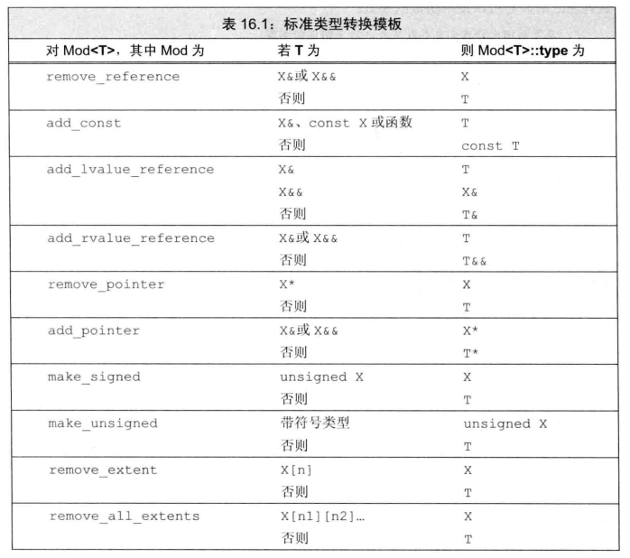
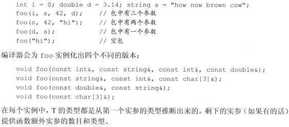

面向对象编程(OOP)和泛型编程都能处理在编写程序时不知道类型的情况。但OOP在程序运行时才能知道类型，而泛型编程在编译时就能获知类型。

# 1 定义模板
## 1.1 函数模板
定义一个通用的函数模板，而不是为每个类型都定义一个新函数。一个函数模板就是一个公式，可用来生成针对特定类型的函数版本，如compare:
```cpp
//声明了一个名为T的类型参数，在该函数中表示一个类型
template <typename T> int compare(const T &v1, const T &v2) {
    if (v1 < v2) return -1;
    if (v1 < v1) return 1;
    return 0;
}
```
以关键字 ```template```开始，后跟一个模板参数列表(template parameter list)，这是一个逗号分割的一个或多个模板参数(template parameter)的列表

- 实例化(instantiate)函数模板

    ```cout << compare(1, 0) << endl;//T为int```实参类型(int)被绑定到模板参数T的类型。

- 模板类型参数

    注意模板参数列表中不同的类型参数前必须使用关键字```class```或```typename```，逗号后也不能省略
    ```cpp
    //在模板参数列表中，typename和class没有什么不同
    template <typename T, class U> calc(const T&, const U&);
    ```
- 非类型模板参数

    一个非类型参数表示一个值而非一个类型，可以通过特定类型名来指定。在模板被实例化时，非类型参数被一个用户提供的或编译器推断的值所替代，但这些值必须是常量表达式。比如由于不能拷贝一个数组，所以我们将自己的参数定义为数组的引用：
    ```cpp
    //N和M分别表示两个数组的长度
    template <unsigned N, unsigned M> 
    int compare(const char (&p1)[N], const char (&p2)[M]) {
        return strcmp(p1, p2);
    }

    //调用
    compare("hi", "mom");
    ```
    由于编译器会在一个字符串字面常量的末尾插入一个空字符，因此编译器会实例化出如下版本：
    ```cpp
    int compare(const char (&p1)[3], const char (&p2)[4])
    ```
    也就是说编译器自动识别合适的数组长度给N和M。

- inline和constexpr的函数模板

    inline或constexpr 紧靠在返回类型之前：
    ```cpp
    template <typename T> inline T min(const T&, const T&);
    ```
- 编写类型无关的代码

    编写泛型代码的2个原则：
    1. 模板中的函数参数是const的引用，以保证函数可以用于不能拷贝的类型以及更快处理大对象。
    2. 函数体中的条件判断仅使用 ```<```比较运算

    如果还想要比较无关指针地址大小，由于[比较指向无关对象的指针会产生未定义的行为，使用less](./14_重载运算与类型转换.md#8.2-标准库定义的函数对象)，更类型无关的版本：
    ```cpp
    //T有可能是指针类型，不支持<
    template <typename T> int compare(const T &v1, const T &v2) {
        if (less<T>() (v1, v2)) return -1；
        if (less<T>() (v2, v1)) return 1;
        return 0;
    }
    ```
- 模板编译

    当编译器遇到一个模板定义时，它并不生成代码。只有当我们实例化出模板的一个特定版本时，编译器才会生成代码。

    一般函数和类的成员函数声明放在头文件中，而定义放在源文件中。而模板则不同，模板的头文件既包括声明和定义。

- 大多数编译错误在实例化期间报告

    编译器可能报告错误的三个阶段：
    1. 编译模板本身时：发现语法错误
    2. 编译器遇到模板使用时：检查实参数目、参数类型是否匹配
    3. 实例化时：检查是否定义 < 运算符

## 1.2 类模板
- 定义类模板

    实现一个类似vector能实现存储的类模板。注意在类外定义函数成员时，需要标明```template <typename T> ret-type class-name<T>::member-name(param-list)```

    类模板的实现见[Blob.h](Exercise/16/Blob.h)。注意模板的头文件既包括声明和定义，且在类外定义成员函数时，不仅需要在返回类型前标明```template <typename T>```，返回类型之后的模板类名(表示作用于)不仅仅是```class-name::```，而是```class-name<T>::```

- 在类模板内使用简化模板类名```class-name```，在类模板外使用类模板名```class-name<T>```

    当我们使用一个类模板类型时必须提供模板实参，例外：在类模板的作用域内可以直接使用模板名而不提供实参：
    ```cpp
    template <typename T> class BlobPtr {
    public:
        //在类模板内使用简化模板类名
        BlobPtr &operator++();//前置运算符
        BlobPtr operator++(int);//后置运算符
        /*...*/
    };
    //在类模板作用域外使用类模板名
    template <typename T> BlobPtr<T>& BlobPtr<T>::operator++() {
        //前置需要检查
        check(curr, "Increment past end of BlobPtr");
        ++curr;
        return *this;
    }
    //对于后置运算符编译器会为int形参赋值0
    template <typename T> BlobPtr<T> BlobPtr<T>::operator++(int) {
        //此处无需检查，调用前置运算符时会进行检查
        BlobPtr ret = *this;//此处又在类模板作用域内了，简化类名
        ++*this;
        return ret;
    }
    ```
- 类模板和友元

    如果一个类模板包含一个非模板友元，则该友元被授权可以访问所有模板示例。如果某类的友元是模板，该类可以授权给所有友元模板实例，也可以只授权给特定实例。
- 一对一友好关系
    ```cpp
    //前置声明
    template <typename>
    class BlobPtr;
    template <typename>
    class Blob;
    //模板函数
    template <typename T>
    bool operator==(const Blob<T> &, const Blob<T> &);

    template <typename T>
    class Blob
    {
        //每个Blob实例仅将访问权限授予用相同类型实例化的BlobPtr和相等运算符
        //<T>表示其也是模板
        friend class BlobPtr<T>;
        //注意声明和定义时都不需要在函数名后加<T>,但声明友元时需要，以表示这是一个模板
        friend bool operator==<T>(const Blob<T> &, const Blob<T> &);
    /*...*/
    };
    ```
    注意每个Blob实例仅将访问权限授予用相同类型实例化的BlobPtr和相等运算符。

    注意即使是友元，只要该友元是模板，**定义和声明**都在头文件中。

    运用实例见[BlobMain.cpp](Exercise/16/BlobMain.cpp)
- 通用和特定的模板友好关系

    五种情况：
    1. 仅用普通类B实例化的模板类A才是B的友元，此时需要提前声明模板类A
    2. 模板类A的所有实例都是普通类B的友元
    3. 模板类A的某个实例是相同类型实例化的模板类B的友元
    4. 模板类A的每个实例都是模板类B的任何实例的友元
    5. 非模板类A是模板类B的所有实例的友元
    ```cpp
    //仅Pal需要前置声明
    template <typename T> class Pal; 
    //C不是类模板
    class C {
        //用类C实例化的Pal是C的友元
        friend class Pal<C>; //需要前置声明
        //Pal2的所有实例都是C的友元，此时无需前置声明
        template <typename T> friend class Pal2;
    };
    template <typename T> class C2 {
        //C2的每个实例都将相同实例化的Pal声明为友元
        friend class Pal<T>;//需要前置声明
        //Pal2的每个实例都是C2每个实例的友元，故typename不同
        template <typename X> friend class Pal2;
        //非模板类Pal3是C2所有实例的友元
        friend class Pal3;
    }
    ```
- 令模板自己的类型参数成为友元
  
    ```cpp
    template <typename Type> class Bar {
        friend Type;//将访问权限授予用来实例化Bar的类型
    };
    ```
    Type可以是个自定义的类类型，也可以是内置类型

- 模板类型别名

    ```cpp
    typedef Blob<string> StrBlob
    ```
    typedef只允许我们为模板的**某个实例**定义类型别名。如果想要为模板类定义类型别名，需要使用using:
    ```cpp
    template<typename T> using twin = pair<T, T>;
    template<typename T> using partNo = pair<T, unsigned>;
    twin<string> authors;//pair<string, string>
    partNo<string> books;//pair<string, unsigned>
    ```

- 类模板的static成员

    ```cpp
    template <typename T> class Foo {
    public:
        static std::size_t count() { return ctr; }
    private:
        static std::size_t ctr;
    };
    //类外对静态成员进行定义
    template <typename T> size_t Foo<T>::ctr = 0;
    ```
    同一模板类的不同实例有各自的static，尽管size_t与T无关。但每一个类(即使该类是模板类)也**有且仅有一个**定义静态成员的机会。因此将静态数据成员也定义成模板。
    ```cpp
    Foo<int> fi;
    auto ct = Foo<int>::count();
    ct = fi.count();//Foo<int>::count()
    ct = Foo::count();//错误，不知道哪个实例的count
    ```

## 1.3 模板参数
typename之后紧跟的模板参数名字可以不是T，可以任取。

- 模板参数与作用域

    模板参数名的可用范围是在其声明之后，至模板声明或定义结束之前。模板参数可以隐藏外层作用于中声明的相同名字，但模板作用域内不能重用(即使用同名参数表示其他意思)模板参数名。
- 模板声明

    模板声明必须包含模板参数：
    ```cpp
    //声明但不定义
    template <typename T> int compare(const T&, const T&);
    template <typename T> class Blob;
    ```
    类似函数参数，声明中的模板参数的名字不必与定义相同：
    ```cpp
    //声明
    template <typename T> T calc(const T&, const T&);
    //定义
    template <typename type> type calc(const type& a, const T]type& b) {/*...*/}
    ```
- 使用类的类型成员

    对于下面的代码(T为typename)
    ```cpp
    T::size_type *p;
    ```
    在实例化之前，编译器不知道我们在定义一个名为p的指针(如类型为T::size_type)还是将一个(类T中)名为size_type的static数据成员与名为p的变量相乘。因此我们需要显示告诉编译器T::size_type是一个类型，需要使用typename：
    ```cpp
    //typename T::value_type表示返回类型
    template <typename T>
    typename T::value_type top(const T& c) {
        if (!c.empty())
            return c.back();
        else
            //typename T::value_type为类型
            return typename T::value_type();
    }
    ```
    但此时必须使用关键字typename，而不能使用class。

- 默认模板实参

    类似函数的默认实参，我们也可以提供默认模板实参：
    ```cpp
    //compare有一个默认模板实参less<T>和一个默认函数实参F()
    template <typename T, typename F = less<T>>
    int compare(const T& v1, const T&v2, F f = F()){
        if (f(v1, v2)) return -1;
        if (f(v2, v1)) return 1;
        return 0;
    }
    bool i = compare(0, 42);//使用less，i为-1
    ```
    类型参数F为一个可调用对象类型，可以理解为```bool (*) (const string&, string&)```，```F f = F()```表示对f进行默认初始化，并将该初始化的变量作为默认实参。

- 默认模板实参与类模板

    即使一个类模板拥有默认模板实参，在使用时也需要加上尖括号(尖括号内为空时表示采用默认模板实参)：
    ```cpp
    template <class T = int> class Numbers {
    public:
        Numbers(T v = 0) : val(v) { }
    private:
        T val;
    };
    Numbers<> average_precision;//表示希望使用默认类型
    ```

## 1.4 成员模板
一个类(无论是普通类还是类模板)可以包含本身是模板的成员函数，称为**成员模板**。**成员模板不能是虚函数**。

- 普通(非模板)类的成员模板

    一个用于删除动态指针的类：[DebugDelete](Exercise/16/DebugDelete.cpp)
    
    由于DebugDelete对象会delete其给定的指针，我们可以将DebugDelete用作unique_ptr的删除器：
    ```cpp
    //给出删除器类型并提供一个这种类型的对象
    unique_ptr<int, DebugDelete> p(new int, DebugDelete());
    ```
- 类模板的成员模板

    类模板如果有成员模板，则类和成员各自有自己的独立的模板参数：
    ```cpp
    template <typename T> class Blob {
        //构造函数模板
        template <typename It> Blob(It b, It e);
    };
    ```
    与类模板的普通函数成员不同，在类外定义成员模板时，必须同时为类模板和成员模板提供模板参数列表：
    ```cpp
    template <typename T>
    template <typename It>
        Blob<T>::Blob(It b, It e): data(make_shared<vector<T>>(b, e)) { }
    ```
- 实例化与成员模板

    ```cpp
    int ia[] = {1,2,3,4,5};
    vector<long> vi = {1,2,3,4,5};
    list<const char*> w = {"Got","ya"};
    //Blob<int>::Blob(int*, int*)
    Blob<int> a1(begin(ia), end(ia));
    //Blob<int>::Blob(vector<long>::iterator, vector<long>::iterator)
    Blob<int> a2(vi.begin(), vi.end());
    //Blob<string>::Blob(list<const char*>::iterator, list<const char*>::iterator)
    Blob<string> a3(w.begin(), w.end());
    ```

## 1.5 控制实例化
一般情况下，编译器在使用模板时才会实例化代码，但在大系统中，实例化相同模板的额外开销(在多个文件中使用相同模板并提供相同模板参数)可能非常严重。新标准允许我们提前通过**显式实例化**来避免这一开销。
```cpp
extern template class Blob<string>;//extern实例化声明
template int compare(const int&, const int&);//非extern实例化声明，也称实例化定义
```
当编译器遇到extern模板声明时，表示承诺在程序其他位置(其他文件)有该实例化的一个非extern声明，并不会在本文件中生成实例化代码。对于一个给定的实例化版本，可能有多个extern声明，但仅有一个非extern声明。但由于编译器在使用一个模板时自动对其实例化，因此**extern声明必须在任何使用此实例化版本的代码之前。
```cpp
//这些模板类型必须在程序其他位置进行实例化
extern tenplate class Blob<string>;
extern template int compare(const int&, const int&);

Blob<string> sa1, sa2;//Blob<string>的代码不会在此时实例化，但变量sa1,sa2可以借助程序别处的实例化代码生成
//Blob<int>的接受initializer_list的构造函数在本文件中实例化
Blob<int> a1 = {1,2,3,4,5};
Blob<int> a2(a1);//拷贝构造函数在本文件中被实例化。
int i = compare(a1[0], a2[0]);//别处实例化
```

- 非extern声明会实例化所有成员
    
    正如上方代码，使用到类模板中的某个函数时并不会直接实例化整个类模板。但是一个类模板的实例化定义(非extern声明)会实例化该模板的所有成员。

# 2 模板实参推断
对于函数模板，编译器利用调用中的函数实参来确定其模板参数。此过程被称作**模板实参推断**
## 2.1 类型转换与模板类型参数
模板所允许的形参实参转换：
1. 顶层const(对象本身const)无论在形参中还是在实参中，都会被忽略：const对象可以被同类型非const对象初始化，const对象可以用于初始化同类型非const对象。
2. const转换：可将一个非const对象的引用(或指针)传递给一个const的引用(或指针)
3. 数组或函数指针转换：如果函数形参不是引用类型，则一个数组/函数实参可以转换为指向其首元素/该函数类型的指针。
   
算术转换(float转int等)、派生类向基类的转换以及用户定义的转换(如非explicit的仅接受一个参数的构造函数等)都不能应用与函数模板。

```cpp
template <typename T> T fobj(T, T);
template <typename T> T fref(const T&, const T&);

string s1("a value");
const string s2("another value");
fobj(s1, s2);//s2的顶层const被忽略
fref(s1, s2);//对s1进行const转换

int a[10], b[42];
fobj(a, b);//调用f(int*, int*)
fref(a, b);//错误
```

- 使用相同模板参数类型的函数形参

    如果模板中形参类型相同，实参类型也必须相同：
    ```cpp
    long lng;
    compare(lng, 1024);//错误，不能实例化compare(long, int)
    ```
    如果希望允许对函数实参进行类型转换，必须将形参类型定义成不同类型：
    ```cpp
    template <typename A, typename B>
    int flexibleCompare(const A& v1, const B& v2) {
        if (v1 < v2) return -1;
        if (v2 < v1) return 1;
        return 0;
    }
    ```

- 正常类型转换应用与普通函数实参

    如果函数参数类型不是模板参数，则对实参进行正常的类型转换

## 2.2 函数模板显式实参
编译器有时无法推断出模板实参的类型，故有时候希望允许用户控制模板实例化。

- 指定显式模板实参

    ```cpp
    template <typename T1, typename T2, typename T3>
    T1 sum(T2, T3);

    int i;
    long lng;
    long val3 = sum<long>(i,lng);//long sum(int, long)
    ```
    在本例中没有任何函数实参的类型可用来推断T1的类型，故每次调用sum时都必须为T1提供一个显式模板实参，如尖括号里的long。

    显式模板实参按从左到右的顺序与对应的模板参数匹配。上例中我们省略了T2和T3显式模板实参的指定，是因为它们在模板参数列表```<typename T1, typename T2, typename T3>```中位于T1后面，且可以通过函数参数推断出来。但下例中则不可省略：
    ```cpp
    template <typename T1, typename T2, typename T3>
    T3 alternative_sum(T2, T1);

    //此时我们必须为所有三个形参指定实参
    long val2 = alternative_sum<long, int, long>(i, lng)
    ```

- 正常类型转换应用于显式指定的实参

    函数模板不允许类型转换，但如果我们显式指定模板实参，也可以进行正常的类型转换。因为已经实例化的函数模板相当于普通非模板函数了。
    ```cpp
    template <typename T>
    int compare(const T&, const T&);

    long lng;
    compare(lng, 1024);//错误，不能实例化compare(long, int)
    compare<long>(lng, 1024);//正确，实例化compare(long, long)
    compare<int>(lng, 1024);//正确，实例化compare(int, int)
    ```

## 2.3 尾置返回类型与类型转换
有时我们可以确定函数模板的输出类型与输入类型之间的关系，此时再要求显式指定模板实参会给用户增添额外负担。故可以使用尾置返回类型：
```cpp
//注意decltype(*beg)相当于It&
template <typename It>
auto fcn(It beg, It end) -> decltype(*beg) {
    return *beg;
}
```
- 进行类型转换的标准库模板类

    头文件```type_traits```中定义了**类型转换**模板：

    

    以remove_reference为例。该模板的每个实例都有一个public的```type```成员(其实是类型别名)，表示去除引用之后的类型。remove_reference<int&>::type即为int。

    如果fcn函数想返回一个元素的值，而不是引用，则：
    ```cpp
    template <typename It>
    //必须在返回类型的声明中使用typename告诉编译器，type表示一个类型，而不是一个数据成员
    auto fcn2(It beg, It end) -> typename remove_reference<decltype(*beg)>::type {
        return *beg;
    }
    ```
## 2.4 函数指针和实参推断
当我们用一个函数模板初始化一个函数指针或为一个函数指针赋值时，编译器使用指针的类型来推断模板实参：
```cpp
template <typename T> int compare(const T&, const T&);
int (*pf1) (const int&, const int&) = compare;//T实例化为int
```
如果函数的形参是函数指针类型，且无法从函数指针类型确定模板实参，则会产生错误。这种情况尤其常出现在重载函数中：
```cpp
//重载func，使其形参类型为函数指针
void func(int(*)(const string&, const string&));
void func(int(*)(const int&, const int&));

func(compare);//错误，无法确定compare的哪个实例
func(compare<int>);//传递compare(const int&, const int&)
```

## 2.5 模板实参推断和引用
- 从左值引用函数参数推断类型

    但一个函数参数是模板类型参数的一个非const的左值引用(如T&)时，只能传递给他一个左值。且如果实参是const(底层const，不能忽略)的，则T被推断为const类型。而当形参类型是```const T&```时，实参可以是const/非const：
    ```cpp
    template <typename T> void f1(T&);//实参必须是左值
    template <typename T> void f2(const T&);//实参可以是右值

    int i;
    const int ci;
    f1(i);//T表示int
    f1(ci);//T表示const int
    f1(5);//错误，实参不是左值

    f2(i);//T表示int
    f2(ci);//ci为const int, 但T表示int
    f2(5);//正确，T是int
    ```
- 从右值引用函数参数推断类型

    实参必须为右值
    ```cpp
    template <typename T> void f3(T&&);
    f3(42);//实参是一个int类型的右值，T是int
    ```

- 引用折叠和右值引用参数

    两个例外规则：
    1. 当我们将一个左值(如i)传递给函数的右值引用参数，且此右值引用指向模板类型参数(如T&&)时，编译器推断模板类型参数(T)为实参的左值引用类型，即当我们调用```f3(i)```时，T被推断为```int&```
    2. 我们[无法直接创建一个引用的引用](02_变量和基本类型.md#3.1-引用)，但如果我们(通过类型别名或模板类型参数)**间接**创建一个引用的引用，则这些引用形成了**折叠**：
        - ```X& &```、```X& &&```、```X&& &```会折叠成左值引用```X&```
        - ```X&& &&```折叠成右值引用```X&&```
    ```cpp
    template <typename T> void f3(T&&);
    int i;
    const int ci;
    f3(i);//实参是一个左值，模板类型T是int&, int& &&折叠成左值引用int &
    f3(ci);//实参是一个左值，模板类型T是const int&, const int& &&折叠成左值引用const int &
    ```
- 编写接受右值引用参数的模板函数

    ```cpp
    template <typename T> void f3(T&& val) {
        T t = val;
        t = fcn(t);
        if (val == t) {/*...*/}//若T是引用类型，则一直为true
    }
    ```
    1. 对一个右值调用f3如```f3(42)```：T为int。此时局部变量t的类型为int，通过拷贝参数val的值被初始化。因此改变t的值时val保持不变。
    2. 对一个左值调用f3如```f3(i)```: T为int&。因此将左值引用t绑定到val变量(i)上。当我们对t赋值时，同时也改变了val的值。条件语句一致为true

    但此时由于多种可能存在的情况，代码的编写就异常困难。因此使用右值引用的函数模板通常使用如下方式重载：
    ```cpp
    template <typename T> void f(T&&);//绑定到非const右值
    template <typename T> void f(const T&);//左值和const右值
    ```
    
    实际中，右值引用常用于[实参转发](#27-转发)及模板重载。

## 2.6 理解std::move
虽然不能直接将一个右值引用绑定到一个左值上，但可以用move获得一个绑定到左值上的右值引用。且move本质上可以接受任何类型的实参，是一个函数模板。

- std::move是如何定义的

    标准库中的定义：
    ```cpp
    template <typename T>
    typename remove_reference<T>::type&& move(T&& t){
        return static_cast<typename remove_reference<T>::type&&>(t);
    }
    ```
    因此我们既可以传递给move一个左值，也可以传递给move一个右值：
    ```cpp
    string s1("hi!"), s2;
    s2 = std::move(string("bye!"));//从一个右值移动数据
    s2 = std::move(s1);//正确，但赋值之后s1的值是不确定的
    ```
    - 当传递右值时，如```std::move(string("bye!"))```中：T代表string，remove_reference<T>::type也是string，move的返回类型是string&&。也就是说类型转换其实什么都不做，直接将右值引用输出
    - 当传递左值时，如```std::move(s1)```中：T代表string&，remove_reference<T>::type是string，move的返回类型是string&&。t本身是string& &&，会折叠成string&，即类型转换其实将string&转换为string&&。

- 从一个左值static_cast到一个右值引用是允许的

    我们不能隐式地将一个左值转换为右值引用，但可以用static_cast显式将一个左值转换为一个右值引用。但为了能够统一查找将左值转换成右值引用的代码，一般用户直接调用std::move

## 2.7 转发
某些函数需要将其一个或多个实参连同类型不变地转发给其他函数，包括实参是否是const以及实参是左值还是右值。

```cpp
//F为一个可调用类型，该模板的作用是利用翻转的参数调用fcn
template <typename F, typename T1, typename T2>
void flip1(F fcn, T1 t1, T2 t2) {
    fcn(t2, t1);
}
void f(int v1, int &v2){//注意v2是一个引用
    cout << v1 << " " << ++v2 << endl;
}
f(42, i);//f改变了实参i
flip1(f, j, 42);//通过flip1调用f不会改变j
```
当我们用flip1调用f时，f想要改变了绑定到v2的实参的值，但实际上不会影响绑定到flip1的t1的实参。换句话说，flip1被调用会实例化为：
```cpp
void flip1(void(*f)(int, int&), int t1, int t2);
```
j的值被拷贝到t1中，f中的引用参数(v2)被绑定到t1，而非j，从而其改变不会影响j。

- 定义能保持类型信息的函数参数

    下面我们重写函数，试图保持参数的**左值性**以及**const属性**：
    ```cpp
    template <typename F, typename T1, typename T2>
    void flip2(F fcn, T1 &&t1, T2 &&t2){
        fcn(t2, t1);
    }
    ```
    当我们传递一个左值int给t1时，flip2中推断出T1的类型为int&, t1的类型也被折叠成int&。当flip2调用f时，f中的引用参数v2被绑定到t1，也就被绑定到实际调用的实参。在f中改变v2也会改变实参。

    也就是说，**如果一个函数参数是指向模板类型参数的右值引用(T&&)，它对应的实参的const属性和左值属性也将得到保持**，见[引用折叠和右值引用参数](#25-模板实参推断和引用)。

    但T&&类型的函数参数不能用于 接受右值引用参数的参数，如：
    ```cpp
    template <typename F, typename T1, typename T2>
    void flip2(F fcn, T1 &&t1, T2 &&t2){
        fcn(t2, t1);
    }
    void g(int &&i, int &j) {
        cout << i << " " << j << endl;
    }
    flip2(g, i, 42);//错误：不能从一个左值(flip2中的t2)实例化int&&(g中的i)
    ```
    注意即使赋值给t2的实参是个右值，flip2函数中变量t2是左值。因此发生错误，不能从左值实例化右值引用。

- 在调用中使用std::forward保持类型信息

    定义在头文件utility中的forward可以通过**显式模板实参**返回该类型的**右值引用**。但由于折叠效应，其实可以保持给定实参的左值/右值属性
    ```cpp
    template <typename T> 
    void func(T &&p) {
        /*...*/
        //std::forward<T>(p)
    }
    ```
    - 如果实参是个右值，T就是一个非引用类型，```std::forward<T>(p)```为T&&
    - 如果实参是个左值，T是一个左值引用类型，```std::forward<T>(p)```返回 T& &&，即 T&

- flip函数的最终版本及总结
    ```cpp
    template <typename F, typename T1, typename T2>
    void flip(F fcn, T1 &&t1, T2 &&t2) {
        fcn(std::forward<T2>(t2), std::forward<T1>(t1));
    }
    void f(int v1, int &v2){//注意v2是一个引用
        cout << v1 << " " << ++v2 << endl;
    }
    void g(int &&i, int &j) {
        cout << i << " " << j << endl;
    }
    ```
    最终版本可以胜任所有情况，诀窍在于：
    1. 函数模板(这里的flip)的函数参数是指向模板参数的右值引用T&&，以维持函数模板中的形参与实参的**左值属性及const属性**统一。我们考虑其他几种情况：
        - T：完全无法改变实参，因为T不会识别出左值引用类型
        - T&:右值实参无法给左值形参赋值
        - const T&:依旧无法改变实参
    2. 在函数模板(flip)中调用其他函数时，使用```std::forward<T>```以维持被调用的其它函数的实参与函数模板中形参的**左值/右值属性**统一。我们考虑其他情况：
        - 直接将函数模板的形参作为被调用的其它函数的实参：假设我们传输给函数模板的实参是右值，由于该右值被赋值给了一个变量，自动代表左值，无法再为其它函数的右值引用形参赋值了。

# 3 重载与模板
函数模板可以被另一个模板或一个普通非模板函数重载，要求同名但参数数量或类型不同。

如果有多个函数提供同样好的匹配：
- 如果同样好的函数中仅一个是非模板函数，则选择此函数
- 如果同样好的函数中没有非模板函数，而有多个函数模板，且其中一个模板比其他模板更特例化，则选择此模板
- 否则，此调用有歧义。

- 编写重载模板

    ```cpp
    template <typename T> 
    string debug_rep(const T &t) {
        ostringstream ret;
        ret << t;
        return ret.str();//返回string流ret绑定的string的一个副本
    }
    //指针版本,但用于char*时效果有所不同。因为IO库为char*定义的<<运算符假定指针指向一个空字符结尾的字符数组，并直接打印内容而非地址
    template <typename T> 
    string debug_rep(T *p) {
        ostringstream ret;
        ret << "pointer: " << p;//打印指针指向的地址
        if (p)
            ret << " " << debug_rep(*p);//打印p指向的值
        else
            ret << " null pointer";//指出指针为空
        return ret.str();
    }

    string s("hi!");
    cout << debug_rep(s) << endl;//调用第一个版本，因为s不是指针类型
    cout << debug_rep(&s) << endl;//调用第二个版本，因为精确匹配，第一个版本还需要转换成const

    const string *sp = &s;
    cout << debug_rep(sp) << endl;//调用更特例化的第二个版本
    ```
    注意最后一条语句，两个版本都是精确匹配：
    1. debug_rep(const T &t): T为string*
    2. debug_rep(T *p): T为const string

    在遇到多个精确匹配的函数模板，且没有精确匹配的非模板函数时，我们选择更特例化的函数模板。否则传递const的指针的调用永远都是有歧义的。

- 非模板和模板重载

    ```cpp
    //打印双引号包围的string
    string debug_rep(const string &s) {
        return '"' + s + '"';
    }
    template <typename T> 
    string debug_rep(const T &t) {
        ostringstream ret;
        ret << t;
        return ret.str();//返回string流ret绑定的string的一个副本
    }

    string s("hi!");
    cout << debug_rep(s) << endl;//调用非模板版本
    ```
    非模板和模板函数的匹配程度同样好时选择非模板版本

- 重载模板和类型转换

    ```cpp
    cout << debug_rep("hi!") << endl;//调用debug_rep(T*)
    ```
    对于C风格字符串const char*, 本例中所有三个debug_rep版本都是可行的：
    1. debug_rep(const T&), T被绑定到char[4]
    2. debug_rep(T*), T被绑定到const char
    3. debug_rep(const string&),发生类型转换

    非模板版本不是精确匹配，直接忽略，T* 版本更特例化，故编译器会选择该版本，但由于IO库为char*定义的<<运算符假定指针指向一个空字符结尾的字符数组，并直接打印内容而非地址。所以我们还需要再构建一个非模板函数，并将字符指针按string处理。需要定义另两个非模板重载版本：
    ```cpp
    string debug_rep(char *p) {
        return debug_rep(string(p));
    }
    string debug_rep(const char *p) {
        return debug_rep(string(p));
    }
    ```
- 缺少声明可能导致程序行为异常

    ```cpp
    template <typename T> 
    string debug_rep(const T &t);
    template <typename T> 
    string debug_rep(T *p);
    string debug_rep(const string &s);//必须声明
    string debug_rep(char *p) {
        return debug_rep(string(p));
    }
    ```
    如果不声明```debug_rep(const string &s)```，char* 版本将调用```debug_rep(const T &t)```

    在定义任何函数之前，记得声明所有重载函数版本。

# 4 可变参数模板
一个**可变参数模板**是指接受可变数目参数的模板函数或模板类。可变数目 的参数称为**参数包**。存在两种参数包：
- 模板参数包(template parameter packet):表示零个或多个模板参数。class...或typename...指出接下来的参数表示零个或多个类型的列表。
- 函数参数包(function parameter packet):表示零个或多个函数参数。一个类型名后面跟一个省略号表示零个或多个给定类型的参数列表。如果一个参数的类型是一个模板参数包，则该参数也是一个函数参数包。
```cpp
//Args是一个模板参数包，rest是一个函数参数包
template <typename T, typename... Args>
void foo(const T &t, const Args &...rest);
```



- ```sizeof...```运算符

    当我们需要知道包中有多少元素，可以使用```sizeof...```运算符：
    ```cpp
    template <typename... Args>
    void g(Args... args){
        cout << sizeof...(Args) << endl;//类型参数的数目
        cout << sizeof...(args) << endl;//函数参数的数目
    }

## 4.1 编写可变参数函数模板
定义一个print函数，在给定流中打印给定实参列表的内容。通常可变参数函数是递归的，因此还需要定义一个非可变参数的print模板：
```cpp
//此非可变函数用于终止递归，并必须在可变参数版本前定义
template <typename T>
ostream &print(ostream &os, const T &t) { 
    return os << t;
}
//可变参数版本
template <typename T, typename... Args>
ostream &print(ostream &os, const T &t, const Args &...rest) {
    os << t << ", ";
    //rest的第一个实参被绑定到t，其余(如果存在)绑定到rest
    return print(os, rest...);//...不可省略
}
```
最后一次调用直接调用非函数版本

## 4.2 包扩展
扩展一个包就是将它分家为构成的元素。扩展一个包时，我们还可以提供一个应用于每个扩展元素的**模式**(如函数)。在模式右边放一个省略号```...```来触发扩展操作。

我们再来详解print的可变版本：
```cpp
template <typename T, typename... Args>
ostream &print(ostream &os, const T &t, const Args &...rest) {//扩展Args
    os << t << ", ";
    //rest的第一个实参被绑定到t，其余(如果存在)绑定到rest
    return print(os, rest...);//...用于扩展rest
}
```
- 理解包扩展

    上面print中的函数参数包扩展仅仅将包扩展为其构成元素，也就是说模式为元素本身。此外我们还可以对包中的每个元素调用函数：
    ```cpp
    template <typename T> 
    string debug_rep(const T &t);

    template <typename T, typename... Args>
    ostream &errorMsg(ostream &os, const T &t, const Args &...rest) {//扩展Args
        //print(os, debug_rep(a1),...)
        return print(os, debug_rep(rest)...);//...用于扩展rest
        return print(os, debug_rep(rest...));//错误，debug_rep仅接受一个参数
    }
    ```
    模式debug_rep(rest)表示希望对包中每个元素调用debug_rep函数，然后再用...进行扩展。注意```...```必须在模式后。

## 4.3 转发参数包
将可变参数模板的实参不变地传递给其他函数。
```cpp
template<typename... Args>
void fun(Args&&... args)//右值引用保持左值性及const性
{   
    //work是已经定义过的其它函数
    work(std::forward<Args>(args)...);//forward保证参数类型信息不变
}
```
# 5 模板特例化
有时通用模板对某些特定类型适不适合的：
```cpp
//第一版本：比较任意两个类型
template <typename T> int compare(const T &v1, const T &v2) {
    if (v1 < v2) return -1;
    if (v1 < v1) return 1;
    return 0;
}
//第二版本：比较字符串字面常量
template <unsigned N, unsigned M> 
int compare(const char (&p1)[N], const char (&p2)[M]) {
    return strcmp(p1, p2);
}

const char *p1 = "hi", *p2 = "mom";
compare(p1, p2);//调用第一版本，但是比较的是指针的地址值，而不是字符串
compare("hi", "mom");//两版本都可行，但第二版本更特例化，故调用第二版本
```
我们可以将一个字符数组转换成一个指针，但不能将一个指针转换成数组。此时我们有必要为第一版本定义一个**模板特例化**，以便处理字符指针类型的比较(比较字符串而不是地址)

- 定义函数模板特例化

    ```cpp
    template <typename T> int compare(const T &v1, const T &v2);
    //<>表示我们将为原模板的所有模板参数提供实参
    template<>
    int compare(const char* const &p1, const char* const &p2) {
        return strcmp(p1, p2);
    }
    ```
    该特例化版本中T为const char*，而我们的函数要求一个指向此类型const版本的引用。一个指针类型的const版本是一个常量指针。也就是说```const char* const &```中第一个const指的是由实参特例化出的指向常量的指针，第二个const表示函数模板要求的。总的来说该类型为一个指向const char的const指针的引用。

- 函数重载与模板特例化

    当定义函数模板的特例化版本时，我们本质上接管了编译器的工作。也就是说一个特例化版本本质上是一个实例，而不是函数名的一个重载版本，因此不影响函数匹配。唯一的改变是如果本来就应该匹配该模板，当实参类型符合特例化版本时，不调用模板而是调用特例而已。

    为了特例化一个模板，原模板的声明必须在作用域中。而在任何使用模板实例的代码之前，特例化的版本的声明也必须在作用域中。模板及其实例化版本应该声明在同一个头文件中。

- 类模板特例化

    特例化std::hash
    ```cpp
    namespace std {
    template<>
    struct hash<Sales_data>{
        /*...*/
    };
    }//关闭std命名空间，此处没有括号
    ```
    如果要将该特例声明为Sales_data的友元
    ```cpp
    template <class T> class std::hash//前置声明
    class Sales_data {
        friend class std::hash<Sales_data>;
        /*...*/
    };
    ```
    记住模板的声明和定义都在一个头文件中，故特例hash<Sales_data>需要定义在Sales_data的头文件中

- 类模板部分特例化

    部分特例化是指仅指定参数的一部分特性而非全部特性。我们只能部分特例化类模板，而不能部分特例化函数模板。如标准库中remove_reference的部分特例化
    ```cpp
    //通用版本
    template <class T> struct remove_reference {
        typedef T type;
    };
    //左值版本
    template <class T> struct remove_reference<T&> {
        typedef T type;
    };
    //右值版本
    template <class T> struct remove_reference<T&&> {
        typedef T type;
    };

    int i;
    //decltype(42)为int，原始版本
    remove_reference<decltype(42)>::type a;
    //decltype(i)为int&，左值版本
    remove_reference<decltype(i)>::type b;
    //decltype(std::move(i))为int&&，右值版本
    remove_reference<decltype(std::move(i))>::type c;
    ```
    但a b c都是int类型

- 特例化成员而不是整个类

    我们可以特例化特定成员函数而不是特例化整个模板：
    ```cpp
    //类模板
    template <typename T> struct Foo {
        Foo(const T&t = T()) : mem(t) { }
        void Bar() {/*...*/}
        T mem;
        /*...*/
    };
    //特例化Foo<int>::Bar成员
    template<>
    void Foo<int>::Bar() {
        //特例化
    }
    ```
    除了int之外的任何类型使用Foo时，其成员像往常一样实例化模板；但当我们用int使用Foo时，Bar之外的成员像往常一样进行实例化，但Foo<int>::Bar采用特例化版本。